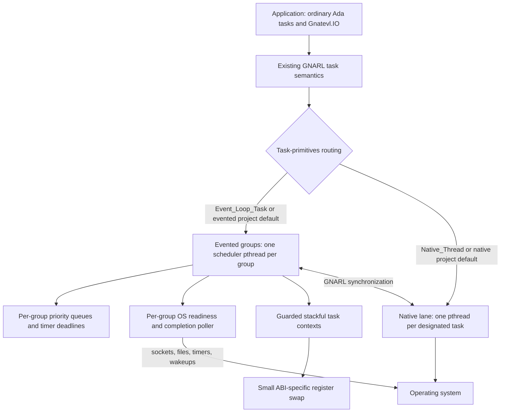
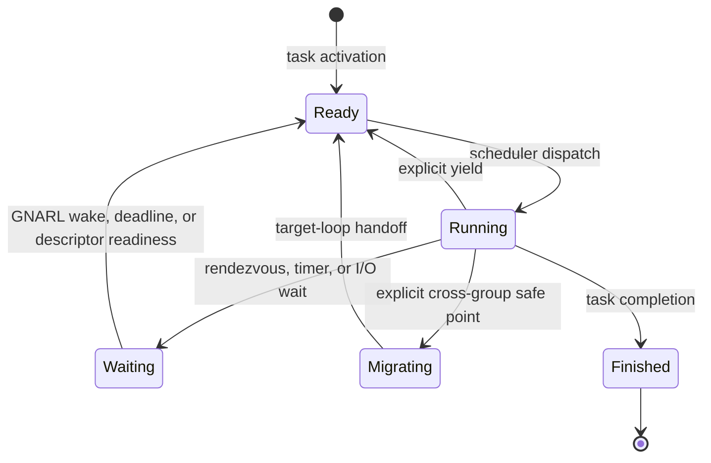

# GNATEVL

GNATEVL is an experimental GNAT runtime that can run designated ordinary Ada
tasks as stackful tasks on an event loop while leaving undesignated tasks on
GNAT's native pthread-backed path.

It is an augmentation of the existing GNAT runtime, not a new async language or
a replacement tasking model. Rendezvous, protected objects, task activation,
masters, exceptions, and normal blocking-looking Ada control flow still come
from GNARL. GNATEVL changes how a task is scheduled and adds I/O operations that
cooperate with either execution mode.

The current patch family covers Alire's available `gnat_native` 13 through 16
releases: 13.2.2, 14.1.3, 14.2.1, 15.1.2, 15.3.1, and 16.1.0. It is tested on
macOS/AArch64 and through a Linux/x86-64 Docker matrix. The event backend is
`kqueue` on macOS and `epoll` plus `eventfd` on Linux. Evented tasks resume
through the small ABI-specific context switch described below.

## Programming model

An undesignated Ada task uses a native thread by default, preserving the
behavior expected by existing GNAT applications:

```ada
task Worker;
```

Event-loop execution is an explicit per-task designation:

```ada
task Connection is
   pragma Task_Info (Gnatevl.Event_Loop_Task);
end Connection;
```

The prepared runtime has a project-wide default. Compatibility-oriented builds
omit the setting or select `native`; evented applications can opt in once for
the whole project:

```sh
GNATEVL_DEFAULT=native  ./scripts/prepare-rts.sh  # default when omitted
GNATEVL_DEFAULT=evented ./scripts/prepare-rts.sh
```

The environment task always remains native. No poller, scheduler context,
fiber stack, or event-loop pthread is created until activation of the first
evented child task.

An explicit `Gnatevl.Event_Loop_Task` or `Gnatevl.Native_Thread` always
overrides that project default. `Gnatevl.Project_Default` explicitly requests
the prepared default and is useful as a task-type discriminant:

```ada
task type Worker (Model : Gnatevl.Execution_Model) is
   pragma Task_Info (Model);
end Worker;

Evented : Worker (Gnatevl.Event_Loop_Task);
Native  : Worker (Gnatevl.Native_Thread);
Default : Worker (Gnatevl.Project_Default);
```

The designation is captured when each task object is created. GNAT's
`Task_Info` representation is target-specific, so GNATEVL supplies distinct
platform-specific values for explicit evented, explicit native, and project
default selection. This preserves the compiler/runtime ABI and avoids a
compiler fork.

Both forms remain Ada tasks and can rendezvous, use protected objects, and wait
on the same GNARL synchronization objects. The designation controls the task's
execution resource; it does not create a second tasking language.

### Execution groups and live migration

An evented task whose effective Ada CPU is `Not_A_Specific_CPU` is placed
automatically. The compatibility configuration has one loop and therefore
retains the original group-0 behavior. A prepared runtime can instead
distribute such tasks across a fixed pool with deterministic round-robin
tickets:

```sh
GNATEVL_LOOP_POOL_SIZE=4 \
GNATEVL_PLACEMENT=round_robin \
  ./scripts/prepare-rts.sh
```

Pool groups are created independently and lazily: configuration inspection
does not start them, and a four-loop configuration owns no event pthreads until
evented tasks are activated. `Gnatevl.Execution_Groups.Configured_Pool_Size`
and `Configured_Placement` report the compiled policy,
`In_Configured_Pool` classifies a group, and `Current` reports where the
calling evented task was actually placed. `Gnatevl.Observability.Snapshot` can
then inspect each created pool group without creating missing ones.

The standard Ada `CPU` aspect is an explicit override and selects that exact
shared event-loop group without consuming an automatic placement ticket. Tasks
with the same value share one loop pthread; different values use different loop
pthreads and can therefore execute in parallel:

```ada
task Parser with CPU => 1 is
   pragma Task_Info (Gnatevl.Event_Loop_Task);
end Parser;

task Writer with CPU => 2 is
   pragma Task_Info (Gnatevl.Event_Loop_Task);
end Writer;
```

Shared group identifiers are `0 .. 127`. Values `128 .. 255` are reserved for
runtime-created dedicated groups, so applying `CPU => 128` or greater to an
evented task fails activation with `Tasking_Error` rather than selecting a CPU.
The automatic pool is likewise limited to 128 shared groups. This interpretation
applies only after event-loop designation: an Ada `CPU` aspect on a native task
continues through stock GNARL's processor-affinity path.
Ada D.16 CPU inheritance is also preserved: a task without its own aspect but
activated by a task with an assigned CPU inherits that effective assignment and
therefore stays on the inherited group rather than entering the automatic pool.

Automatic placement, explicit `CPU` selection, and live migration are separate
decisions. Placement chooses an event loop at activation, `CPU` overrides that
choice, and `Migrate` changes the current group later at an explicit safe point.
None of these currently claims that the group's pthread is hard-pinned to a
physical core; the operating system schedules loop pthreads across processors.

`Gnatevl.Execution_Groups` also provides an explicit safe-point migration API:

```ada
declare
   package Groups renames Gnatevl.Execution_Groups;
   Home      : constant Groups.Group_Id := Groups.Current;
   Dedicated : Groups.Dedicated_Group_Id;
begin
   Groups.Migrate (Groups.For_CPU (2));

   Dedicated := Groups.Create_Dedicated;
   Groups.Migrate (Dedicated);
   Blocking_Foreign_Call;  --  this task now owns the loop pthread

   Groups.Migrate (Home);
end;
```

Migration returns on the destination pthread without changing Ada task
identity, its stack, locals, exception state, master, or rendezvous semantics.
The source scheduler performs the actual handoff only after the fiber has fully
switched away, so two loops can never restore one context concurrently.

Ada task identity is not OS-thread identity. Evented tasks in one group share
that group's pthread and therefore also share C `pthread_key` values, signal
masks, per-thread foreign-library caches, locale state, and other pthread-local
state. A yield stays on the same group pthread, but migration changes all of
that thread-local context even though the Ada task itself is unchanged.

Code holding a thread-affine foreign resource can prevent that change with a
scoped pin:

```ada
declare
   Pin : Groups.Thread_Pin := Groups.Pin_To_Current_Thread;
begin
   Use_Thread_Affine_Handle;
   --  A Groups.Migrate call to another group raises Migration_Error here.
end; -- Pin is deterministically released, including during exception cleanup
```

Pins nest safely, and migration remains disabled until the outermost pin is
finalized. A pin is owned by the Ada task that acquired it and must be finalized
by that same task; the intended use is a task-local lexical scope as above. A
pin stabilizes the event-loop pthread; it does not give the task exclusive use
of that pthread, so unrelated fibers in the group still share its pthread-local
state. Use a dedicated group as well when a foreign resource requires both
stable identity and exclusive access. Native tasks accept the same API as an
inherent no-op because GNARL already fixes each native task to its own pthread.
`Is_Thread_Pinned` reports both explicit evented pins and this inherent native
binding.

A dedicated group is a reusable event loop reserved for one fiber. Operationally
it gives that task an OS thread to itself, which is the safe live transition for
temporarily blocking foreign work. A stock `Native_Thread` task remains fixed at
creation: its continuation lives on a pthread-owned stack and cannot be
teleported into a fiber without replacing GNARL task identity and lifecycle.

The reservation is consumed when its task migrates out, immediately making the
empty lane reusable. Call `Create_Dedicated` again before re-entering it; if no
other task claimed the lane, the API normally returns the same group id.

The same GNATEVL I/O call also works from either kind of task:

```ada
Gnatevl.IO.Timers.Sleep_For (0.050);
Gnatevl.IO.Sockets.Receive (Socket, Buffer, Last, Timeout => 1.0);
Gnatevl.IO.Files.Read_At
  (File, Offset => 0, Item => Buffer, Last => Last);
```

In an evented task, these calls suspend only the current Ada task. In a native
task, they may block only that task's pthread. Values, `out` parameters, local
variables, exception propagation, and call stacks behave like normal
synchronous Ada code in both cases.

## Architecture



### GNARL integration boundary

GNATEVL integrates at `System.Task_Primitives.Operations`, below GNARL's task
semantics. The patched task primitives route each task to one of two execution
lanes:

- Evented tasks receive a guarded stack and a resumable execution context. Each
  execution group has a priority-aware ready queue, poller, and scheduler
  pthread. The environment task remains a normal GNARL task; even group 0 owns
  a separate scheduler pthread created on first evented-task activation.
- `Native_Thread` tasks use the normal pthread-backed path.
- Alternate signal stacks are owned by OS threads. Native tasks retain GNARL's
  per-pthread stack, while each event-loop pthread installs one permanent stack
  shared by its fibers. `Task_Wrapper` therefore does not reserve GNARL's 32 KiB
  alternate-stack local inside every evented task stack.
- Synchronization between the lanes still passes through GNARL. A native task
  wakes the event-loop scheduler through `EVFILT_USER` on macOS or `eventfd` on
  Linux.

Keeping the integration below GNARL is what lets existing Ada task syntax and
semantics survive. Reimplementing rendezvous or protected objects would create a
parallel runtime with subtly different behavior; GNATEVL deliberately avoids
that.

### Context switching is not event polling

These are independent mechanisms with different jobs:

| Mechanism | Purpose | Current implementation | Portability boundary |
| --- | --- | --- | --- |
| Context switching | Save one evented task's CPU/stack state and resume another | Guarded stacks plus a small ABI-specific register-swap routine for AArch64/macOS and x86-64/macOS or Linux | ABI and architecture |
| Event polling | Sleep until socket readiness, file completion, a timer deadline, or a cross-thread wake | `kqueue` with `EVFILT_AIO`/`EVFILT_USER` on macOS; `epoll` with `io_uring`/`eventfd` on Linux | Operating system |
| Scheduling | Choose which runnable Ada task executes next | Ada priority-ready queue and deadline bookkeeping | Runtime policy |

The poller discovers readiness; the context machinery preserves a suspended
Ada task's call stack and makes resumption look like an ordinary procedure
return. Scheduling connects those two mechanisms without exposing either one
in application code.

The scheduler state transition is:



Scheduling inside the evented lane is cooperative. A CPU-bound task must reach a
runtime suspension or yield point; otherwise it owns the loop. A native task is
the intended designation for code that blocks unpredictably, invokes blocking
foreign libraries, or needs independent CPU execution.

`delay 0.0` is an explicit cooperative yield for an evented task. A permanently
runnable yielding task does not starve descriptors: after at most 64 dispatches,
the scheduler promotes expired timers and drains up to 64 immediately available
poll events in one batched `kevent` or `epoll_wait` call before returning to the
ready queue.
Both budgets are explicit policy, keeping I/O moving without allowing a hot
descriptor set to monopolize the loop in the opposite direction.

CPU loops can make that policy reusable with a time-budgeted checkpoint:

```ada
Budget : Gnatevl.Fairness.Yield_Budget;

Budget.Configure (Ada.Real_Time.Microseconds (250));
while More_Work loop
   Process_One_Item;
   Budget.Checkpoint;
end loop;
```

`Checkpoint` reads the monotonic clock and performs `delay 0.0` only after its
quantum expires. It works for both task designations: an evented task gives its
loop peers a turn, while a native task offers its pthread to the OS scheduler.
It deliberately does not interrupt arbitrary Ada instructions; code that never
calls a runtime suspension or checkpoint remains cooperative and can still own
the loop until it returns.

## Task-aware I/O

GNATEVL exposes synchronous-looking operations in:

- `Gnatevl.IO.Timers`: relative and absolute sleeps.
- `Gnatevl.IO.Sockets`: connect, accept, partial/exact receive, and partial/all
  send operations.
- `Gnatevl.IO.Connections`: bounded admission, single-owner sockets,
  cancellation tokens, and graceful server draining.
- `Gnatevl.IO.Files`: open, close, positional read, and positional write.
- `Gnatevl.IO`: descriptor waits and task-mode detection used by the packages
  above.

### Sockets and descriptors

Socket operations use readiness, not callback delivery and not kernel
completion queues. The evented path is:


If the first system call succeeds, no suspension occurs. If it would block, the
task is parked and the scheduler runs other work. On readiness, the original
call resumes, retries the operation, and returns its result normally. A native
task uses `poll` for the equivalent wait, blocking its own pthread but not the
event-loop thread.

Descriptor registrations are one-shot so the resumed task owns the retry and
decides whether another wait is needed. Exact reads and complete writes loop
over partial progress while preserving a single deadline.

Accepted Darwin sockets have `SO_NOSIGPIPE` applied before they are exposed to
the caller; Linux sends use `MSG_NOSIGNAL`. This matches GNAT.Sockets'
process-safety convention while retaining the raw nonblocking `accept(2)` retry
path required by the event loop. Native `poll(2)` waits retry `EINTR` with a
recomputed remaining monotonic deadline.

### Connection lifecycle

`Gnatevl.IO.Connections.Server` puts a bounded admission gate in front of
socket ownership. `Take` transfers an existing socket into a limited
`Connection`; `Accept_Connection` acquires capacity before accepting from the
listener, so overload remains in the kernel backlog instead of becoming an
unbounded user-space task or socket queue.

```ada
Manager : aliased Gnatevl.IO.Connections.Server (Capacity => 256);
Owned   : Gnatevl.IO.Connections.Connection;

Manager.Accept_Connection (Listener, Owned, Peer);
Owned.Receive_Exactly (Request);
Owned.Send_All (Response);
```

The limited owner cannot be copied and closes its socket while releasing the
admission permit during explicit `Close`, normal scope exit, or exception
unwinding. The `Server` object must outlive its admitted owners.

Operations register both an optional per-operation `Cancellation_Token` and the
server shutdown source in the same kernel wait as the socket. A token request
or `Request_Shutdown` writes a persistent nonblocking wake descriptor: native
tasks observe it in `poll`, while evented tasks observe it through their loop's
`kqueue`/`epoll` poller. The suspended call resumes immediately without closing
the connection descriptor and without periodic timer wakeups. One signal wakes
all operations registered with that source.

`Cancellation_Quantum` remains in the API for source compatibility but is no
longer a polling interval and is ignored. Cancellation tokens and servers must
outlive operations waiting on their wake sources. `Request_Shutdown` also closes
admission, releases tasks queued at the capacity gate with `Admission_Closed`,
and causes active lifecycle I/O to raise `Operation_Cancelled`;
`Await_Drained` returns after all owners release. Raw `Gnatevl.IO.Sockets`
remains the lower-level mechanism when an application needs different ownership
or cancellation policy. Its optional interrupt descriptors are a low-level
building block; callers retain their ownership and lifetime responsibility.

### Timers

An evented sleep records a scheduler deadline and suspends the current context.
A native sleep blocks only its pthread. Timer calls share one public API and use
monotonic time, so wall-clock changes do not alter elapsed waits.

Each loop stores finite deadlines in an indexed binary min-heap. Insertion and
cancellation are `O(log n)`, the next poll deadline is available in `O(1)`, and
expiration removes the minimum repeatedly without scanning unrelated fibers.
The index stored in each fiber also lets readiness, abort wakeups, and reaping
remove that fiber's deadline directly.

The earliest deadline becomes the timeout of the group's next `kevent64` or
`epoll_wait`; expiry therefore wakes the same event-loop syscall already used
for sockets and file completions. There is no timer thread and no per-task OS
timer object.

### Regular files

Regular files are not readiness-oriented: marking a regular descriptor readable
with `kqueue` or `epoll` does not make a potentially blocking `pread` safe on an
event-loop thread. GNATEVL therefore submits positional reads and writes to an
actual kernel completion facility and suspends only the calling Ada task.

- On macOS, POSIX AIO posts `EVFILT_AIO` completions directly to the execution
  group's kqueue. `kevent64` carries the XNU completion result and error back to
  the Ada scheduler.
- On Linux, each execution group owns an `io_uring`; its completion queue
  signals the group's existing eventfd, which is already watched by epoll. If
  `io_uring_setup` is unavailable or forbidden, the backend uses Linux native
  AIO with `IOCB_FLAG_RESFD` and the same eventfd completion path.

Submission-queue saturation is explicit backpressure: the task remains
suspended in a per-group FIFO until the scheduler can submit it. No Ada worker
task, pthread pool, or blocking `pread`/`pwrite` call is hidden behind the
evented API. Native-designated callers use direct positional syscalls. Explicit
offsets avoid shared file-position races in both lanes.

`Open` and `Close` are still direct metadata syscalls because neither supported
platform provides an equivalent portable completion operation for them. They
normally complete quickly on local filesystems, but applications should isolate
potentially slow remote-filesystem metadata operations on a native task.

## Runtime observability

`Gnatevl.Observability` exposes a stable, read-only snapshot for each event
group. Calling `Snapshot` for a group that has never existed returns `False`
and does not create a pthread, poller, scheduler context, or any other event
runtime resource. A native-only application can therefore link and query the
package without losing lazy-start inertness.

```ada
declare
   Sample : Gnatevl.Observability.Group_Snapshot;
begin
   if Gnatevl.Observability.Snapshot (0, Sample) then
      Put_Line ("ready" & Sample.Ready'Image
                & " waiting" & Sample.Waiting'Image
                & " dispatches" & Sample.Dispatches'Image);
   end if;
end;
```

A snapshot reports thread startup state and whether the group is dedicated or
reserved; total and thread-pinned members; members in ready, waiting, running,
migrating, and finished states;
active timer, descriptor, interrupt-enabled, and file waits; file submissions queued behind kernel
backpressure; and lifetime dispatch, poll-batch, delivered-event, GNARL-wakeup,
and migration-in/out counters. Wait categories overlap: for example, a
descriptor wait with a deadline contributes to both `Descriptor_Waits` and
`Timer_Waits`; a connection wait also contributes to `Interrupt_Waits` when it
has a cancellation or shutdown wake source. `Pending_File_Submissions` is the subset of `File_Waits` not yet
accepted by the bounded kernel queue.

Topology and queue values are coherent at one instant: the runtime holds the
short topology lock and the selected group's scheduler lock while walking its
member list. Snapshot cost is therefore `O(group members)` and briefly delays
group creation or migration as well as scheduler queue maintenance; it is
intended for periodic diagnostics, not per-request instrumentation. Lifetime
counters are updated under the owning group lock, wrap modulo 2^64, and never
reset because groups are permanent.

`Made_Progress` compares two samples. A group with runnable or running work but
no dispatch or poll progress over the sampling interval is a useful loop-lag
signal; an empty waiting group with no progress is merely idle. This sampled
design avoids adding a monotonic-clock read to every dispatch. A policy-driven
stall watchdog is provided as an opt-in layer on these observations and is
deliberately not a runtime scheduling policy.

### Sampled stall watchdog

`Gnatevl.Observability.Stall_Watchdogs` can monitor one group from a dedicated
native Ada task. Merely declaring a `Watchdog` is inert. `Start` creates the
native monitor, but observing a group that does not exist still does not create
that group or any event-runtime resource. `Stop` waits for the monitor to exit;
the limited controlled object also stops it during finalization, and a stopped
object can be restarted.

```ada
declare
   Monitor : Gnatevl.Observability.Stall_Watchdogs.Watchdog;
begin
   Gnatevl.Observability.Stall_Watchdogs.Start
     (Monitor,
      (Group           => 0,
       Sample_Interval => 0.050,
       Stall_Threshold => 0.250));
   --  Poll Latest_Report from a service health or diagnostics task.
   Gnatevl.Observability.Stall_Watchdogs.Stop (Monitor);
end;
```

Reports distinguish an absent or starting group, an empty idle group, a group
whose members are waiting, an advancing group, runnable work that has not yet
crossed the threshold, a suspected stall, a failed event thread, and a stopped
or failed monitor. A suspected stall requires runnable or running work plus no
change to dispatch or polling progress for the configured threshold. Its
episode count is latched so a service can observe a transient stall after the
loop resumes.

This is a sampled diagnosis, not proof of deadlock. Each snapshot is coherent,
but work can arrive, yield, or finish between samples; detection latency is
quantized by `Sample_Interval`. The watchdog does not interrupt, migrate,
reprioritize, or otherwise preempt a monopolizing task. Sampling also retains
the snapshot operation's `O(group members)` cost and brief scheduler-lock hold,
so intervals should be diagnostic rather than per-request scale.

Fatal invariant paths retain a small `Last_Fatal` classification and write the
same category directly to standard error before `abort`. A live process normally
reports `No_Fatal`; the retained atomic scalar is chiefly postmortem context for
a crash handler or debugger and querying it takes no scheduler lock.

## Design decisions

| Decision | Rationale | Consequence |
| --- | --- | --- |
| Keep ordinary Ada task syntax | Existing programs and GNARL semantics remain recognizable | No separate `async`/`await`, callback, or future API is required |
| Default to native execution, with a project-wide evented option | Existing tasking code keeps its blocking and parallelism assumptions while high-I/O projects can opt in once | Evented examples and mixed projects must designate their intended lane |
| Start event machinery on first use | A native-only program should not acquire a poller, scheduler context, fiber stack, or loop pthread merely because it links the custom RTS | The first evented task pays the one-time group startup handshake |
| Keep native threads as a task designation | Some foreign calls, CPU work, and platform APIs genuinely need threads | The runtime is hybrid rather than ideologically thread-free |
| Place undesignated evented tasks through a build-time loop pool | High-I/O applications can use several event-loop pthreads without encoding a `CPU` aspect into every task declaration | The compatibility default remains one loop; round-robin balances task count rather than measured work |
| Map Ada `CPU` aspects to event-loop groups | Existing Ada syntax expresses task co-location without a second annotation system | On macOS the value selects a loop thread, but cannot hard-pin that pthread to a physical core |
| Allow live fiber migration | Work can be rebalanced or moved to a dedicated blocking lane without changing task identity | Migration is explicit and occurs only at the API safe point |
| Integrate below GNARL | Rendezvous, protected objects, activation, and masters are already mature | The patch is coupled to the exact GNAT runtime source version |
| Hash ATCB addresses to fibers | Rendezvous wakeups and priority changes must not scan every evented task while holding the registry lock | Lookup and removal are constant-time on average; a prime-sized fixed bucket table avoids allocation in wake paths |
| Shard the task registry | Independent loops and native wake sources should not serialize every lookup on one process-wide mutex | 64 shard locks isolate ordinary wake and priority paths; group creation, reservations, migration, and destruction still coordinate through a short-held topology lock |
| Hash descriptor waiters per group | Readiness delivery must not scan every fiber once for every ready descriptor | Delivery is constant-time on average while collision chains retain same-descriptor reader/writer fan-out |
| Keep deadlines in per-group indexed heaps | Timer maintenance must scale with active deadlines rather than every fiber in a loop | Insert and arbitrary cancellation are logarithmic; earliest-deadline lookup is constant-time |
| Make CPU fairness explicit | Arbitrary signal-time preemption would cross Ada and GNARL critical regions at unsafe instructions | Time-budgeted checkpoints provide bounded cooperative slices where application invariants are known to be stable |
| Use stackful contexts | Normal calls, locals, `out` values, and exceptions survive suspension naturally | Each evented task still needs a virtual stack and ABI-specific switching code |
| Separate scheduler, context, and poller | CPU state, scheduling policy, and OS readiness are different concerns | New architectures and new OS pollers can be ported independently |
| Use readiness-and-retry I/O | It maps directly to nonblocking sockets and keeps control in Ada | Arbitrary blocking libc or foreign calls cannot be intercepted transparently |
| Use kernel-completion file I/O | Disk operations must not stall an event-loop pthread or require hidden workers | Darwin AIO and Linux `io_uring`/native AIO add platform ABI code and bounded submission queues |
| Make connection lifetime explicit | High-density servers need a bound on accepted work and one authority to close each descriptor | Limited owners release permits automatically; persistent wake descriptors cancel idle operations without polling or concurrent socket close |
| Put runtime logic in Ada | Types, task coordination, errors, and policies remain inspectable in the target language | OS entry points are imported from C system interfaces; only register switching is assembly |
| Generate a static custom RTS | The experiment works without a compiler fork and can fail closed on mismatched sources | Builds require a matching installed runtime from the tested GNAT 13–16 family |

## Ada, C, and assembly boundary

Ada implements scheduling, queues, timeout and backpressure policy, descriptor
registration, stacks, task routing, and I/O retry logic. It imports the platform
primitives exposed through the C ABI, including `kqueue`/`kevent64`,
`epoll`/`eventfd`, `mmap`, `poll`, POSIX AIO, `syscall`, and socket calls. The
file engine itself is Ada: platform bodies define explicit representation
clauses for Darwin `aiocb` and Linux `io_uring`/native-AIO UAPI records, own the
mapped rings and control blocks, submit operations, and drain completions.

The shared Linux rings require acquire/release ordering against the kernel.
GNATEVL uses GNAT's `System.Atomic_Primitives` for atomic loads. GNAT 13 does
not expose the corresponding store operation, so the narrow C ABI shim calls
the compiler's `__atomic_store_n` intrinsic; no worker runtime is involved.

The only assembly is the minimal context swap needed to save and restore the
callee-saved machine state. Rewriting a system-call declaration in Ada would
not make the kernel implementation Ada; the useful boundary is to keep policy
and coordination in Ada while treating the OS ABI as a narrow platform layer.

## SPARK proof boundary

SPARK can cover the deterministic policy kernels without pretending that the
entire task runtime is currently proofable. `Gnatevl.Time_Math` implements the
timeout clamp used by socket retry loops and the nanosecond/millisecond
conversions used by event-loop and native descriptor waits. Its contracts cover
the infinite-timeout sentinel, non-expired timeout, expiration, remaining-time
cases, rounding up to poll milliseconds, and saturation at the `poll(2)` integer
limit.

Two more production policy units prove native `poll` and `accept` result
classification, including `EINTR` retry and would-block handling, and regular
file open validation and exact Darwin `O_RDONLY`/`O_WRONLY`/`O_RDWR`, `O_CREAT`,
and `O_TRUNC` flag composition for Darwin and Linux. The Ada import of variadic
`open(2)` remains an ABI boundary and uses GNAT's `C_Variadic_2` calling
convention.

The scheduler policy unit proves deadline classification and safe calculation
of the next poll timeout. It also proves earliest-deadline selection,
maintenance cadence, dispatch-counter safety, and the distinction between
immediate and deferred fiber destruction, including the in-flight `Migrating`
phase. Shared/dedicated group classification, dedicated-lane availability, and
migration admission are exact contracted functions used by the production
scheduler. Ready tasks live in one FIFO bucket per bounded Ada priority: append,
removal, and priority changes are constant-time, while choosing the next
non-empty priority scans only the fixed `System.Any_Priority` range. Those
intrusive bucket updates, lock ownership, and actual context handoff remain
outside SPARK.

Run the proof through the Alire-provided GNATprove toolchain:

```sh
./scripts/prove.sh
```

The current run discharges 62 flow, functional-contract, termination, and
run-time-safety checks across four production policy units, with zero unproved
checks. Good next proof candidates are ready-bucket insertion/removal invariants
and descriptor wake matching.
The GNARL tasking integration, imported system calls, address conversions,
assembly register swap, and kernel behavior remain trusted boundaries. These
can be wrapped in contracts, but GNATprove cannot establish their implementations
from this Ada source tree.

## Portability boundaries

| Area | macOS | Linux | Remaining boundary |
| --- | --- | --- | --- |
| Descriptor poller | `kqueue` with `EVFILT_USER` | `epoll` with `eventfd` | Windows IOCP needs a completion-oriented adapter |
| Regular-file completion | POSIX AIO with `EVFILT_AIO` | Per-group `io_uring`; Linux native AIO fallback | Windows overlapped I/O/IOCP adapter |
| CPU placement | Stable group pthread; no public hard pinning | Stable group pthread; strict affinity is not yet applied | Optional platform binding policy |
| Context switch | AArch64 and x86-64 assembly | x86-64 assembly | One small implementation per additional architecture/ABI |
| Stack allocation | `mmap` plus guard pages | `mmap` plus guard pages | Platform virtual-memory API |
| OS calls | Thin Ada imports of Darwin/POSIX interfaces | Thin Ada imports of Linux/POSIX interfaces | Per-platform binding body |
| GNARL hook | Versioned GNAT 13–16 Darwin patch | Versioned GNAT 13–16 Linux patch | Add and verify a new family when GNARL source changes |

The scheduler and public I/O semantics are intended to remain Ada and
platform-neutral. Pollers and context implementations are explicitly isolated
rather than hidden behind a claim of universal portability.

## Repository layout

- [`runtime/ada`](runtime/ada): platform-neutral scheduler, context, and poller
  interfaces.
- [`runtime/config`](runtime/config): project-default execution and generated
  automatic loop-pool policy selected while preparing the RTS.
- [`runtime/platform`](runtime/platform): `kqueue` and `epoll` poller bodies,
  plus the Ada platform file-engine implementations.
- [`runtime/native`](runtime/native): ABI-specific context-switch assembly,
  and the minimal platform-constant shim.
- [`runtime/compat`](runtime/compat): version-selected bindings for runtime ABI
  differences such as the GNAT 16 `timespec` move.
- [`runtime/patches`](runtime/patches): versioned Darwin/Linux GNARL
  task-primitives integration and its tested-release manifest.
- [`src`](src): public task-aware I/O packages.
- [`tests`](tests): runtime, socket, timeout, and native TCP smoke tests.
- [`showcases`](showcases): side-by-side scheduling and I/O demonstrations.
- [`scripts`](scripts): custom RTS construction, verification, and test runners.

## Build and test

The project expects Alire at `~/alr` and one of the tested GNAT 13–16
toolchains. Set `ALR` to override the executable location:

```sh
./scripts/prepare-rts.sh                       # native project default
GNATEVL_DEFAULT=evented ./scripts/prepare-rts.sh
GNATEVL_LOOP_POOL_SIZE=4 ./scripts/prepare-rts.sh
~/alr exec -- gprbuild --RTS="$PWD/build/rts" -P path/to/application.gpr
```

The build script detects the exact active compiler release, selects its versioned patch
family and runtime ABI adapter, copies the matching installed runtime sources,
selects the project execution default, and builds a static RTS.
`GNATEVL_DEFAULT` accepts only `native` or `evented`.
`GNATEVL_LOOP_POOL_SIZE` accepts `1 .. 128` and defaults to `1`;
`GNATEVL_PLACEMENT` currently accepts `round_robin`. These generated policies
are compiled into the RTS rather than read from the process environment, so
deployment configuration is stable during elaboration and concurrent task
activation. The script checks source compatibility by applying the source
patch under `set -e`, so an incompatible runtime source tree fails rather than
being silently accepted.

Run the complete verification suite with:

```sh
./scripts/test.sh
./scripts/prove.sh
```

`scripts/test.sh` verifies both project defaults, then runs the behavioral suite
with the compatibility-oriented native default and explicit evented/native task
designations. `scripts/showcases.sh` selects the evented project default;
`many_evented_tasks.adb` deliberately uses `Gnatevl.Project_Default`, while the
mixed-lane showcases keep explicit overrides.

On macOS, Docker can build the Linux/x86-64 target and run the same behavioral
suite under emulation:

```sh
./scripts/test-linux-docker.sh
```

The default image uses Ubuntu 24.04, Alire 2.1.0, GNAT 16.1, and GPRbuild
26.0.1. `GNATEVL_GNAT_VERSION` and `GNATEVL_GPRBUILD_VERSION` select another
pair; `GNATEVL_LINUX_IMAGE` overrides its local image name. To run every Alire
release covered by the patch family:

```sh
./scripts/test-alire-runtime-matrix.sh
```

Current smoke coverage includes:

- inert pool configuration queries, one-loop compatibility, exact explicit
  `CPU` override, round-robin distribution across three lazy loops, native
  `CPU` behavior, and automatic-placement interaction with scoped pins and
  dedicated groups;
- `CPU`-selected shared groups, same-group thread identity, cross-group live
  migration, reusable dedicated lanes, and native-task migration rejection;
- real C pthread-local state shared by same-loop fibers and changed by
  cross-group migration, plus nested scoped pinning, exception cleanup,
  dedicated-group stability, and native pthread identity;
- evented and native task activation, rendezvous, protected operations, and
  timers;
- one generic semantic-conformance scenario instantiated unchanged for both
  lanes: conditional and timed entry calls, selective accept delay and
  terminate alternatives, requeue, asynchronous transfer of control,
  suspension objects, task attributes, dynamic priority across a
  maximum-ceiling protected operation, nested and access-type task masters,
  abort during activation/delay/entry wait/finalization, and rendezvous in both
  directions across the native/evented boundary;
- evented/native socket-pair transfer, simultaneous read/write watches on one
  descriptor, and timeout behavior;
- bounded connection admission, one-shot cancellation, shutdown-driven I/O
  cancellation, RAII socket release, admission closure, accept cancellation,
  immediate pre-requested cancellation, timeout precedence, 64 idle evented
  connections, and blocked native parity despite a ten-second legacy quantum;
- descriptor-readiness fairness under a continuously yielding evented task;
- coherent event-group load/counter snapshots and native-only observation that
  does not eagerly start a loop;
- read/write/create/truncate file-open combinations plus 64 concurrent
  positional operations through the kernel-completion path;
- repeated evented-child teardown under a native master, exercising deferred
  fiber destruction and ATCB-address reuse;
- 16 KiB `Storage_Size` parity across evented and native tasks, including
  task-aware socket suspension and resumption;
- native TCP connect, accept, send, and receive behavior, including verification
  that accepted sockets suppress `SIGPIPE`.

## Showcases

Run every showcase with:

```sh
./scripts/showcases.sh
```

After they have been built, an individual showcase can be rerun directly:

```sh
./showcases/bin/evented_pipeline
./showcases/bin/many_evented_tasks
./showcases/bin/cooperative_fairness
./showcases/bin/connection_lifecycle
./showcases/bin/cancellation_density evented 1000
./showcases/bin/hybrid_blocking_bridge
./showcases/bin/evented_vs_threads
./showcases/bin/evented_io
./showcases/bin/evented_file_io
./showcases/bin/execution_groups
./showcases/bin/runtime_observability
./showcases/bin/stall_watchdog
./showcases/run_event_loop_pool.sh
./showcases/run_connection_density.sh
```

The examples demonstrate:

- a producer/transform/sink pipeline using entry calls;
- fan-out timers and protected aggregation;
- uncooperative CPU monopolization versus time-budgeted cooperative checkpoints
  on the same event loop;
- bounded connection admission followed by cancellation and a fully drained
  graceful shutdown, including automatic socket ownership cleanup;
- cancellation-enabled connection density with one second of idle process-CPU
  measurement and immediate release from a deliberately ten-second legacy
  quantum;
- evented coordination with native CPU workers;
- `CPU`-selected loop groups, live cross-loop migration, a reusable dedicated
  one-task thread, and rejection of unsafe live stock-native conversion;
- evented versus pthread-backed tasks under identical source-level work;
- a real loopback TCP exchange, positional file I/O, and timers through the
  task-aware I/O API;
- 256 evented file tasks sharing one event-loop pthread, with the process thread
  count sampled before their kernel-completion writes are released;
- periodic per-group diagnostics showing parked load, idle progress, dispatch,
  poll, and wakeup counters before and after releasing 128 tasks;
- native-thread sampling that distinguishes normally waiting and idle groups
  from a sustained, runnable event loop that is not making progress;
- repeated socket-readiness waves over one loop and a configured loop pool,
  including per-group task distribution and poll/dispatch counters;
- 10,000 simultaneously waiting socket connections on one event-loop thread,
  followed by an isolated same-load resource comparison with native tasks.

### Event-loop pool showcase

`run_event_loop_pool.sh` rebuilds the same explicitly evented workload first
with one automatic loop and then with a configurable pool. Each worker owns a
real socket endpoint; every round sends one byte to every endpoint, waits for
all task-aware receives, and reports elapsed time plus per-group worker,
dispatch, poll-batch, and delivered-event counts:

```sh
./showcases/run_event_loop_pool.sh 1024 20 4
```

The arguments are workers, readiness rounds, and comparison pool size. Timing
starts after task and socket creation, so the measurement is repeated I/O wake
and dispatch rather than setup density. The pool permits the OS to run several
loop pthreads concurrently, but it deliberately makes no physical-core-pinning
claim; load shape, kernel behavior, and host scheduling determine whether more
loops improve elapsed time.

### Connection-density showcase

`run_connection_density.sh` uses separate processes so peak and current
resource measurements from one mode cannot contaminate the other. Every
connection owns a real socket endpoint and an Ada task that enters
`Receive_Exactly`; an in-process peer endpoint releases every connection after
the resource measurement. Both modes request the same 16 KiB task stack.

The sampling barrier establishes that every worker has reached the boundary
immediately before its `Receive_Exactly` call. It does not claim every worker
has completed kernel-poller registration by that instant. Task stacks and, for
native mode, pthreads already exist at the boundary, so the resource comparison
does not depend on that narrower scheduling distinction.

The default run is:

```sh
./showcases/run_connection_density.sh 1000 10000
```

The first argument is the connection count used for the evented/native
comparison. The second is the evented-only scale run. On a host capable of
creating 10,000 pthreads, a full head-to-head can be requested explicitly:

```sh
./showcases/run_connection_density.sh 10000 10000
```

A representative run on the development Apple Silicon machine, after adding
the ATCB and descriptor-wait indexes and moving alternate signal-stack storage
from each fiber to its event-loop pthread, produced:

| Mode | Connections | OS threads at sample | RSS increase | Virtual-memory increase | Setup | Release all |
| --- | ---: | ---: | ---: | ---: | ---: | ---: |
| Evented | 10,000 | 2 | 462 MiB | 1.13 GiB | 0.219 s | 0.028 s |
| Native | 10,000 | 10,001 | 617 MiB | 1.17 GiB | 7.736 s | 0.137 s |

The central win today is kernel-concurrency density: the evented version avoids
one pthread per connection and can reach connection counts at which creating an
equal number of pthreads commonly exceeds host limits. In this run it also used
about 155 MiB (25%) less incremental resident memory, reserved less address
space, set up 35 times faster, and drained readiness 4.8 times faster. The RSS
change comes from no longer touching pages for a dead 32 KiB alternate-stack
local in every fiber; both lanes still request the same user stack size. Native
release latency can still win at other loads because pthreads run in parallel;
the showcase reports the result rather than assuming either outcome.

The scaling changes identify the data structures responsible. Hashing ATCB
addresses changed 10,000-task evented setup from roughly 0.76 seconds to 0.31
seconds. Hashing descriptor waiters per group then changed the 10,000-connection
release drain from roughly 0.41 seconds to 0.065 seconds. Both formerly
quadratic lookup components now take expected linear total work for the
one-descriptor-per-connection load.

The process holds both ends of each socket pair to provide a self-contained load
generator, so it reports twice as many file descriptors as server-side
connections. Results vary with the OS, compiler, allocator, and resource limits.

### Cancellation-density showcase

`cancellation_density` parks real socket-owning connections with cancellation
enabled, samples process CPU across one idle second, then requests a shared
token and reports the time to drain every connection. Each operation passes a
ten-second `Cancellation_Quantum`: cancellation completing promptly demonstrates
that the value is compatibility-only and no periodic quantum drives progress.

```sh
./showcases/bin/cancellation_density evented 1000
./showcases/bin/cancellation_density native 1000
```

The evented lane should remain close to idle process CPU with one loop thread;
the native lane blocks a pthread per connection. Absolute CPU and cancellation
latency vary by host, so the showcase reports measurements rather than asserting
a fixed performance ratio.

## Performance snapshot

Five-run medians on the development Apple Silicon machine:

| Workload | Evented tasks | pthread tasks | Result |
| --- | ---: | ---: | --- |
| 256 tasks × 100 yields | 25.910 ms | 17.935 ms | pthreads 1.44× faster |
| 2,048 tasks × 20 ms wait | 83.675 ms | 308.056 ms | evented 3.68× faster |

This is the intended tradeoff, not a claim that event loops always win. Native
threads are very competitive at modest concurrency and can run CPU work in
parallel. Evented tasks become attractive when many mostly-waiting activities
would otherwise pay for thousands of pthreads and kernel scheduling events.

## Current constraints

- Supported combinations are macOS/AArch64 and Linux/x86-64. The macOS/x86-64
  context switch is implemented but is not part of the current automated run.
- Each event group uses one scheduler pthread. Tasks within a group are
  cooperative, while separate groups can execute in parallel.
- Evented tasks without a `CPU` aspect use the compiled automatic pool. Its
  default size is one for compatibility; the only current policy is
  round-robin task count, which does not measure per-task CPU or I/O load.
- A group identifies a stable loop pthread but is not currently hard-pinned to
  a physical core. Darwin lacks a public strict pinning API; Linux affinity can
  be added as an explicit policy.
- Evented tasks in a group share pthread-local state. Scoped
  `Gnatevl.Execution_Groups.Thread_Pin` objects prevent migration but do not
  isolate that state from other tasks in the same group; use a dedicated group
  when exclusive pthread-local ownership is required.
- All loops, including group 0, are created lazily; each group's pthread and
  poller (`kqueue` or `epoll`) remain alive for the process lifetime. The table
  is bounded to 256 groups, and vacated dedicated loops are reserved and reused
  by later callers.
- First use of a loop waits synchronously for its pthread startup handshake. An
  evented caller occupies its source loop during this bounded `sched_yield`
  wait; subsequent use of the already-started loop does not wait.
- Ready queues, fiber membership, timer heaps, descriptor delivery, and dispatch
  use independent per-group locks, per-group fiber lists, and an 8,191-bucket
  descriptor-wait index. On the supported 64-bit targets, each lazily created
  loop therefore carries about 64 KiB of fixed descriptor-index storage. The
  fixed 16,381-bucket task table uses collision chains, never resizes in a wake
  path, and is protected by 64 independent shard locks. Ordinary wakeups and
  priority changes take only the relevant shard and destination-group lock.
  Group allocation, dedicated reservations, migration, and destruction also
  use a short-held topology lock; topology changes remain globally serialized.
- Shared `CPU` group ids are limited to `0 .. 127`; `128 .. 255` are the
  dedicated range and cannot be selected statically with the `CPU` aspect.
- The environment task always remains on its native pthread-owned initial stack
  and is never registered as a fiber, even when the project default is evented.
  It therefore cannot migrate; child evented tasks use guarded runtime-owned
  stacks and can.
- Cooperative scheduling means an evented task that never reaches a suspension
  point can monopolize the loop. `Gnatevl.Fairness.Yield_Budget` makes explicit
  time-budgeted checkpoints reusable but cannot force unmodified CPU loops to
  yield safely.
- Arbitrary blocking foreign calls are not automatically made event-aware; use
  a designated native task or an explicit worker boundary.
- Evented regular-file data operations use bounded kernel completion queues;
  queue saturation suspends and retries the Ada task without creating workers.
  Linux prefers `io_uring` and falls back to native AIO when the syscall is
  unavailable or forbidden. The fallback is still kernel completion I/O, but
  filesystem support and true asynchronous behavior are more limited than with
  `io_uring`.
- File `Open` and `Close` remain direct metadata syscalls and may briefly occupy
  an event loop, particularly on remote or unhealthy filesystems.
- A submitted file buffer remains owned by the kernel until completion. An
  abort request therefore wakes that task only after the outstanding operation
  completes; cancellable file-operation handles are not yet a public API.
- `Gnatevl.IO.Connections` provides scheduler-driven cancellation without
  concurrent descriptor close or periodic readiness timeouts. Raw socket
  operations do not infer descriptor ownership; closing a raw descriptor
  concurrently with an indefinite wait remains outside that lower-level API's
  guarantees. Generation-tagged descriptor ownership remains future work.
- Fiber guard pages make stack overflow fail fast. Each loop pthread has an
  alternate signal stack on which GNARL can translate the guard fault into Ada
  `Storage_Error`; this stack is thread state and is intentionally not stored
  in an individual fiber's task wrapper.
- `Task_Info` produces an obsolete-feature warning in current GNAT, but it
  provides the required per-task and per-task-type designation without a
  compiler fork. GNATEVL's test and showcase projects use `-gnatwJ` to suppress
  that specific warning class while retaining the other `-gnatwa` diagnostics.
- The custom RTS patch is tied deliberately to the versioned GNAT 13–16 source
  family. An unsupported compiler release or a changed source hunk fails runtime
  preparation instead of falling back to a nearby patch.
- The semantic differential suite checks language-level outcomes and ordering
  only where the Ada rules determine them; it deliberately does not compare
  scheduling traces or elapsed-time ordering between lanes. It covers a
  successful dynamic-priority/maximum-ceiling protected interaction under the
  project's locking policy, but not full Real-Time Systems Annex dispatching,
  priority-inheritance, or ceiling-violation conformance across OS schedulers.

The next architectural work is additional architectures and operating systems,
optional CPU-affinity policy, structured listener/worker orchestration, and
more complete randomized stress testing across both execution lanes.
