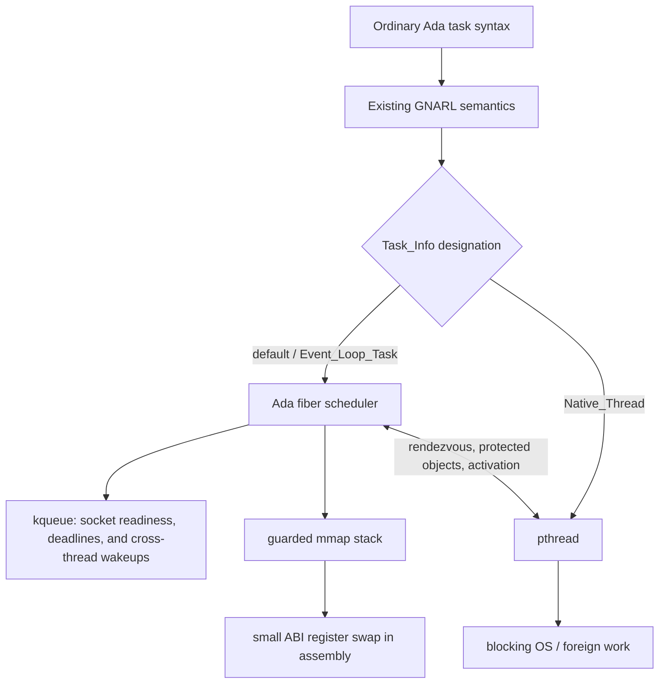

# GNATEVL

GNATEVL is an experimental hybrid tasking runtime for GNAT. Ordinary Ada
tasks are stackful tasks multiplexed by one event loop; a task can explicitly
request a native OS thread and still use rendezvous and protected objects with
event-loop tasks.

The public designation uses GNAT's existing `Task_Info` channel, so it does
not require a compiler fork:

```ada
with Gnatevl;

task Evented; -- the default in the GNATEVL runtime

task Threaded is
   pragma Task_Info (Gnatevl.Native_Thread);
end Threaded;
```

`Gnatevl.Event_Loop_Task` is the explicit spelling of the default. Internally,
these map to the existing `Default_Scope` and `System_Scope` values so the
first runtime can retain GNAT 16's `System.Task_Info` ABI.

## Architecture

GNARL already concentrates platform tasking in
`System.Task_Primitives.Operations`. GNATEVL replaces that body while keeping
its specification intact:

- `Create_Task` creates either a stackful context or a `pthread`, according to
  the task's `Task_Info` value.
- `Sleep`, `Timed_Sleep`, `Timed_Delay`, `Wakeup`, and `Yield` route to the
  event-loop scheduler for evented tasks and to the existing POSIX primitives
  for native tasks.
- Native threads wake the scheduler through `EVFILT_USER`/`NOTE_TRIGGER`.
- Existing GNARL rendezvous, activation, protected-object, and master logic
  remains above this boundary and is shared by both execution models.



The scheduler, priority queues, timer management, stack allocation,
trampoline, and `kqueue` backend are implemented in Ada. They import only the
OS primitives they need (`mmap`, `munmap`, `kqueue`, `kevent`, and pthread
mutex operations). There are no C sources in the runtime. The only non-Ada
implementation is the small ABI-specific register save/restore routine in
`runtime/native/context_switch.S`; context switching and event polling remain
separate portability boundaries.

The verified backend targets macOS on AArch64 and x86-64. An `epoll`/`eventfd`
poller and the corresponding Linux packaging are the next platform backend;
IOCP remains a future Windows backend. None of those choices leaks into Ada
task syntax.

## Cooperative I/O

`Gnatevl.IO` presents synchronous-looking operations to either execution
model. Event-loop tasks suspend their fiber; designated native tasks block
their pthread. Callers use the same return values, out parameters, timeouts,
and exceptions in both cases.

```ada
Gnatevl.IO.Timers.Sleep_For (0.050);

Gnatevl.IO.Sockets.Receive_Exactly
  (Socket, Message, Timeout => 2.0);

Gnatevl.IO.Files.Read_At
  (File, Offset => 0, Item => Buffer, Last => Last);
```

- Timers use the runtime's task-model-aware delay path.
- Sockets are nonblocking. Evented tasks register one-shot read/write interest
  with `kqueue`; native tasks wait with `poll`. The syscall is retried after
  readiness because readiness does not itself carry the data.
- Regular files cannot be made reliably nonblocking with `kqueue`. An evented
  caller therefore rendezvouses with a four-thread native file-worker pool;
  a native caller performs the operation directly. The API currently exposes
  explicit-offset `Read_At` and `Write_At`, avoiding shared file-position races.

The socket package includes partial and exact receive, partial and complete
send, nonblocking connect, and readiness-based accept operations. Closing a
descriptor concurrently with an infinite wait is not yet a cancellation API;
use finite timeouts when another task owns descriptor lifetime.

## Current status

The custom GNAT 16.1 runtime builds and passes an end-to-end hybrid tasking
test on macOS/AArch64. That test covers default evented task activation, a
designated native task, cross-model rendezvous, protected operations, and both
evented and native `delay` statements.

Prepare the runtime and build an application with it:

```sh
./scripts/prepare-rts.sh
~/alr exec -- gprbuild \
  --RTS="$PWD/build/rts" \
  -P path/to/application.gpr
```

The generated runtime is intentionally static and is tied to the installed
GNAT 16.1 runtime sources. The preparation patch fails closed if those sources
change incompatibly.

Run the complete verification suite with:

```sh
./scripts/test.sh
```

## Showcases

Build and run all showcases against the custom runtime:

```sh
./scripts/showcases.sh
```

- `evented_pipeline` passes values through three ordinary Ada tasks using
  rendezvous; every stage prints the same underlying thread.
- `evented_io` runs evented timers and a `kqueue` TCP server while an evented
  file operation crosses the native worker pool and designated native tasks
  act as the TCP client and file reader.
- `hybrid_blocking_bridge` runs a designated native worker alongside evented
  timer ticks, then rendezvouses from the pthread into an evented task.
- `many_evented_tasks` starts 64 independently timed Ada tasks and verifies
  that all complete on the single event thread.
- `evented_vs_threads` runs the same scheduling-heavy workload first as 256
  evented Ada tasks and then as 256 pthread-backed Ada tasks. It also compares
  2,048 mostly-waiting tasks side by side. The two cases deliberately show the
  crossover instead of presenting one model as universally faster.

On the development macOS/AArch64 host, five warm runs produced these medians:

| Workload | Event loop | pthread tasks | Result |
|---|---:|---:|---:|
| 256 tasks × 100 yields | 19.584 ms | 14.966 ms | pthreads 1.31× faster |
| 2,048 tasks × 20 ms wait | 76.902 ms | 306.634 ms | event loop 3.99× faster |

These are local prototype measurements, not portable performance claims. Run
the showcase on the target machine for the relevant result.
