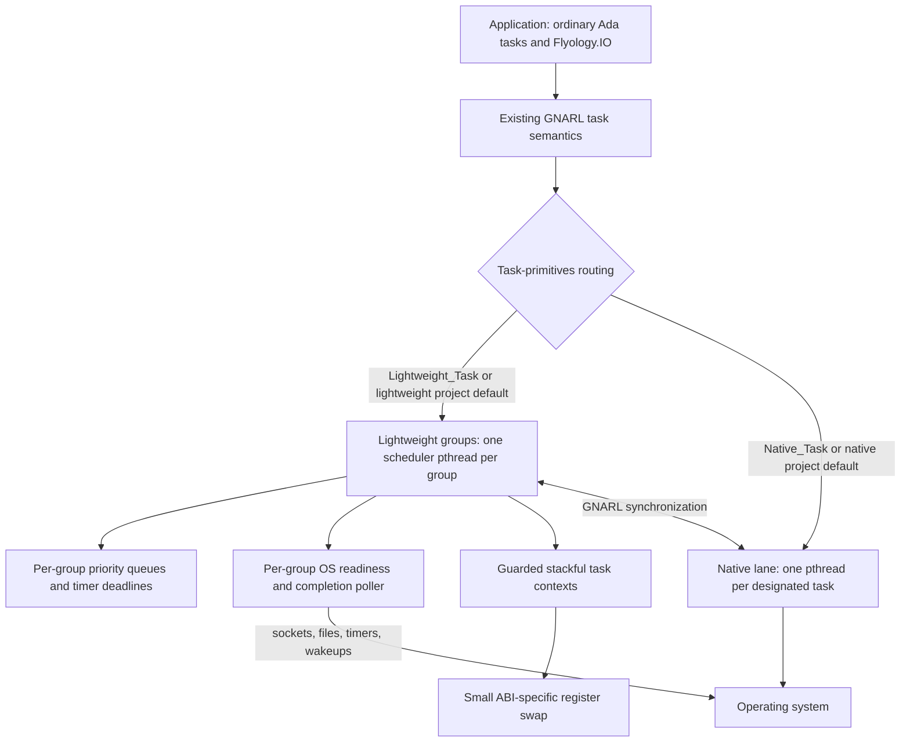
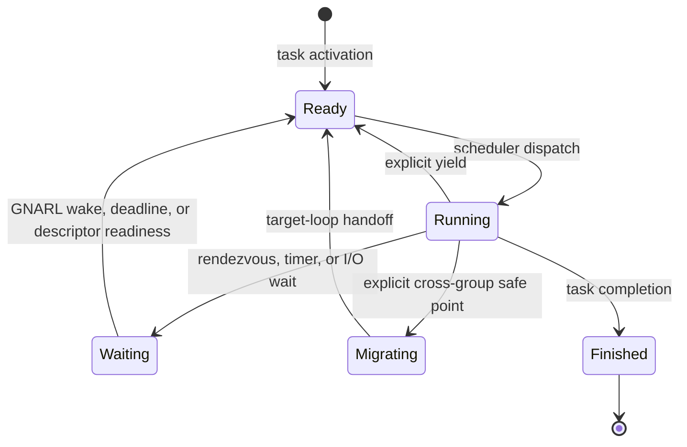

<p align="center">
  <picture>
    <source media="(prefers-color-scheme: dark)" srcset="assets/brand/flyology-horizontal-lockup-dark.svg">
    <source media="(prefers-color-scheme: light)" srcset="assets/brand/flyology-horizontal-lockup.svg">
    
  </picture>
</p>

<p align="center">
  <a href="https://github.com/flyology-ada/flyology/actions/workflows/ci.yml"></a>
</p>

<p align="center">
  <a href="https://flyology.org/">Guide</a> ·
  <a href="https://flyology.org/architecture/">Architecture</a> ·
  <a href="https://flyology.org/api/">API reference</a>
</p>

Flyology adds an explicit lightweight execution lane to ordinary Ada tasking.
Selected tasks share event-loop pthreads as fibers while keeping Ada rendezvous,
protected objects, exceptions, task activation, masters, and normal
synchronous control flow. Undesignated tasks remain native by default, and
either lane can be selected explicitly. Flyology adds no `async` dialect; the
closest familiar comparison is an opt-in Ada analogue of Java virtual threads.

The name comes from Ada Lovelace's 1828 study of flight. Her letters from that
year describe examining bird anatomy, making wings from paper, silk, and
feathers, and planning a book she called *Flyology*. This history is documented
in a [study of Lovelace's early education](https://doi.org/10.1080/17498430.2017.1325297)
based on the surviving correspondence.

## Table of contents

- [Status](#status)
- [Programming model](#programming-model)
  - [Execution groups and live migration](#execution-groups-and-live-migration)
  - [Thread-per-core and ownership sharding](#thread-per-core-and-ownership-sharding)
- [Priority and real-time contract](#priority-and-real-time-contract)
- [Architecture](#architecture)
  - [GNARL integration boundary](#gnarl-integration-boundary)
  - [Context switching is not event polling](#context-switching-is-not-event-polling)
- [Concurrency primitives](#concurrency-primitives)
- [Task-aware I/O](#task-aware-io)
  - [Sockets and descriptors](#sockets-and-descriptors)
  - [TLS](#tls)
  - [DNS resolution](#dns-resolution)
  - [Connection lifecycle](#connection-lifecycle)
  - [Structured servers](#structured-servers)
  - [Timers](#timers)
  - [Regular files](#regular-files)
- [Runtime observability](#runtime-observability)
  - [Sampled stall watchdog](#sampled-stall-watchdog)
- [Process lifecycle](#process-lifecycle)
- [Design decisions](#design-decisions)
- [Ada, C, and assembly boundary](#ada-c-and-assembly-boundary)
- [SPARK proof boundary](#spark-proof-boundary)
- [Portability boundaries](#portability-boundaries)
- [Repository layout](#repository-layout)
- [Build and test](#build-and-test)
  - [Use as an Alire dependency](#use-as-an-alire-dependency)
  - [AddressSanitizer builds](#addresssanitizer-builds)
  - [CI and releases](#ci-and-releases)
- [Showcases](#showcases)
  - [Event-loop pool showcase](#event-loop-pool-showcase)
  - [Connection-density showcase](#connection-density-showcase)
  - [Cancellation-density showcase](#cancellation-density-showcase)
- [Performance snapshot](#performance-snapshot)
- [Current constraints](#current-constraints)
- [License](#license)

## Status

Flyology is experimental. This checkout is verified on macOS/AArch64 with
Alire `gnat_native` 16.1.0. Linux/AArch64 and Linux/x86-64 backends are present;
the repository CI configuration includes Linux jobs, while the native Docker
runner uses Linux/AArch64 by default on an Apple Silicon host. Hosted validation
status is reported by Actions. Runtime preparation is pinned to the exact host
and GNAT releases listed under [Build and test](#build-and-test) and fails closed
for an unverified combination.

The current patch family covers exact Alire `gnat_native` releases from 13
through 16. Linux/x86-64 supports 13.2.2, 14.1.3, 14.2.1, 15.1.2, 15.3.1,
and 16.1.0; Linux/AArch64 is validated with 16.1.0. macOS supports 13.2.2,
14.1.3, 14.2.1, and 16.1.0. The event backend is
`kqueue` on macOS and `epoll` plus `eventfd` on Linux. Lightweight tasks resume
through the small ABI-specific context switch described below.

## Programming model

An undesignated Ada task runs as a native task by default, preserving the
behavior expected by existing GNAT applications:

```ada
task Worker;
```

Lightweight execution is an explicit per-task designation:

```ada
task Connection is
   pragma Task_Info (Flyology.Lightweight_Task);
end Connection;
```

The prepared runtime has a project-wide default. Compatibility-oriented builds
omit the setting or select `native`; lightweight applications can opt in once for
the whole project:

```sh
FLYOLOGY_DEFAULT=native  ./scripts/prepare-rts.sh  # default when omitted
FLYOLOGY_DEFAULT=lightweight ./scripts/prepare-rts.sh
```

The environment task always remains native. No poller, scheduler context,
fiber stack, or event-loop pthread is created until activation of the first
lightweight child task.

An explicit `Flyology.Lightweight_Task` or `Flyology.Native_Task` always
overrides that project default. `Flyology.Project_Default` explicitly requests
the prepared default and is useful as a task-type discriminant:

```ada
task type Worker (Model : Flyology.Execution_Model) is
   pragma Task_Info (Model);
end Worker;

Lightweight : Worker (Flyology.Lightweight_Task);
Native  : Worker (Flyology.Native_Task);
Default : Worker (Flyology.Project_Default);
```

The designation is captured when each task object is created. GNAT's
`Task_Info` representation is target-specific, so Flyology supplies distinct
platform-specific values for explicit lightweight, explicit native, and project
default selection. This preserves the compiler/runtime ABI and avoids a
compiler fork.

Both forms remain Ada tasks and can rendezvous, use protected objects, and wait
on the same GNARL synchronization objects. The designation controls the task's
execution resource; it does not create a second tasking language.

### Execution groups and live migration

A lightweight task whose effective Ada CPU is `Not_A_Specific_CPU` is placed
automatically. The compatibility configuration has one loop and therefore
retains the original group-0 behavior. A prepared runtime can instead
distribute such tasks across a fixed pool with deterministic round-robin
tickets:

```sh
FLYOLOGY_LOOP_POOL_SIZE=4 \
FLYOLOGY_PLACEMENT=round_robin \
  ./scripts/prepare-rts.sh
```

Pool groups are created independently and lazily: configuration inspection
does not start them, and a four-loop configuration owns no event pthreads until
lightweight tasks are activated. `Flyology.Execution_Groups.Configured_Pool_Size`
and `Configured_Placement` report the compiled policy,
`In_Configured_Pool` classifies a group, and `Current` reports where the
calling lightweight task was actually placed. `Flyology.Observability.Snapshot` can
then inspect each created pool group without creating missing ones.

The standard Ada `CPU` aspect is an explicit override and selects that exact
shared event-loop group without consuming an automatic placement ticket. Tasks
with the same value share one loop pthread; different values use different loop
pthreads and can therefore execute in parallel:

```ada
task Parser with CPU => 1 is
   pragma Task_Info (Flyology.Lightweight_Task);
end Parser;

task Writer with CPU => 2 is
   pragma Task_Info (Flyology.Lightweight_Task);
end Writer;
```

Shared group identifiers are `0 .. 127`. Values `128 .. 255` are reserved for
runtime-created dedicated groups, so applying `CPU => 128` or greater to a
lightweight task fails activation with `Tasking_Error` rather than selecting a CPU.
The automatic pool is likewise limited to 128 shared groups. This interpretation
applies only after event-loop designation: an Ada `CPU` aspect on a native task
continues through stock GNARL's processor-affinity path.
Ada D.16 CPU inheritance is also preserved: a task without its own aspect but
activated by a task with an assigned CPU inherits that effective assignment and
therefore stays on the inherited group rather than entering the automatic pool.

Automatic placement, explicit `CPU` selection, and live migration are separate
decisions. Placement chooses an event loop at activation, `CPU` overrides that
choice, and `Migrate` changes the current group later at an explicit safe point.
By default none of these pins the group's pthread; the operating system may
schedule it across processors.

Loop-thread placement is a fourth, explicitly separate policy. Linux can bind
a group pthread to one zero-based OS logical-CPU id and verifies the effective
mask after `pthread_setaffinity_np`. The value is not an Ada `CPU` aspect: that
aspect names a logical Flyology group. Darwin has no public hard-core binding.
Where its kernel supports `THREAD_AFFINITY_POLICY`, Flyology instead exposes a
positive advisory tag for cache locality; a tag is never reported as a CPU.
Current Apple-silicon Darwin returns `KERN_NOT_SUPPORTED`, which the capability
query and runtime preparation report rather than pretending that a hint was
applied.

Configure a group before its lazy startup, then inspect whether the request is
pending, applied, failed, or unavailable:

```ada
if Groups.Placement_Supported (Groups.Strict_CPU)
  and then Groups.Placement_Value_Available (Groups.Strict_CPU, 3)
then
   Result := Groups.Configure_Loop_Thread
     (Group => 1, Kind => Groups.Strict_CPU, Value => 3);
end if;

Status := Groups.Loop_Thread_Status (1);
```

The same request is idempotent after startup. A different request or clearing
the request after group creation reports `Group_Already_Started`; the scheduler
never moves a live loop pthread behind the application's back. Configuration
and lazy creation serialize on the topology lock, so a race has one of two
complete outcomes: configuration wins and is applied before startup publishes,
or startup wins and configuration is rejected. Groups `128 .. 255` can be
preconfigured in the same way before `Create_Dedicated` claims them. Migration
to a placed group naturally resumes on that group's already-placed pthread.
Native-task `CPU` affinity remains entirely on stock GNARL's path.

`Flyology.Execution_Groups` also provides an explicit safe-point migration API:

```ada
declare
   package Groups renames Flyology.Execution_Groups;
   Home      : constant Groups.Group_Id := Groups.Current;
   Dedicated : Groups.Dedicated_Group_Id;
begin
   Groups.Migrate (Groups.For_CPU (2));

   Dedicated := Groups.Create_Dedicated;
   Groups.Migrate (Dedicated);
   Blocking_Foreign_Call;  --  this task now owns the loop pthread

   Groups.Migrate (Home);
end;
```

Migration returns on the destination pthread without changing Ada task
identity, its stack, locals, exception state, master, or rendezvous semantics.
The source scheduler performs the actual handoff only after the fiber has fully
switched away, so two loops can never restore one context concurrently.

Ada task identity is not OS-thread identity. Lightweight tasks in one group share
that group's pthread and therefore also share C `pthread_key` values, signal
masks, per-thread foreign-library caches, locale state, and other pthread-local
state. A yield stays on the same group pthread, but migration changes all of
that thread-local context even though the Ada task itself is unchanged.

Code holding a thread-affine foreign resource can prevent that change with a
scoped pin:

```ada
declare
   Pin : Groups.Thread_Pin := Groups.Pin_To_Current_Thread;
begin
   Use_Thread_Affine_Handle;
   --  A Groups.Migrate call to another group raises Migration_Error here.
end; -- Pin is deterministically released, including during exception cleanup
```

Pins nest safely, and migration remains disabled until the outermost pin is
finalized. A pin is owned by the Ada task that acquired it and must be finalized
by that same task; the intended use is a task-local lexical scope as above. A
pin stabilizes the event-loop pthread; it does not give the task exclusive use
of that pthread, so unrelated fibers in the group still share its pthread-local
state. Use a dedicated group as well when a foreign resource requires both
stable identity and exclusive access. Native tasks accept the same API as an
inherent no-op because GNARL already fixes each native task to its own pthread.
`Is_Thread_Pinned` reports both explicit lightweight pins and this inherent native
binding.

A dedicated group is a reusable event loop reserved for one fiber. Operationally
it gives that task an OS thread to itself, which is the safe live transition for
temporarily blocking foreign work. A stock `Native_Task` task remains fixed at
creation: its continuation lives on a pthread-owned stack and cannot be
teleported into a fiber without replacing GNARL task identity and lifecycle.

The reservation is consumed when its task migrates out, immediately making the
empty lane reusable. Call `Create_Dedicated` again before re-entering it; if no
other task claimed the lane, the API normally returns the same group id.

### Thread-per-core and ownership sharding

Flyology execution groups can support a thread-per-core-shaped architecture:
configure a shared group for each application shard, optionally place each
group's loop pthread, and keep a shard's mutable state in tasks that run on that
group. The group is the stable scheduling and ownership domain. It is not a
physical-core identifier. Configured groups start lazily, and the operating
system may move an unplaced loop pthread between processors.

`Flyology.Execution_Groups.Topology` maps a key deterministically into the
configured shared pool and gives an explicit name to an ownership-boundary
crossing:

```ada
with Flyology.Execution_Groups;
with Flyology.Execution_Groups.Topology;

declare
   package Groups renames Flyology.Execution_Groups;
   package Topology renames Flyology.Execution_Groups.Topology;
   Target : constant Topology.Shard_Id :=
     Topology.Shard_For_Hash (Request_Hash);
begin
   Topology.Cross_To_Shard (Target);
   pragma Assert (Groups.Current = Target);
   Handle_Owned_State;
end;
```

The default mapping is `Hash mod Configured_Pool_Size`. The pool size is
compiled into the prepared runtime and does not change while a process is
running. Preparing another runtime with a different pool size can remap keys.
The overload taking an explicit `Shard_Count` is available when an application
must keep a stored partitioning scheme independent of loop configuration.
Crossing targets are limited to configured shared-pool ids; dedicated groups
are not shards in this policy.

Migration alone does not make arbitrary data share-nothing. The application
must assign each mutable object to a shard and arrange that only its owner
mutates it. Ada task entries, protected message queues, or task-aware sockets
can carry cross-shard work. A native task can send those messages but cannot
migrate; a lightweight task can either send a message remotely or cross at the
explicit safe point. GNARL and the runtime still use synchronization internally,
so this architecture is not a claim that the process executes without locks.

Each group has its own ready queues, deadline heap, descriptor index, poller,
and stable loop pthread. There is no implicit work stealing between groups;
automatic placement and explicit crossings determine ownership. Topology
changes still use the short-held global topology lock. Within a group,
scheduling remains cooperative: CPU work must suspend or call a fairness
checkpoint, and an arbitrary blocking foreign call can stop every task on that
loop. Use Flyology's task-aware I/O or an explicit native-task boundary for
blocking work.

Linux `Strict_CPU` placement can bind a loop pthread to one available logical
CPU. This may be used to construct a pinned layout, but it does not identify a
physical core and it does not reserve that CPU from other processes. Darwin
offers only advisory affinity tags where supported; current Apple-silicon
Darwin reports them unavailable. `Current` remains the authoritative group
identity, while `Current_Processor` is only optional host observation.

The runnable showcase creates one task-owned counter per configured shard,
routes work from both native and lightweight callers, and explicitly crosses a
lightweight caller through every shard:

```sh
./showcases/run_thread_per_core.sh 4 1000
```

The same Flyology I/O call also works from either kind of task:

```ada
Flyology.IO.Timers.Sleep_For (0.050);
Flyology.IO.Sockets.Receive (Socket, Buffer, Last, Timeout => 1.0);
Flyology.IO.Files.Read_At
  (File, Offset => 0, Item => Buffer, Last => Last);
```

In a lightweight task, these calls suspend only the current Ada task. In a native
task, they may block only that task's pthread. Values, `out` parameters, local
variables, exception propagation, and call stacks behave like normal
synchronous Ada code in both cases.

## Priority and real-time contract

Task priorities retain two deliberately different implementation domains. An
undesignated or explicitly `Native_Task` task stays on stock GNARL's pthread
path: Flyology does not intercept its kernel scheduling policy, priority, CPU
affinity, or priority-change calls. The host GNAT runtime and operating system
therefore keep their normal behavior, permissions, and limitations.

For a lightweight task, Ada active priority orders fibers **within its current
execution group**. Every group selects the highest non-empty priority bucket;
tasks of equal priority run FIFO. The state transitions are precise:

| Priority change while the lightweight task is… | Scheduler effect |
| --- | --- |
| Ready | Remove from the old bucket and append to the new bucket in constant time |
| Waiting | Record the active priority; the next wake enters that priority's bucket |
| Running | Record the active priority; it takes effect at the next suspension or yield |
| Migrating | Preserve the active priority and use it when the target loop accepts the task |
| Losing rendezvous-inherited priority | If the next handoff is a yield on the same loop, enter the head of the base-priority bucket as required by RM D.2.2(9); a wait, migration, or finish consumes that intent without carrying it to a later wake or another group |

`Ada.Dynamic_Priorities.Set_Priority` remains the standard public operation. A
self-change reaches GNARL's normal dispatching point, which yields the lightweight
task after the runtime update. GNARL's rendezvous priority boost is also routed
into the lightweight scheduler, so a low-base-priority acceptor runs at the caller's
inherited active priority and returns with the specified loss-of-inheritance
queue placement. Head placement describes entering a ready queue now; it is not
a durable preference. A server that blocks after losing inheritance was never
inserted in that queue, so its later wake uses normal FIFO placement. The
deterministic `priority_semantics_smoke` test covers ready, waiting, running,
rendezvous, loss followed by blocking, and cross-group migration cases; the
`priority_scheduling` showcase prints the visible highest-priority/FIFO trace.

This is fixed-priority cooperative scheduling, not a hard-real-time claim:

- Priorities do not preempt arbitrary lightweight instructions. A task that does
  not suspend or yield can delay even a newly ready higher-priority peer.
- Priority order is local to one loop. Separate groups execute on separate
  pthreads, so there is no process-wide total order between their ready queues.
- The loop pthread is not raised and lowered to mirror each fiber's active
  priority. `FIFO_Within_Priorities` and `Round_Robin_Within_Priorities` kernel
  policies, deadline dispatching, budget enforcement, and bounded preemption
  are not implemented for lightweight tasks.
- `CPU` chooses an event-loop group. Physical loop-thread placement is a
  separate opt-in policy; unconfigured groups remain OS-scheduled.
  Native-task CPU affinity remains stock.
- Protected-object mutual exclusion and language-level rendezvous still come
  from GNARL. Successful maximum-ceiling protected actions are covered by the
  native/lightweight semantic suite, but kernel priority-ceiling violation checks,
  priority inheritance through arbitrary pthread/foreign locks, and bounded
  priority inversion are not a lightweight guarantee. Potentially blocking work
  remains unsuitable inside a protected action.

Applications needing OS `SCHED_FIFO`/`SCHED_RR`, physical affinity, a
preemption bound, or certified ceiling behavior should keep those tasks native
and validate the target GNAT/OS real-time configuration. Lightweight priorities are
useful for deterministic service preference among cooperative tasks on one
loop, especially at high I/O concurrency; they are not a substitute for that
configuration.

## Architecture



### GNARL integration boundary

Flyology integrates at `System.Task_Primitives.Operations`, below GNARL's task
semantics. The patched task primitives route each task to one of two execution
lanes:

- Lightweight tasks receive a guarded stack and a resumable execution context. Each
  execution group has a priority-aware ready queue, poller, and scheduler
  pthread. The environment task remains a normal GNARL task; even group 0 owns
  a separate scheduler pthread created on first lightweight-task activation.
- `Native_Task` tasks use the normal pthread-backed path.
- Alternate signal stacks are owned by OS threads. Native tasks retain GNARL's
  per-pthread stack, while each event-loop pthread installs one permanent stack
  shared by its fibers. `Task_Wrapper` therefore does not reserve GNARL's 32 KiB
  alternate-stack local inside every lightweight task stack. Stack sizing still
  retains GNARL's conservative alternate-stack allowance; removing the local
  changes touched pages, not the requested task's established headroom.
- Lightweight stacks are mapped in arenas of at most 64 slots, targeting 4 MiB
  before the final guard. Each usable stack is preceded by an inaccessible guard
  of at least 64 KiB, rounded to the host page size. Adjacent stacks share that
  interior guard region. A released slot is protected before reuse and receives
  best-effort page-discard advice; a completely empty arena is unmapped instead
  of becoming an historical-peak cache.
- Synchronization between the lanes still passes through GNARL. A native task
  wakes the event-loop scheduler through `EVFILT_USER` on macOS or `eventfd` on
  Linux.

Keeping the integration below GNARL is what lets existing Ada task syntax and
semantics survive. Reimplementing rendezvous or protected objects would create a
parallel runtime with subtly different behavior; Flyology deliberately avoids
that.

At normal process finalization, GNARL first completes task masters, terminates
remaining library-level tasks according to Ada rules, and finalizes controlled
library objects. Flyology then reaps any already-finished static task fibers,
wakes and joins quiescent loop pthreads, and releases their pollers, contexts,
timer heaps, locks, and group records. It never tears these resources down while
a fiber can still run: if the final registry is unexpectedly nonempty after a
bounded final-reap grace period, cleanup is marked deferred and left to the
operating system at process exit.

### Context switching is not event polling

These are independent mechanisms with different jobs:

| Mechanism | Purpose | Current implementation | Portability boundary |
| --- | --- | --- | --- |
| Context switching | Save one lightweight task's CPU/stack state and resume another | Guarded stacks plus a small ABI-specific register-swap routine for AArch64 and x86-64 on macOS or Linux | ABI and architecture |
| Event polling | Sleep until socket readiness, file completion, a timer deadline, or a cross-thread wake | `kqueue` with `EVFILT_AIO`/`EVFILT_USER` on macOS; `epoll` with `io_uring`/`eventfd` on Linux | Operating system |
| Scheduling | Choose which runnable Ada task executes next | Ada priority-ready queue and deadline bookkeeping | Runtime policy |

The poller discovers readiness; the context machinery preserves a suspended
Ada task's call stack and makes resumption look like an ordinary procedure
return. Scheduling connects those two mechanisms without exposing either one
in application code.

The scheduler state transition is:



Scheduling inside the lightweight lane is cooperative. A CPU-bound task must reach a
runtime suspension or yield point; otherwise it owns the loop. A native task is
the intended designation for code that blocks unpredictably, invokes blocking
foreign libraries, or needs independent CPU execution.

`delay 0.0` is an explicit cooperative yield for a lightweight task. A permanently
runnable yielding task does not starve descriptors: after at most 64 dispatches,
the scheduler promotes expired timers and drains up to 64 immediately available
poll events in one batched `kevent` or `epoll_wait` call before returning to the
ready queue.
Both budgets are explicit policy, keeping I/O moving without allowing a hot
descriptor set to monopolize the loop in the opposite direction.

CPU loops can make that policy reusable with a time-budgeted checkpoint:

```ada
Budget : Flyology.Fairness.Yield_Budget;

Budget.Configure (Ada.Real_Time.Microseconds (250));
while More_Work loop
   Process_One_Item;
   Budget.Checkpoint;
end loop;
```

`Checkpoint` reads the monotonic clock and performs `delay 0.0` only after its
quantum expires. It works for both task designations: a lightweight task gives its
loop peers a turn, while a native task offers its pthread to the OS scheduler.
It deliberately does not interrupt arbitrary Ada instructions; code that never
calls a runtime suspension or checkpoint remains cooperative and can still own
the loop until it returns.

## Concurrency primitives

Flyology supplies a small coordination layer for bounded work. These packages
use ordinary Ada protected entries and task scopes; they do not introduce an
executor, detached tasks, or a second scheduling model. A protected entry wait
suspends a lightweight task cooperatively and retains normal GNARL behavior for
a native task.

`Flyology.Capacity.Gate` admits a fixed number of concurrent holders. It offers
blocking, nonblocking, and timed acquisition, terminal shutdown, waiter and
active counts, and a drain barrier. `Flyology.IO.Connections.Server` is a
source-compatible subtype of this general gate, so connection admission and
application capacity control share the same implementation. The caller remains
responsible for pairing every successful acquisition with `Release`.

`Flyology.Channels.Bounded` is generic over a definite element type. Each
channel is a fixed-storage MPMC FIFO with blocking and nonblocking operations,
relative-deadline wrappers, current-state snapshots, and terminal close-and-
drain behavior. Closing rejects queued and later senders but preserves FIFO
delivery of values already accepted. The channel owns no task and performs no
allocation after elaboration.

```ada
package Jobs is new Flyology.Channels.Bounded (Job);

Queue : Jobs.Channel (Capacity => 256);

Queue.Send (Next_Job);
Queue.Close;
Queue.Await_Drained;
```

`Flyology.Worker_Pools` builds a one-shot structured worker scope on that
channel. Its generic parameters fix the worker callback, lightweight/native
designation, and CPU or execution-group selection. `Run` creates exactly the
configured worker count and does not return until shutdown closes the queue,
accepted jobs drain, and every dependent task joins. Callback failures close
admission, request the shared cancellation token, retain the first exception,
and are reported as `Pool_Failed` after the workers join. The shared context
must provide its own synchronization when workers can execute concurrently.

`Flyology.Cancellation.Token.Await_Request` provides a protected-entry wait for
task-only coordination. Descriptor-backed wakeup remains available through
`Wait_Source` when cancellation must participate in a socket or file wait; a
task-only request does not allocate an OS descriptor.

## Task-aware I/O

Flyology exposes synchronous operations in:

- `Flyology.IO.Timers`: relative and absolute sleeps.
- `Flyology.IO.Sockets`: connect, accept, partial/exact receive, and partial/all
  send operations.
- `Flyology.IO.Connections`: bounded admission, single-owner sockets,
  cancellation tokens, and descriptor-generation-safe close.
- `Flyology.IO.TLS`: provider-neutral nonblocking TLS sessions with owned
  sockets, shared deadlines, cancellation, and orderly shutdown.
- `Flyology.IO.Structured_Servers`: scoped listener ownership, bounded handler
  task pools, graceful drain, deadline cancellation, and failure propagation.
- `Flyology.IO.Files`: open, close, positional read, and positional write.
- `Flyology.IO.DNS`: A/AAAA resolution over task-aware UDP and TCP, without a
  resolver worker thread.
- `Flyology.IO`: descriptor waits and task-mode detection used by the packages
  above.

### Sockets and descriptors

`Flyology.IO.Sockets` owns its public `Socket_Type`, `IP_Address`, and
`Endpoint` types. Address values contain network-order octets, a host-order
port, and an optional IPv6 scope; they do not expose a platform `sockaddr`
layout. Socket handles have a private representation. `Native_Descriptor`
borrows the underlying descriptor. Handles are limited: Ada assignment cannot
copy an owner. `Move`, `Adopt`, and `Release` transfer ownership explicitly and
leave their source closed or invalid. Default-initialized handles are closed,
and `Is_Open` reports whether a handle currently owns a descriptor.

`Flyology.IO.Sockets.GNAT_Adapters` provides explicit transfers to and from
`GNAT.Sockets.Socket_Type`. Its `Adopt` and `Release` procedures invalidate the
source handle before returning, so integration cannot create two closing
owners for one descriptor.

The package also provides creation, bind, listen, option, numeric-address, and
immediate datagram operations. Applications therefore do not need
`GNAT.Sockets` to construct inputs for task-aware Flyology I/O. A narrow C shim
uses host headers for address conversion, socket constants, variadic descriptor
configuration, and `errno` capture; retry, timeout, cancellation, and exception
policy remain in Ada.

Socket operations use readiness, not callback delivery and not kernel
completion queues. The lightweight path is:


If the first system call succeeds, no suspension occurs. If it would block, the
task is parked and the scheduler runs other work. On readiness, the original
call resumes, retries the operation, and returns its result normally. A native
task uses `poll` for the equivalent wait, blocking its own pthread but not the
event-loop thread.

Descriptor registrations are one-shot so the resumed task owns the retry and
decides whether another wait is needed. Exact reads and complete writes loop
over partial progress while preserving a single deadline.

`Flyology.IO.Wait` and `Flyology.IO.Wait_Interruptibly` deliberately remain raw
integer-descriptor primitives. They do not own the descriptor or prevent a
concurrent `close(2)` from releasing its number for reuse; callers choosing
that compatibility layer must serialize descriptor lifetime themselves.

`Flyology.IO.Wait_Any` extends the same low-level contract to a bounded,
caller-provided array of read/write interests. It allocates neither in the
public library nor while registering a lightweight fiber, returns the exact array
index that became ready, and returns zero on timeout. Repeated descriptors and
separate read/write interests for one descriptor are valid; when multiple
entries are ready together the lowest index wins. The fixed limit of 32 keeps
per-fiber scheduler storage predictable and is intended for protocol engines,
not as a replacement for ownership-aware connection APIs.

Created and accepted Darwin sockets have `SO_NOSIGPIPE` applied before they are
exposed to the caller; Linux sends use `MSG_NOSIGNAL`. The nonblocking hot path
returns ordinary would-block and interrupted results to Ada instead of raising
and resolving exceptions for expected retry conditions. Native `poll(2)` waits
retry `EINTR` with a recomputed remaining monotonic deadline.

### TLS

`Flyology.IO.TLS` owns TLS orchestration but not cryptography. An application
passes a provider object when it transfers a connected socket into a limited
TLS connection. The connection becomes the socket's sole closing owner. It
serializes provider calls, maps `Want_Read` and `Want_Write` to the same
`kqueue`/`epoll` readiness waits used by plain sockets, and keeps one monotonic
deadline across every retry. A lightweight task suspends on its event loop; a
native task blocks only its pthread.

The shipped `Flyology.IO.TLS.OpenSSL` adapter supports OpenSSL 3.x. It loads
`libssl` and `libcrypto` at run time, so building or linking Flyology does not
require a TLS library. Applications may select an installation directory when
initializing a provider and may use different provider objects for different
connections. The directory must contain a matched OpenSSL 3 library pair;
the adapter verifies that `libssl` is bound to the selected `libcrypto`, and
OpenSSL 1.x and 4.x are rejected. Code modules and provider contexts remain
loaded only while a provider or one of its sessions retains them. A session
therefore remains usable after its provider object is finalized.

Client configuration is secure by default and has no insecure mode: it verifies
the peer chain, sends SNI, and verifies the requested DNS hostname. An empty CA
path selects OpenSSL's default trust store. Server configuration requires a PEM
certificate chain and matching private key. The shipped server adapter does not
request client certificates. Provider initialization synchronously loads code,
trust data, certificates, and keys, so it should run before event loops start or
from a native task. Flyology neither reads TLS records itself nor contains
cryptographic primitives.

The adapter boundary is public. A downstream crate can implement another
provider by returning nonblocking `Complete`, `Want_Read`, `Want_Write`,
`Peer_Closed`, or `Failed` steps. Flyology currently tests only OpenSSL 3.
`tlsada`/libtls remains a possible downstream adapter but would add an Alire and
system-libltls dependency. wolfSSL remains possible downstream under its
GPL/commercial licensing terms. OpenSSL states that releases from 3.0 onward
use [Apache License 2.0](https://openssl-library.org/source/license/); its
nonblocking guide documents the
[`WANT_READ`/`WANT_WRITE` contract](https://docs.openssl.org/master/man7/ossl-guide-tls-client-non-block/).

`Shutdown` completes the bidirectional `close_notify` exchange under one
deadline. `Close` is separately idempotent: it wakes and drains any active
operation, destroys provider session state, and only then closes the socket.
Cancellation never releases provider-owned state while a provider call is
active. Leader cleanup runs in an abort-deferred controlled finalizer, so an
aborted closer cannot leave the connection permanently closing. A peer
transport close without `close_notify` is a `TLS_Error`.
Calls queued behind another operation on the same TLS connection retain the
same original deadline. They accept the shared `Flyology.Cancellation.Token`
and notice either a token request or a concurrent close within a 10 ms
scheduling quantum; active provider readiness waits use wake descriptors and
do not poll at that quantum. Each queued call retains the connection generation
it observed at entry and is cancelled if the object is closed and reused before
acquisition.
On Linux, each OpenSSL call temporarily blocks `SIGPIPE` on its pthread, removes
one newly pending signal when none was pending before the call, and restores the
exact prior mask before returning to Ada. Darwin applies `SO_NOSIGPIPE` to the
owned socket. A task never suspends while the temporary Linux signal mask is
installed.

### DNS resolution

`Flyology.IO.DNS.Resolve` is an in-tree Ada stub resolver. Numeric addresses and
`localhost` return without opening a socket. Other names use numeric servers,
search domains, `ndots`, attempt counts, timeouts, and rotation read from
`/etc/resolv.conf` through `Flyology.IO.Files`, so a lightweight caller parks while
the kernel-completion backend reads the configuration. `Resolve` accepts an
alternate configuration path for isolated deployments and tests; numeric
IPv4 `address:port` and bracketed IPv6 `[address]:port` server entries are a
Flyology extension. `Resolve_Using` accepts explicit numeric endpoints for
split-DNS applications and deterministic tests.

Each attempt sends a nonblocking UDP query to one configured server and parks
the calling task on the socket, deadline, and optional cancellation descriptors
in one wait set. Replies must match the connected source, transaction ID,
question name, type, and class. Transaction IDs come directly from OS entropy
for every query—there is no fork-repeated pseudo-random stream—and entropy
failure stops resolution rather than weakening validation. The bounded parser
handles compressed names,
A/AAAA records, CNAME chains, NXDOMAIN/NODATA negative TTLs, malformed packets,
and compression or alias loops. A truncated UDP reply retries the same query
over task-aware TCP within that server's attempt budget, so a silent TCP
primary does not hide a healthy secondary. Server order remains part of the
split-DNS cache identity. `Any_Family` reserves finite-deadline time for A when
AAAA transport is silent. Cancellation covers connect, send, and receive. A
64-entry process-local LRU cache honors bounded positive and negative TTLs and
owns no descriptors, tasks, or shutdown resources; cache hits retain remaining
TTL when composing CNAME aliases.

This is deliberately DNS, not libc `getaddrinfo` parity. It does not consult
arbitrary NSS modules, LDAP, platform mDNS/Bonjour databases, or non-localhost
`/etc/hosts` entries, and it does not validate DNSSEC. The resolver accepts up
to four configured name servers, returns up to sixteen addresses, bounds UDP
packets to 4096 bytes and TCP replies to 16 KiB, and caps cached TTLs at one day.
Applications that require platform identity-service semantics should perform
that lookup on an explicitly native task.

### Connection lifecycle

`Flyology.IO.Connections.Server` puts a bounded admission gate in front of
socket ownership. `Take` transfers an existing socket into a limited
`Connection`; `Accept_Connection` acquires capacity before accepting from the
listener, so overload remains in the kernel backlog instead of becoming an
unbounded user-space task or socket queue.

```ada
Manager : aliased Flyology.IO.Connections.Server (Capacity => 256);
Owned   : Flyology.IO.Connections.Connection;

Manager.Accept_Connection (Listener, Owned, Peer);
Owned.Receive_Exactly (Request);
Owned.Send_All (Response);
```

The limited owner cannot be copied and closes its socket while releasing the
admission permit during explicit `Close`, normal scope exit, or exception
unwinding. Each adoption receives a monotonically wrapping generation tag. A
concurrent `Close` signals that generation's private wake source, waits for its
active operation to remove every poller registration, and only then releases
the OS descriptor. The kernel therefore cannot reuse an integer while an old
generation can still act on its readiness. An in-flight operation interrupted
by close raises `Operation_Cancelled` in both native and lightweight lanes.

A connection admits one socket operation at a time. Additional operations queue
at the owner rather than registering duplicate waits, which gives
same-descriptor waiting bounded, exclusive semantics instead of a thundering
herd. Independent connections remain fully concurrent. The `Server` object
must outlive its admitted owners.

Operations register both an optional per-operation `Cancellation_Token` and the
server shutdown source in the same kernel wait as the socket. A token request
or `Request_Shutdown` signals the persistent nonblocking descriptor borrowed by
registered operations: native tasks observe it in `poll`, while lightweight
tasks observe it through their loop's `kqueue`/`epoll` poller. A task-only
request allocates no descriptor. The suspended call resumes immediately without
closing the connection descriptor and without periodic timer wakeups. One
signal wakes all operations registered with that source.

The raw I/O boundary represents these independent wake descriptors as an
`Interrupt_Set` rather than fixed close/shutdown/token parameters. This keeps
owner-specific policy in `Connections`, TLS, and other structured layers while
allowing low-level callers to compose a bounded set of lifecycle sources. Raw
waits observe set members for readability but never consume or close them.

`Flyology.Cancellation.Token` is the canonical one-shot token shared by
connection and file I/O. `Connections.Cancellation_Token` and
`Files.Cancellation_Token` are source-compatible subtypes of it, and both
packages rename the same canonical `Operation_Cancelled` exception. A
structured handler can therefore pass its existing connection token into a
file operation, and either package-qualified exception name catches cancellation
from either I/O domain.

`Cancellation_Quantum` remains in the API for source compatibility but is no
longer a polling interval and is ignored. Cancellation tokens and servers must
outlive operations waiting on their wake sources. `Request_Shutdown` also closes
admission, releases tasks queued at the capacity gate with `Admission_Closed`,
and causes active lifecycle I/O to raise `Operation_Cancelled`;
`Await_Drained` returns after all owners release. Raw `Flyology.IO.Sockets`
remains the lower-level mechanism when an application needs different ownership
or cancellation policy. Its explicit interrupt sets and the raw
descriptor-wait APIs are unsafe lifetime building blocks: callers retain their
ownership, close serialization, and wake-source lifetime responsibility.

### Structured servers

`Flyology.IO.Structured_Servers` is the application-facing orchestration layer
above `Connections`. It is generic over a limited handler context, a typed
handler procedure, and the handler task type's execution designation:

```ada
procedure Handle
  (State        : in out App_State;
   Connection   : in out Flyology.IO.Connections.Connection;
   Peer         : Flyology.IO.Sockets.Endpoint;
   Cancellation : not null access
     Flyology.IO.Connections.Cancellation_Token);

package HTTP is new Flyology.IO.Structured_Servers
  (Handler_Context => App_State,
   Handle          => Handle,
   Handler_Model   => Flyology.Lightweight_Task,
   Handler_CPU     => System.Multiprocessors.Not_A_Specific_CPU);

Server : aliased HTTP.Server (Capacity => 256);
HTTP.Serve (Server, Listener, State, Drain_Timeout => 5.0);
```

`Serve` takes ownership of an already-bound listening socket and leaves the
caller's limited handle closed. It creates exactly `Capacity` dependent Ada
handler tasks in a lexical task scope; each task accepts at most one connection
at a time, so accepted work cannot exceed the bound and overload remains in the
kernel listen backlog. There is no detached task, hidden worker thread, or
user-space connection queue. A native instantiation creates ordinary GNARL
native tasks backed by pthreads; a lightweight instantiation creates fibers on the configured loop
pool. The designation belongs to the instantiated task type and never changes
during a connection. `Handler_CPU` is also a task-type property: an explicit
value chooses an event group for lightweight handlers (or keeps normal Ada CPU
semantics for native handlers), while `Not_A_Specific_CPU` uses the configured
automatic event-loop pool or stock native placement.

The handler context is one shared limited object, not one copy per connection.
With `Capacity > 1`, callbacks may use it concurrently and native handlers may
do so in parallel on different pthreads. Mutable context therefore belongs
behind protected operations, atomics, or an application-defined lock. The pool
is eager for the duration of `Serve`: even an idle server owns `Capacity` tasks,
so the bound is also an explicit resource choice (especially for native tasks).

Shutdown has two explicit phases. `Request_Shutdown` is idempotent and wakes
idle accepts without cancelling admitted connections. Existing handlers drain
normally until the `Serve` call's monotonic `Drain_Timeout`. If that deadline
expires, the package signals both the handler cancellation token and the
connection manager; tasks blocked in connection I/O resume with
`Operation_Cancelled`. Arbitrary CPU code remains cooperative and must inspect
the token's `Requested` query at its own safe points. The listener is closed
only after every accept has left the poller and every handler has terminated,
so its descriptor cannot be reused by a stale waiter.

A shutdown request made before the one allowed `Serve` call is retained. That
call still takes and safely closes the listener, creates and joins its bounded
task scope, and admits no connections; a `Server` object is deliberately
one-shot rather than restartable.

A handler or admission exception stops further admission, is retained in the
server snapshot and `First_Failure_Information`, and is re-raised to the
`Serve` caller as `Server_Failed` after the whole scope is joined and the
listener is closed. The snapshot also reports active, accepted, completed, and
cancelled counts plus whether deadline cancellation was needed. Thus no handler
outlives `Serve`, its context, the server object, or their Ada master.

An aborted backlog entry or protocol-level admission error is retried rather
than treated as a server failure. Process-wide or system-wide descriptor
exhaustion uses exponential backoff capped at 50 milliseconds; shutdown and
other cancellation wake that backoff. Listener state errors such as an invalid
descriptor remain structural failures and stop the server.

The structured guarantee applies to `Serve`. Direct use of `Connections`, raw
socket operations, interrupt descriptors, and descriptor waits remains
deliberately unstructured: those APIs are compatibility/building blocks whose
callers own task scopes, wake-source lifetime, shutdown ordering, and close
serialization themselves.

The structured smoke program is also compiled and linked against the
ASan-aware RTS. It is not executed under ASan on Darwin because orderly server
shutdown necessarily propagates and catches `Operation_Cancelled` on a lightweight
stack, which crosses the fully instrumented Ada exception-propagation boundary
called out in [AddressSanitizer builds](#addresssanitizer-builds). Ordinary
macOS and Linux runs exercise those exception paths in both handler lanes.

### Timers

A lightweight sleep records a scheduler deadline and suspends the current context.
A native sleep blocks only its pthread. Timer calls share one public API and use
monotonic time, so wall-clock changes do not alter elapsed waits.

Each loop stores finite deadlines in an indexed binary min-heap. Insertion and
cancellation are `O(log n)`, the next poll deadline is available in `O(1)`, and
expiration removes the minimum repeatedly without scanning unrelated fibers.
The index stored in each fiber also lets readiness, abort wakeups, and reaping
remove that fiber's deadline directly.

The earliest deadline becomes the timeout of the group's next `kevent64` or
`epoll_wait`; expiry therefore wakes the same event-loop syscall already used
for sockets and file completions. There is no timer thread and no per-task OS
timer object.

### Regular files

Regular files are not readiness-oriented: marking a regular descriptor readable
with `kqueue` or `epoll` does not make a potentially blocking `pread` safe on an
event-loop thread. Flyology therefore submits positional reads and writes to an
actual kernel completion facility and suspends only the calling Ada task.

- On macOS, POSIX AIO posts `EVFILT_AIO` completions directly to the execution
  group's kqueue. `kevent64` carries the XNU completion result and error back to
  the Ada scheduler.
- On Linux, each execution group owns an `io_uring`; its completion queue
  signals the group's existing eventfd, which is already watched by epoll. If
  setup is unavailable or forbidden, the kernel probe does not report `READ`
  and `WRITE`, or later ring initialization fails, Flyology releases the
  partial ring and uses Linux native AIO with `IOCB_FLAG_RESFD` and the same
  eventfd completion path.

Linux interfaces without ordinary libc functions cross a small typed C bridge.
Its syscall wrappers select `SYS_*` numbers from the target headers, and its
epoll wrappers translate the host's native `struct epoll_event` into an
eight-byte Ada-neutral event record. This keeps both AArch64's aligned epoll
record and x86-64's packed record out of Ada while leaving engine policy,
submission, completion handling, and scheduling in Ada.

Linux submission pressure is explicit backpressure: Flyology caps outstanding
`io_uring` SQEs at the kernel-reported completion-queue capacity, and a task
that cannot yet be submitted remains suspended in a per-group FIFO. The engine
also detects a kernel overflow backlog and asks `io_uring_enter` to flush it
before admitting more work. No Ada worker task, pthread pool, or blocking
`pread`/`pwrite` call is hidden behind the lightweight API. Native-designated
callers use direct positional syscalls. Explicit offsets avoid shared
file-position races in both lanes.

`Read_At` and `Write_At` accept the same shared optional cancellation token.
Cancellation is terminal rather than optimistic: the call never raises
`Operation_Cancelled` while the kernel can still access the caller's buffer.
It is not transactional. A cancelled `Write_At` may already have changed the
file; its `Last` out parameter is not meaningful when the exception propagates,
and blindly retrying can duplicate or overwrite data. Applications that retry
writes need their own idempotence or committed-offset protocol.
The scheduler serializes cancellation and ordinary completion under the owning
group lock and applies these states:

| State when cancellation is observed | Action | Safe resumption point |
| --- | --- | --- |
| Token already requested | No request is submitted | Immediate |
| Waiting for kernel queue capacity | Remove the request from the per-group FIFO | Immediate |
| Darwin POSIX AIO submitted | Call `aio_cancel`; distinguish `AIO_CANCELED`, `AIO_NOTCANCELED`, and `AIO_ALLDONE` | Immediate `EVFILT_AIO` deletion and `aio_return` for `AIO_CANCELED`; otherwise the normal terminal event |
| Linux `io_uring` submitted | Submit `IORING_OP_ASYNC_CANCEL`; consume its administrative CQE separately | The original operation's terminal CQE |
| Linux native AIO submitted | Call `io_cancel` | Its returned terminal `io_event` on success, otherwise the normal completion event |
| Cancellation unsupported, already completing, or not cancelable | Record the disposition and retain ownership | The normal completion event |

Completion and cancellation can become ready in the same poll batch. Whichever
the scheduler observes first selects the public result; in either order exactly
one terminal path wakes the fiber and exactly one path recycles the backend
request. Ada task abort uses the same cancellation state machine. Native tasks
retain their direct `pread`/`pwrite` behavior: a token is checked before the
syscall, but an already-running native syscall is not interrupted by a hidden
worker or polling thread.

`Open` and `Close` are still direct metadata syscalls because neither supported
platform provides an equivalent portable completion operation for them. They
normally complete quickly on local filesystems, but applications should isolate
potentially slow remote-filesystem metadata operations on a native task.
`File_Descriptor` remains a low-level scalar owner: callers must not invoke
`Close` concurrently with an operation and must retain the token, descriptor,
and buffer until the call has returned. The cancellation guarantee makes it
safe to join the operation and then close or reuse the descriptor; it does not
turn raw file descriptors into generation-tagged connection owners.

## Runtime observability

`Flyology.Observability` exposes a stable, read-only snapshot for each event
group. Calling `Snapshot` for a group that has never existed returns `False`
and does not create a pthread, poller, scheduler context, or any other event
runtime resource. A native-only application can therefore link and query the
package without losing lazy-start inertness.

```ada
declare
   Sample : Flyology.Observability.Group_Snapshot;
begin
   if Flyology.Observability.Snapshot (0, Sample) then
      Put_Line ("ready" & Sample.Ready'Image
                & " waiting" & Sample.Waiting'Image
                & " dispatches" & Sample.Dispatches'Image);
   end if;
end;
```

A snapshot reports thread startup state and whether the group is dedicated or
reserved; total and thread-pinned members; members in ready, waiting, running,
migrating, and finished states;
active timer, descriptor, interrupt-enabled, and file waits; file submissions queued behind kernel
backpressure; and lifetime dispatch, poll-batch, delivered-event, GNARL-wakeup,
and migration-in/out counters. Wait categories overlap: for example, a
descriptor wait with a deadline contributes to both `Descriptor_Waits` and
`Timer_Waits`; a connection wait also contributes to `Interrupt_Waits` when it
has a cancellation or shutdown wake source. `Pending_File_Submissions` is the subset of `File_Waits` not yet
accepted by the bounded kernel queue.

Topology and queue values are coherent at one instant: the runtime holds the
short topology lock and the selected group's scheduler lock while walking its
member list. Snapshot cost is therefore `O(group members)` and briefly delays
group creation or migration as well as scheduler queue maintenance; it is
intended for periodic diagnostics, not per-request instrumentation. Lifetime
counters are updated under the owning group lock, wrap modulo 2^64, and never
reset because groups are permanent.

`Made_Progress` compares two samples. A group with runnable or running work but
no dispatch or poll progress over the sampling interval is a useful loop-lag
signal; an empty waiting group with no progress is merely idle. This sampled
design avoids adding a monotonic-clock read to every dispatch. A policy-driven
stall watchdog is provided as an opt-in layer on these observations and is
deliberately not a runtime scheduling policy.

### Sampled stall watchdog

`Flyology.Observability.Stall_Watchdogs` can monitor one group from a dedicated
native Ada task. Merely declaring a `Watchdog` is inert. `Start` creates the
native monitor, but observing a group that does not exist still does not create
that group or any event-runtime resource. `Stop` waits for the monitor to exit;
the limited controlled object also stops it during finalization, and a stopped
object can be restarted.

```ada
declare
   Monitor : Flyology.Observability.Stall_Watchdogs.Watchdog;
begin
   Flyology.Observability.Stall_Watchdogs.Start
     (Monitor,
      (Group           => 0,
       Sample_Interval => 0.050,
       Stall_Threshold => 0.250));
   --  Poll Latest_Report from a service health or diagnostics task.
   Flyology.Observability.Stall_Watchdogs.Stop (Monitor);
end;
```

Reports distinguish an absent or starting group, an empty idle group, a group
whose members are waiting, an advancing group, runnable work that has not yet
crossed the threshold, a suspected stall, a failed event thread, and a stopped
or failed monitor. A suspected stall requires runnable or running work plus no
change to dispatch or polling progress for the configured threshold. Its
episode count is latched so a service can observe a transient stall after the
loop resumes.

This is a sampled diagnosis, not proof of deadlock. Each snapshot is coherent,
but work can arrive, yield, or finish between samples; detection latency is
quantized by `Sample_Interval`. The watchdog does not interrupt, migrate,
reprioritize, or otherwise preempt a monopolizing task. Sampling also retains
the snapshot operation's `O(group members)` cost and brief scheduler-lock hold,
so intervals should be diagnostic rather than per-request scale.

Fatal invariant paths retain a small `Last_Fatal` classification and write the
same category directly to standard error before `abort`. A live process normally
reports `No_Fatal`; the retained atomic scalar is chiefly postmortem context for
a crash handler or debugger and querying it takes no scheduler lock.

## Process lifecycle

`Flyology.Process_Lifecycle` exposes the event runtime's process-wide state and
the number of lazily created groups without starting a loop. A native-only
program reports `Dormant` and zero groups. The first lightweight task changes the
state to `Running`; successful GNARL process finalization changes it to
`Stopped` and returns the group count to zero. `Cleanup_Deferred` means Flyology
found state it could not safely tear down and deliberately left it to operating
system process exit.

Shutdown is intentionally not a public application operation. Ada masters,
task termination, and controlled-object finalization establish the only safe
global boundary; stopping a group earlier could invalidate a suspended task's
stack or an in-flight kernel file buffer. The event runtime is therefore
one-shot and cannot be restarted inside the same process. Higher-level servers
should stop accepting, cancel owned connections, and let their task scopes
finish normally.

`fork` does not clone the other pthreads of a multi-threaded process. GNARL and
Flyology mutex ownership, loop threads, pollers, and TLS therefore cannot be
continued safely in the child. Flyology records the process that initialized the
runtime: its lock-free lifecycle query reports `Fork_Child` after `fork`, and an
attempt to enter a scheduler lock fails loudly instead of waiting forever for a
vanished owner. The supported child path is the POSIX minimum: call only
async-signal-safe operations and then `exec` or `_exit`. After `exec`, the new
image initializes a fresh `Dormant` runtime. This restriction applies even when
the calling Ada task was native because stock GNARL is already multi-threaded.

Loop pthreads inherit the creator's signal mask. A signal handler may therefore
run on a loop pthread and interrupt the kernel wait; pollers treat `EINTR` as a
retry/no-event result. Application signal handlers must still obey normal
async-signal-safety rules and must not call Ada tasking or Flyology APIs.

## Design decisions

| Decision | Rationale | Consequence |
| --- | --- | --- |
| Keep ordinary Ada task syntax | Existing programs and GNARL semantics remain recognizable | No separate `async`/`await`, callback, or future API is required |
| Default to native execution, with a project-wide lightweight option | Existing tasking code keeps its blocking and parallelism assumptions while high-I/O projects can opt in once | Lightweight examples and mixed projects must designate their intended lane |
| Start event machinery on first use | A native-only program should not acquire a poller, scheduler context, fiber stack, or loop pthread merely because it links the custom RTS | The first lightweight task pays the one-time group startup handshake |
| Finalize loops only at GNARL's process boundary | Suspended stacks, in-flight file buffers, and Ada masters must outlive their tasks | There is no arbitrary shutdown/restart API; unsafe cleanup is deferred to OS exit |
| Keep native threads as a task designation | Some foreign calls, CPU work, and platform APIs genuinely need threads | The runtime is hybrid rather than ideologically thread-free |
| Place undesignated lightweight tasks through a build-time loop pool | High-I/O applications can use several event-loop pthreads without encoding a `CPU` aspect into every task declaration | The compatibility default remains one loop; round-robin balances task count rather than measured work |
| Map Ada `CPU` aspects to event-loop groups | Existing Ada syntax expresses task co-location without a second annotation system | On macOS the value selects a loop thread, but cannot hard-pin that pthread to a physical core |
| Configure loop pthread placement separately | Logical co-location and physical scheduling are different policies | Linux can verify a strict one-CPU mask; Darwin exposes only a capability-checked advisory cache tag, and requests become immutable once startup begins |
| Allow live fiber migration | Work can be rebalanced or moved to a dedicated blocking lane without changing task identity | Migration is explicit and occurs only at the API safe point |
| Integrate below GNARL | Rendezvous, protected objects, activation, and masters are already mature | The patch is coupled to the exact GNAT runtime source version |
| Hash ATCB addresses to fibers | Rendezvous wakeups and priority changes must not scan every lightweight task while holding the registry lock | Lookup and removal are constant-time on average; a prime-sized fixed bucket table avoids allocation in wake paths |
| Shard the task registry | Independent loops and native wake sources should not serialize every lookup on one process-wide mutex | 64 shard locks isolate ordinary wake and priority paths; group creation, reservations, migration, and destruction still coordinate through a short-held topology lock |
| Hash descriptor waiters per group | Readiness delivery must not scan every fiber once for every ready descriptor | Delivery is constant-time on average while collision chains retain same-descriptor reader/writer fan-out |
| Keep deadlines in per-group indexed heaps | Timer maintenance must scale with active deadlines rather than every fiber in a loop | Insert and arbitrary cancellation are logarithmic; earliest-deadline lookup is constant-time |
| Make CPU fairness explicit | Arbitrary signal-time preemption would cross Ada and GNARL critical regions at unsafe instructions | Time-budgeted checkpoints provide bounded cooperative slices where application invariants are known to be stable |
| Use stackful contexts | Normal calls, locals, `out` values, and exceptions survive suspension naturally | Each lightweight task still needs a virtual stack and ABI-specific switching code |
| Pack stacks into guarded arenas | Neighboring stacks can share one inaccessible boundary while allocation and reclamation remain arena operations | Every slot reserves a 64 KiB guard region; creation and reap briefly take one process-wide stack-pool mutex, empty arenas are unmapped, and partially occupied slots receive best-effort page-discard advice |
| Select ASan fiber annotations at RTS build time | AddressSanitizer must learn the real source and destination stack around a custom assembly transfer | Sanitized builds use LLVM's fiber interface; ordinary builds compile out every hook and sanitizer TLS object |
| Separate scheduler, context, and poller | CPU state, scheduling policy, and OS readiness are different concerns | New architectures and new OS pollers can be ported independently |
| Use readiness-and-retry I/O | It maps directly to nonblocking sockets and keeps control in Ada | Arbitrary blocking libc or foreign calls cannot be intercepted transparently |
| Use kernel-completion file I/O | Disk operations must not stall an event-loop pthread or require hidden workers | Darwin AIO and Linux `io_uring`/native AIO add platform ABI code, bounded submission queues, and backend-specific cancellation handshakes |
| Make connection lifetime explicit | High-density servers need a bound on accepted work and one authority to close each descriptor | Generation-tagged limited owners cancel and drain the exact active operation before releasing an OS descriptor for reuse |
| Keep TLS providers selectable | Readiness, deadlines, and descriptor ownership are Flyology policy; protocol and cryptography belong to maintained TLS libraries | OpenSSL 3 is the shipped adapter; other libraries implement the public provider boundary |
| Put runtime logic in Ada | Types, task coordination, errors, and policies remain inspectable in the target language | OS entry points are imported from C system interfaces; only register switching is assembly |
| Generate a static custom RTS | The experiment works without a compiler fork and can fail closed on mismatched sources | Builds require a matching installed runtime from the tested GNAT 13–16 family |

## Ada, C, and assembly boundary

Ada implements scheduling, queues, timeout and backpressure policy, descriptor
registration, stacks, task routing, and I/O retry logic. It imports the platform
primitives exposed through the C ABI, including `kqueue`/`kevent64`,
`epoll`/`eventfd`, `mmap`, `poll`, POSIX AIO, `syscall`, and socket calls. The
socket bridge marshals Flyology's portable endpoint values through host
`sockaddr` definitions and captures `errno`; it does not contain readiness or
retry policy. The
file engine itself is Ada: platform bodies define explicit representation
clauses for Darwin `aiocb` and Linux `io_uring`/native-AIO UAPI records, own the
mapped rings and control blocks, submit operations, and drain completions.

The shared Linux rings require acquire/release ordering against the kernel.
Flyology uses GNAT's `System.Atomic_Primitives` for atomic loads. GNAT 13 does
not expose the corresponding store operation, so the narrow C ABI shim calls
the compiler's `__atomic_store_n` intrinsic; no worker runtime is involved.

The OpenSSL adapter adds a C ABI table for dynamically resolved OpenSSL 3
functions. Ada owns session lifetime, readiness retry, timeout, cancellation,
and socket-close policy. The bridge translates provider return codes and does
not implement TLS records or cryptographic operations.

The only assembly is the minimal context swap needed to save and restore the
callee-saved machine state. Rewriting a system-call declaration in Ada would
not make the kernel implementation Ada; the useful boundary is to keep policy
and coordination in Ada while treating the OS ABI as a narrow platform layer.

## SPARK proof boundary

SPARK can cover the deterministic policy kernels without pretending that the
entire task runtime is currently proofable. `Flyology.Time_Math` implements the
timeout clamp used by socket retry loops and the nanosecond/millisecond
conversions used by event-loop and native descriptor waits. Its contracts cover
the infinite-timeout sentinel, non-expired timeout, expiration, remaining-time
cases, rounding up to poll milliseconds, and saturation at the `poll(2)` integer
limit.

The public-library proof boundary also covers native `poll` and `accept` result
classification, including `EINTR` retry and would-block handling. Socket policy
proves the IPv4/IPv6 and stream/datagram ABI encodings, maps host-supplied errno
constants to portable error kinds, and classifies receive/send retry and connect
completion decisions. The constants and syscall results remain inputs from the
C boundary; the decisions made from them are the proved production functions.
Regular-file policy proves open validation and exact Darwin
`O_RDONLY`/`O_WRONLY`/`O_RDWR`, `O_CREAT`, and `O_TRUNC` flag composition for
Darwin and Linux. The Ada import of variadic `open(2)` remains an ABI boundary
and uses GNAT's `C_Variadic_2` calling convention.

Production connection and TLS controllers consume proved decisions for lease
admission, generation replacement, waiter wakeups, close leadership, drain
completion, and open-state reporting. TLS buffer policy additionally proves
that provider progress is in range, that wait and peer-close results preserve
the caller's progress bound, that retry sentinels lie outside the active slice,
and that advancing a completed slice cannot overflow. Structured-server phase
changes use proved one-shot start, stop, handler/worker admission, terminal
drain, and snapshot classifications. Capacity gates and bounded channels use
proved admission, close/drain, counter, and circular-index transitions. Worker
pools likewise consume proved start, completion classification, worker join,
and terminal-state decisions. Resource destruction, task activation,
protected-object mutual exclusion, and provider calls remain outside SPARK.

The scheduler policy unit proves deadline classification and safe calculation
of the next poll timeout. It also proves earliest-deadline selection,
maintenance cadence, dispatch-counter safety, and the distinction between
immediate and deferred fiber destruction, including the in-flight `Migrating`
phase. Shared/dedicated group classification, dedicated-lane availability, and
migration admission are exact contracted functions used by the production
scheduler. One-based timer-heap parent/child arithmetic and descriptor-bucket
indexing are also proved before the scheduler uses them. Ready tasks live in one
FIFO bucket per bounded Ada priority: append, removal, and priority changes are
constant-time, while choosing the next non-empty priority scans only the fixed
`System.Any_Priority` range. Intrusive ready/timer link updates, heap ordering,
lock ownership, descriptor-generation matching, and the actual context handoff
remain outside SPARK.

Run the proof through the Alire-provided GNATprove toolchain:

```sh
./scripts/prove.sh
```

GNATprove is a dependency of the nested `proof` development crate, not of the
published Flyology library. Applications therefore do not download proof tooling
merely because they depend on the runtime API.

[scripts/prove.sh](scripts/prove.sh) prints the authoritative check totals in
its GNATprove success summaries; the totals change as contracts and policy
units evolve. Its final suite marker is emitted only after every selected proof
target succeeds, and CI checks that marker instead of a change-prone summary or
check count. A successful run proves every selected flow, functional-contract,
termination, and run-time-safety check with zero unproved checks. The current
boundary includes the loss-of-inherited-priority queue-placement choice. Good
next proof candidates are intrusive ready-bucket and timer-heap invariants, DNS
wire parsing and cache replacement, and descriptor wake-generation matching.

The GNARL tasking integration, imported system calls, address conversions,
assembly register swap, and kernel behavior remain trusted boundaries. These
can be wrapped in contracts, but GNATprove cannot establish their implementations
from this Ada source tree. `Socket_Type` is limited, so the Ada compiler rejects
implicit owner copies; explicit move and adapter behavior remains covered by
contracts and behavioral tests rather than a linear SPARK ownership proof.

## Portability boundaries

| Area | macOS | Linux | Remaining boundary |
| --- | --- | --- | --- |
| Descriptor poller | `kqueue` with `EVFILT_USER` | `epoll` with `eventfd` | Windows IOCP needs a completion-oriented adapter |
| Regular-file completion | POSIX AIO with `EVFILT_AIO` | Per-group `io_uring`; Linux native AIO fallback | Windows overlapped I/O/IOCP adapter |
| CPU placement | Stable pthread; capability-checked advisory tag only, with no physical-CPU claim | Stable pthread; optional verified one-CPU affinity mask | Windows processor-group adapter |
| Context switch | AArch64 and x86-64 assembly | AArch64 and x86-64 assembly | One small implementation per additional architecture/ABI |
| Stack allocation | `mmap` plus guard pages | `mmap` plus guard pages | Platform virtual-memory API |
| OS calls | Thin Ada imports plus a header-derived socket/address bridge | Thin Ada imports plus header-derived bridges for sockets, Linux syscall numbers, and epoll record padding | Per-platform binding body |
| GNARL hook | Versioned GNAT 13–16 Darwin patch | Versioned GNAT 13–16 Linux patch | Add and verify a new family when GNARL source changes |

The scheduler and public I/O semantics are intended to remain Ada and
platform-neutral. Pollers and context implementations are explicitly isolated
rather than hidden behind a claim of universal portability.

## Repository layout

- [`runtime/ada`](runtime/ada): platform-neutral scheduler, context, and poller
  interfaces.
- [`runtime/config`](runtime/config): project-default execution and generated
  automatic loop-pool policy selected while preparing the RTS.
- [`runtime/platform`](runtime/platform): `kqueue` and `epoll` poller bodies,
  plus the Ada platform file-engine implementations.
- [`runtime/native`](runtime/native): ABI-specific context-switch assembly and
  narrow C bridges for Linux syscall numbers and `epoll` record translation,
  thread placement, fork detection, virtual-memory operations, test fault
  hooks, and the GNAT 13 atomic-store compatibility shim.
- [`runtime/compat`](runtime/compat): version-selected bindings for runtime ABI
  differences such as the GNAT 16 `timespec` move.
- [`runtime/patches`](runtime/patches): versioned Darwin/Linux GNARL
  task-primitives integration and its tested-release manifest.
- [`src`](src): public task-aware I/O packages and the optional dynamic TLS
  provider bridge.
- [`tests`](tests): behavioral and semantic-parity programs covering tasking,
  I/O, lifecycle, stress, fault injection, sanitizers, and observability; the
  detailed scope is listed under [CI and releases](#ci-and-releases).
- [`showcases`](showcases): side-by-side scheduling and I/O demonstrations.
- [`scripts`](scripts): custom RTS construction, verification, and test runners.
- [`docker`](docker): native-architecture Linux validation Dockerfile.

## Build and test

Flyology supports Alire 2.1 or newer with the exact `gnat_native` releases shown
below:

| Host | Releases |
| --- | --- |
| macOS/AArch64 | 13.2.2, 14.1.3, 14.2.1, 16.1.0 |
| Linux/AArch64 | 16.1.0 |
| Linux/x86-64 | 13.2.2, 14.1.3, 14.2.1, 15.1.2, 15.3.1, 16.1.0 |

The crate declares a generic `gnat >=13 & <17` dependency so Alire can select a
compiler; runtime preparation then checks the exact host/release pair against
the versioned patch manifest and fails closed if it has not actually been
verified. Alire's Darwin GNAT 15 packages bundle a different
`s-taprop.adb` source shape and need a separate Darwin patch family before
they can be enabled. macOS/AArch64 and Linux/x86-64 are the hosted CI reference
targets; Linux/AArch64 is the native local Docker reference. The source also
contains the x86-64 macOS context switch, but that host/ABI combination is not
part of the hosted matrix.

Scripts use `ALR` when set, otherwise `alr` from `PATH`, with `~/alr` retained
as a compatibility fallback:

```sh
alr build
./scripts/prepare-rts.sh                       # native project default
FLYOLOGY_DEFAULT=lightweight ./scripts/prepare-rts.sh
FLYOLOGY_LOOP_POOL_SIZE=4 ./scripts/prepare-rts.sh
FLYOLOGY_LOOP_PLACEMENT=strict \
FLYOLOGY_LOOP_PLACEMENT_MAP=0:2,1:4 ./scripts/prepare-rts.sh  # Linux
alr exec -- gprbuild --RTS="$PWD/build/rts" -P path/to/application.gpr
```

Generate the public API reference with:

```sh
./scripts/docs.sh
```

The [documentation script](scripts/docs.sh) runs GNATdoc with
undocumented-entity warnings enabled and writes the ignored HTML output to
`docs/api/index.html`. It also builds a client-side name index for compilation
units, declarations, enumeration literals, record fields, formal parameters,
parameters, and exceptions. Search is case-insensitive and tolerates nearby
misspellings while ranking exact and prefix matches first. Build the complete
GitHub Pages artifact, including the guide, architecture notes, and generated
API reference, with:

```sh
./scripts/build-site.sh
node ./scripts/check-site.mjs build/site
```

The build script detects the exact active compiler release, selects its versioned patch
family and runtime ABI adapter, copies the matching installed runtime sources,
selects the project execution default, and builds a static RTS.
Set `FLYOLOGY_RTS_DIR` to put that generated runtime somewhere other than the
crate checkout. Relative values are resolved from the caller's current
directory; the resulting path is canonicalized before patching runtime files.
`FLYOLOGY_DEFAULT` accepts only `native` or `lightweight`.
`FLYOLOGY_LOOP_POOL_SIZE` accepts `1 .. 128` and defaults to `1`;
`FLYOLOGY_PLACEMENT` currently accepts `round_robin`.
`FLYOLOGY_LOOP_PLACEMENT` accepts `none`, `strict`, or `advisory`, and
`FLYOLOGY_LOOP_PLACEMENT_MAP` supplies unique `GROUP:VALUE` pairs. `strict` is
Linux-only; its values are zero-based OS logical CPUs in the process leader's
current allowed mask and preparation rejects unavailable values. `advisory` is
Darwin-only, requires positive tags, and is rejected on Apple-silicon hosts
where the kernel reports `THREAD_AFFINITY_POLICY` unsupported. An empty default
map adds no placement initialization syscall to a native-only process. These generated policies
are compiled into the RTS rather than read from the process environment, so
deployment configuration is stable during elaboration and concurrent task
activation. The script checks source compatibility by applying the source
patch under `set -e`, so an incompatible runtime source tree fails rather than
being silently accepted.

### Use as an Alire dependency

Once an indexed release exists, an application adds it normally:

```sh
alr with flyology
```

During development, use a path or Git pin instead:

```sh
alr with flyology --use /path/to/flyology
```

Alire makes `flyology.gpr` available to the consumer and exports
`FLYOLOGY_ROOT` as the deployed dependency root. Prepare a consumer-owned RTS,
then compile the application with that runtime:

```sh
alr exec -- sh -c \
  'FLYOLOGY_RTS_DIR="$PWD/build/flyology-rts" \
   "$FLYOLOGY_ROOT/scripts/prepare-rts.sh"'
alr exec -- gprbuild --RTS="$PWD/build/flyology-rts" -P app.gpr
```

The application's GPR file may explicitly `with "flyology.gpr"`; Alire also
supports its normal automatic GPR dependency wiring. No `../../src` paths or
imports of runtime implementation units are required. Building an executable
without `--RTS` is intentionally unsupported: the public library imports the
Flyology hooks supplied by the prepared runtime, and the stock GNARL does not
define them.

`scripts/test-external-consumer.sh` copies a small consumer into a fresh
temporary workspace, adds Flyology through an Alire path pin, prepares native-
and lightweight-default runtimes under that workspace, and runs both variants. It
also verifies the native default is inert before and after an ordinary task and
that event machinery appears only for the lightweight opt-in.

Run the complete verification suite with:

```sh
./scripts/test.sh
./scripts/prove.sh
```

Run the bounded, reproducible concurrency and fault campaign with:

```sh
./scripts/stress.sh
```

Generate a source-coverage baseline with:

```sh
./scripts/coverage.sh
```

This requires the Alire `gnatcov_bin` tool crate on `PATH`. The script runs the
portable behavioral programs selected by `scripts/coverage.sh` and consolidates
statement and decision coverage for the Ada units in the Flyology library
project. The native-default pass remains the inertness control. Focused pool,
topology, and fault-policy programs are relinked against explicit prepared
runtime configurations when that configuration exposes a distinct library
decision. The summary computes the program, execution, and configuration
counts from the run. It also writes a detailed text report and annotated `xcov`
sources under `coverage/`; those generated files are ignored. The Alire
GNATcoverage binary does not include its dynamic HTML reporter.

The baseline deliberately excludes generated configuration, test sources, the
prepared custom RTS, C bridges, and assembly. Source instrumentation still
links and runs against that prepared RTS, but `prepare-rts.sh` compiles runtime
units before the GPR instrumentation build. Existing behavioral, ABI, fault,
sanitizer, and architecture-specific tests remain the evidence for those
boundaries.

### AddressSanitizer builds

AddressSanitizer awareness is opt-in when preparing the runtime:

```sh
FLYOLOGY_RTS_DIR="$PWD/build/asan-rts" \
FLYOLOGY_SANITIZER=address ./scripts/prepare-rts.sh
# Compile/link the application with the same GCC toolchain and
# -fsanitize=address, then run with:
ASAN_OPTIONS=detect_stack_use_after_return=0:use_sigaltstack=0 ./application
```

The address configuration brackets every assembly context transfer with
LLVM's `__sanitizer_start_switch_fiber` and
`__sanitizer_finish_switch_fiber` interface. It covers first task entry,
yield/sleep/I/O suspension, resumption on another group pthread, terminal
switch-away, scheduler-stack discovery, and normal event-thread teardown.
Scheduler pthread stack bounds are learned from the first completed transfer;
runtime-owned task stacks are checked against their exact guarded mappings on
every return.

Fake-stack handles are deliberately null. LLVM documents that mode for
programs which do not require stack-use-after-return detection, and it is the
only supported mode here because a lightweight task can migrate to a different
pthread while ASan fake stacks are thread-owned. Set
`detect_stack_use_after_return=0` accordingly. Flyology also installs the loop
pthread's alternate signal stack for guard-page translation, so ASan must not
install and later unmap a competing stack; set `use_sigaltstack=0`.

Run the focused positive and negative campaign with:

```sh
./scripts/test-sanitizer.sh
```

It proves the normal RTS object contains no sanitizer references or
sanitizer-only TLS, then exercises instrumented C frames on lightweight task
stacks across yields, timers, I/O interruption, cross-pthread migration,
repeated task destruction, and process finalization. An isolated executable
also performs an intentional fiber-stack out-of-bounds write and must terminate
with an ASan `stack-buffer-overflow` report.

This is stack-switch awareness, not a promise that every sanitizer/toolchain
combination understands Ada. The current Darwin GNAT/libasan combination can
fail inside fully ASan-instrumented Ada exception propagation, so the checked
harness instruments C frames and leaves its Ada frames uninstrumented. Leak
scanning of suspended or migrated custom stacks is not claimed and the test
disables leak detection. Assembly transfers remain opaque to compiler-generated
unwind metadata, so debugger backtraces stop at the task's fresh frame unless a
tool explicitly understands the saved context. TSan fiber identities and
Valgrind stack registration are not enabled by the ASan switch and require
separate, tool-specific lifecycle designs.

The default short campaign reports every seed and runs four seeds through
repeated lightweight/native task allocation and destruction, cross-lane
rendezvous, priority changes, yield and delay, abort, group migration, pin
rejection, readiness, interrupt, and timeout waits, concurrent kernel file
submissions, and four active event groups. Override `FLYOLOGY_STRESS_SEEDS`,
`FLYOLOGY_STRESS_BATCHES`, `FLYOLOGY_STRESS_WIDTH`, or
`FLYOLOGY_STRESS_TIMEOUT` to reproduce or resize a run. For example:

```sh
FLYOLOGY_STRESS_SEEDS="42" FLYOLOGY_STRESS_BATCHES=50 \
  FLYOLOGY_STRESS_WIDTH=64 ./scripts/stress.sh
```

The stress runner rebuilds a test-only RTS with `FLYOLOGY_TEST_FAULTS=1` and
exercises deterministic failure counters for fiber allocation, stack mapping,
group startup, poller watch/wait/wake, interrupted poll waits, and file-queue
saturation. On Linux it also drives more operations than the reported
`io_uring` completion capacity, a retryable `EBUSY`, and the overflow-flush
path while checking that every completion is delivered. Recoverable failures
must surface to Ada and permit a subsequent
task to run; poller failures that violate
scheduler progress must terminate the isolated subprocess with `SIGABRT`. The
runner restores a normal, fault-disabled RTS before exiting. The selected
production configuration exposes a compile-time false constant, so fault
conditions and their cross-language hook calls are eliminated from scheduler,
poller, and context objects; production contains no random decision logic or
fault-hook call overhead.

The normal `scripts/test.sh` run also builds a fault-enabled RTS for one bounded
accept regression. It injects aborted admissions, protocol errors, descriptor
pressure, and a structural listener error through the host's errno constants.
Both task lanes check recovery, bounded retry, deadline, shutdown, and
escalation behavior under an outer timeout, so hosted macOS and Linux jobs
exercise this server policy directly.

The longer campaign is deliberately opt-in:

```sh
FLYOLOGY_LONG_SOAK=1 ./scripts/stress-soak.sh
```

Its defaults execute 16 fixed seeds, 250 batches per seed, and 64 workers per
batch. All sizing and seed variables remain overrideable. A failure log's seed,
batch count, and width are sufficient to replay the exact operation plan.

`scripts/test.sh` verifies both project defaults, then runs the behavioral suite
with the compatibility-oriented native default and explicit lightweight/native task
designations. `scripts/showcases.sh` selects the lightweight project default;
`many_lightweight_tasks.adb` deliberately uses `Flyology.Project_Default`, while the
mixed-lane showcases keep explicit overrides.

Docker builds the host's native Linux architecture by default, so an Apple
Silicon host validates Linux/AArch64 without emulation:

```sh
./scripts/test-linux-docker.sh
```

The default image uses Ubuntu 24.04, the matching official AArch64 or x86-64
Alire 2.1.0 archive, GNAT 16.1, and GPRbuild 26.0.1. The test run deliberately
denies `io_uring_setup` at the C bridge and asserts that a real lightweight file
operation selected Linux native AIO. `FLYOLOGY_LINUX_ARCH=amd64` requests the
x86-64 compatibility target explicitly; `FLYOLOGY_GNAT_VERSION` and
`FLYOLOGY_GPRBUILD_VERSION` select another pair, and `FLYOLOGY_LINUX_IMAGE`
overrides its local image name. The script removes its test image when the run
finishes, including after a test failure. Set `FLYOLOGY_KEEP_LINUX_IMAGE=1` to
retain it for inspection. To run every Alire release covered by the patch family:

```sh
./scripts/test-alire-runtime-matrix.sh
```

### CI and releases

`.github/workflows/ci.yml` runs the following checks without
`continue-on-error` fallbacks:

- the full behavioral suite and a 1,000-connection showcase smoke on macOS and
  Linux with GNAT 16.1;
- explicit `epoll` and `io_uring` checks in the Linux behavioral run; and
- the SPARK proof crate on Linux with GNATprove 16.1.

The official Alire setup action is pinned to its v6.0.0 commit and Alire 2.1.1.
Its cache key includes runner OS, architecture, Alire revision, and the exact
GNAT/GPRbuild selection, so toolchains are reused without sharing incompatible
runtime objects. Local and Docker scripts remain the source of the commands run
by CI; generated `alire`, `config`, `obj`, `lib`, `build`, and test/showcase
output directories stay ignored and are not release inputs.

For a release, replace the `-dev` crate version with the intended semantic
version, run `./scripts/test.sh`, `./scripts/stress.sh`, and
`./scripts/prove.sh`, and require the complete hosted matrix to pass. Tag the
same commit with that version, then run Alire's publishing assistant against
the tagged public origin. Do not widen the generic compiler dependency or add a
GNAT release to the verified list until its exact bundled GNARL sources apply
the matching patch family and pass the external-consumer and behavioral
matrices. `alr publish` is intentionally a maintainer action; CI never submits
or publishes a release.

Current smoke coverage includes:

- inert pool configuration queries, one-loop compatibility, exact explicit
  `CPU` override, round-robin distribution across three lazy loops, native
  `CPU` behavior, and automatic-placement interaction with scoped pins and
  dedicated groups;
- deterministic hash-to-shard boundaries and distribution, runtime-independent
  fixed-count mapping, native crossing rejection, configured-pool validation,
  and
  lightweight safe-point crossings;
- capability-checked loop-thread placement, invalid value rejection, pre-start
  and idempotent configuration, immutable post-start policy, dedicated-group
  placement, Darwin no-hard-pin behavior, and Linux runtime verification that
  a strict group runs on the requested logical CPU;
- `CPU`-selected shared groups, same-group thread identity, cross-group live
  migration, reusable dedicated lanes, and native-task migration rejection;
- real C pthread-local state shared by same-loop fibers and changed by
  cross-group migration, plus nested scoped pinning, exception cleanup,
  dedicated-group stability, and native pthread identity;
- lightweight and native task activation, rendezvous, protected operations, and
  timers;
- one generic semantic-conformance scenario instantiated unchanged for both
  lanes: conditional and timed entry calls, selective accept delay and
  terminate alternatives, requeue, asynchronous transfer of control,
  suspension objects, task attributes, dynamic priority across a
  maximum-ceiling protected operation, nested and access-type task masters,
  abort during activation/delay/entry wait/finalization, and rendezvous in both
  directions across the native/lightweight boundary;
- a four-way native/lightweight termination matrix covering task entry
  families, calls to normally and exceptionally terminated tasks, partial
  sibling activation failure with abort cleanup, abort during an active
  rendezvous, nested asynchronous transfer of control, all three
  `Ada.Task_Termination` causes, and an explicit cross-group entry-family call;
- lightweight/native socket-pair transfer, simultaneous read/write watches on one
  descriptor, bounded multi-descriptor waits, lowest-index simultaneous
  readiness, partial-registration rollback, abort cleanup, descriptor reuse,
  and timeout behavior;
- native/lightweight local DNS resolution with source/question validation, OS
  entropy and deterministic test injection, positive/negative cache TTLs,
  ordered split-DNS identity, retry and TCP failover, AAAA-to-A deadline
  fallback, task-aware resolver-configuration reads, cancellation, and a
  bounded parser mutation corpus covering compression, record counts, and
  RDLENGTH arithmetic;
- bounded connection admission, one-shot cancellation, shutdown-driven I/O
  cancellation, RAII socket release, admission closure, accept cancellation,
  immediate pre-requested cancellation, timeout precedence, 64 idle lightweight
  connections, and blocked native parity despite a ten-second legacy quantum;
- generation-tagged connection close under forced descriptor-number reuse,
  simultaneous cancellation/close, readiness/timeout races in both lanes,
  exclusive same-descriptor waiters, and removal of all poller registrations;
- OpenSSL 3 handshake, hostname verification, backpressured partial transfer,
  orderly `close_notify`, abrupt peer failure, timeout, immediate cancellation,
  queued cancellation and timeout, concurrent close, provider lifetime,
  mismatched-library rejection, provider result validation, explicit
  provider-directory selection, and native/lightweight parity over local
  socket pairs;
- structured listener ownership and bounded handler pools in both lanes,
  overload backpressure, handler-failure propagation, concurrent idempotent
  shutdown, accept cancellation, graceful drain, deadline cancellation,
  transient admission recovery, descriptor-pressure backoff, structural
  listener-failure escalation, final scope joining, and listener descriptor
  reuse;
- descriptor-readiness fairness under a continuously yielding lightweight task;
- coherent event-group load/counter snapshots and native-only observation that
  does not eagerly start a loop;
- read/write/create/truncate file-open combinations plus 64 concurrent
  positional operations through the kernel-completion path;
- shared cross-domain cancellation identity, pre-submission and queued file
  cancellation, completion-versus-cancel races in both task lanes, task abort,
  not-cancelable/already-completing fallbacks, and descriptor/request reuse;
- repeated lightweight-child teardown under a native master, exercising deferred
  fiber destruction and ATCB-address reuse;
- 16 KiB `Storage_Size` parity across lightweight and native tasks, including
  task-aware socket suspension and resumption;
- native TCP connect, accept, send, and receive behavior, including verification
  that accepted sockets suppress `SIGPIPE`.
- deterministic short/soak stress for mixed-lane lifecycle, cross-group and
  cross-lane concurrency, descriptor and file completion, abort, priority, and
  ATCB reuse, plus isolated boundary fault injection with per-case timeouts.

## Showcases

Run every showcase with:

```sh
./scripts/showcases.sh
```

After they have been built, an individual showcase can be rerun directly:

```sh
./showcases/bin/lightweight_pipeline
./showcases/bin/many_lightweight_tasks
./showcases/bin/cooperative_fairness
./showcases/bin/dns_resolution example.com
./showcases/bin/priority_scheduling
./showcases/bin/connection_lifecycle
./showcases/bin/cancellation_density lightweight 1000
./showcases/bin/hybrid_blocking_bridge
./showcases/bin/structured_http
./showcases/bin/lightweight_vs_native
./showcases/bin/lightweight_io
./showcases/bin/lightweight_file_io
./showcases/bin/execution_groups
./showcases/bin/runtime_observability
./showcases/bin/stall_watchdog
./showcases/run_loop_thread_placement.sh
./showcases/run_event_loop_pool.sh
./showcases/run_thread_per_core.sh 4 1000
./showcases/run_connection_density.sh
```

The examples demonstrate:

- a producer/transform/sink pipeline using entry calls;
- fan-out timers and protected aggregation;
- uncooperative CPU monopolization versus time-budgeted cooperative checkpoints
  on the same event loop;
- bounded connection admission followed by cancellation and a fully drained
  graceful shutdown, including automatic socket ownership cleanup;
- a deterministic HTTP/1.0-style server run with the same scoped API over
  event-loop and native handler task types, with bounded admission, listener
  ownership, client-driven completion, and signal-independent shutdown;
- cancellation-enabled connection density with one second of idle process-CPU
  measurement and immediate release from a deliberately ten-second legacy
  quantum;
- lightweight coordination with native CPU workers;
- the same synchronous DNS API on native and lightweight tasks, backed by UDP/TCP
  readiness rather than a resolver worker pool;
- `CPU`-selected loop groups, live cross-loop migration, a reusable dedicated
  one-task thread, and rejection of unsafe live stock-native conversion;
- side-by-side logical group selection and physical/advisory loop-thread
  placement, including the explicit unsupported result on current arm64 Darwin;
- lightweight versus native tasks under identical source-level work;
- a real loopback TCP exchange, positional file I/O, and timers through the
  task-aware I/O API;
- 256 lightweight file tasks sharing one event-loop pthread, with the process thread
  count sampled before their kernel-completion writes are released;
- periodic per-group diagnostics showing parked load, idle progress, dispatch,
  poll, and wakeup counters before and after releasing 128 tasks;
- native-thread sampling that distinguishes normally waiting and idle groups
  from a sustained, runnable event loop that is not making progress;
- repeated socket-readiness waves over one loop and a configured loop pool,
  including per-group task distribution and poll/dispatch counters;
- task-owned state sharded across configured groups, with rendezvous messages
  from native and lightweight callers and explicit lightweight crossings;
- 10,000 simultaneously waiting socket connections on one event-loop thread,
  followed by an isolated same-load resource comparison with native tasks.

### Event-loop pool showcase

`run_event_loop_pool.sh` rebuilds the same explicitly lightweight workload first
with one automatic loop and then with a configurable pool. Each worker owns a
real socket endpoint; every round sends one byte to every endpoint, waits for
all task-aware receives, and reports elapsed time plus per-group worker,
dispatch, poll-batch, and delivered-event counts:

```sh
./showcases/run_event_loop_pool.sh 1024 20 4
```

The arguments are workers, readiness rounds, and comparison pool size. Timing
starts after task and socket creation, so the measurement is repeated I/O wake
and dispatch rather than setup density. The pool permits the OS to run several
loop pthreads concurrently, but it deliberately makes no physical-core-pinning
claim; load shape, kernel behavior, and host scheduling determine whether more
loops improve elapsed time.

### Connection-density showcase

`run_connection_density.sh` uses separate processes so peak and current
resource measurements from one mode cannot contaminate the other. Every
connection owns a real socket endpoint and an Ada task that enters
`Receive_Exactly`; an in-process peer endpoint releases every connection after
the resource measurement. Both modes request the same 16 KiB task stack.

The sampling barrier establishes that every worker has reached the boundary
immediately before its `Receive_Exactly` call. It does not claim every worker
has completed kernel-poller registration by that instant. Task stacks and, for
native mode, pthreads already exist at the boundary, so the resource comparison
does not depend on that narrower scheduling distinction.

The default run is:

```sh
./showcases/run_connection_density.sh 1000 10000
```

The first argument is the connection count used for the lightweight/native
comparison. The second is the lightweight-only scale run. On a host capable of
creating 10,000 pthreads, a full head-to-head can be requested explicitly:

```sh
./showcases/run_connection_density.sh 10000 10000
```

The following same-load run was recorded on the development Apple Silicon host
with Alire GNAT 16.1.0. Values are one run, not fixed performance guarantees:

| Mode | Connections | OS threads at sample | RSS increase | Peak RSS | Virtual-memory increase | Setup | Release all |
| --- | ---: | ---: | ---: | ---: | ---: | ---: | ---: |
| Lightweight | 10,000 | 2 | 463.922 MiB | 465.875 MiB | 1,571.547 MiB | 0.205089 s | 0.019983 s |
| Native | 10,000 | 10,001 | 616.750 MiB | 618.734 MiB | 1,191.500 MiB | 7.875962 s | 0.133239 s |

In this run the lightweight lane created the tasks about 38.4 times faster and
released all waits about 6.7 times faster. It used one event-loop pthread in
addition to the main thread instead of one pthread per connection. The
lightweight lane had the lower waiting-sample RSS, while the native lane had
the lower virtual-memory increase. The useful distinction is the resource
shape, not a claim that one lane always uses less memory or finishes faster.

The lightweight stack-pool counters reported 278 active arenas, 10,000 live
stacks, 48 KiB of effective usable stack per task, and 1,112.000 MiB of exact
runtime-controlled reservation. The 64 KiB inter-slot guards account for most
of that reservation without committing corresponding resident pages. Process
RSS and virtual size also include Ada task state, allocator behavior, socket
storage, and other process resources, so they should be measured on the
deployment host.

The process holds both ends of each socket pair to provide a self-contained load
generator, so it reports twice as many file descriptors as server-side
connections. Results vary with the OS, compiler, allocator, and resource limits.

### Cancellation-density showcase

`cancellation_density` parks real socket-owning connections with cancellation
enabled, samples process CPU across one idle second, then requests a shared
token and reports the time to drain every connection. Each operation passes a
ten-second `Cancellation_Quantum`: cancellation completing promptly demonstrates
that the value is compatibility-only and no periodic quantum drives progress.

```sh
./showcases/bin/cancellation_density lightweight 1000
./showcases/bin/cancellation_density native 1000
```

The lightweight lane should remain close to idle process CPU with one loop thread;
the native lane blocks a pthread per connection. Absolute CPU and cancellation
latency vary by host, so the showcase reports measurements rather than asserting
a fixed performance ratio.

## Performance snapshot

One run on the development Apple Silicon machine during this verification:

| Workload | Lightweight tasks | Native tasks | Result |
| --- | ---: | ---: | --- |
| 256 tasks × 100 yields | 12.812 ms | 8.600 ms | pthreads 1.49× faster |
| 2,048 tasks × 20 ms wait | 79.377 ms | 307.338 ms | lightweight 3.87× faster |

This is the intended tradeoff, not a claim that event loops always win. Native
threads are very competitive at modest concurrency and can run CPU work in
parallel. Lightweight tasks become attractive when many mostly-waiting activities
would otherwise pay for thousands of pthreads and kernel scheduling events.

## Current constraints

- Supported combinations are macOS/AArch64, Linux/AArch64, and Linux/x86-64.
  Linux/AArch64 is currently validated with GNAT 16.1.0; the macOS/x86-64
  context switch is implemented but is not part of the current automated run.
- Each event group uses one scheduler pthread. Tasks within a group are
  cooperative, while separate groups can execute in parallel.
- Lightweight tasks without a `CPU` aspect use the compiled automatic pool. Its
  default size is one for compatibility; the only current policy is
  round-robin task count, which does not measure per-task CPU or I/O load.
- A group identifies a stable loop pthread but is unplaced by default. Linux
  strict placement uses one zero-based logical CPU from the process leader's
  allowed mask and verifies the resulting one-CPU mask. CPU hotplug or a
  concurrent external affinity-policy change can still make startup fail; the
  group's placement status preserves the OS error. Darwin never claims strict
  pinning: advisory tags are exposed only on supported host architectures,
  and an actual kernel rejection is reported in the group's status. Current
  arm64 Darwin reports `THREAD_AFFINITY_POLICY` unsupported.
- Lightweight tasks in a group share pthread-local state. Scoped
  `Flyology.Execution_Groups.Thread_Pin` objects prevent migration but do not
  isolate that state from other tasks in the same group; use a dedicated group
  when exclusive pthread-local ownership is required.
- All loops, including group 0, are created lazily; each group's pthread and
  poller (`kqueue` or `epoll`) remain alive for the application's tasking
  lifetime and are joined at safe GNARL process finalization. The table is
  bounded to 256 groups, and vacated dedicated loops are reserved and reused by
  later callers.
- First use of a loop waits synchronously for its pthread startup handshake. A
  lightweight caller occupies its source loop during this bounded `sched_yield`
  wait; subsequent use of the already-started loop does not wait.
- Each lazily created loop carries about 64 KiB of fixed descriptor-index
  storage on the supported 64-bit targets. Group allocation, dedicated
  reservations, migration, and destruction use a short-held topology lock, so
  topology changes remain globally serialized.
- Shared `CPU` group ids are limited to `0 .. 127`; `128 .. 255` are the
  dedicated range and cannot be selected statically with the `CPU` aspect.
- The environment task always remains on its native pthread-owned initial stack
  and is never registered as a fiber, even when the project default is lightweight.
  It therefore cannot migrate; child lightweight tasks use guarded runtime-owned
  stacks and can.
- Event-runtime initialization and teardown are one-shot. There is no supported
  repeated setup/teardown cycle inside a process and no per-group shutdown API.
- After `fork` in a process that initialized Ada tasking, neither GNARL nor
  Flyology may be used in the child. Only async-signal-safe work followed by
  `exec` or `_exit` is supported; the lifecycle query reports `Fork_Child` for
  diagnostics and scheduler lock entry aborts rather than deadlocking.
- Cooperative scheduling means a lightweight task that never reaches a suspension
  point can monopolize the loop. `Flyology.Fairness.Yield_Budget` makes explicit
  time-budgeted checkpoints reusable but cannot force unmodified CPU loops to
  yield safely.
- Lightweight priorities order ready fibers within one cooperative group but do not
  provide kernel FIFO/RR scheduling, deadline dispatching, bounded preemption,
  or a cross-group total order. Native tasks retain the stock GNARL/OS priority
  path.
- Arbitrary blocking foreign calls are not automatically made event-aware; use
  a designated native task or an explicit worker boundary.
- Linux prefers `io_uring` and falls back to native AIO when setup is
  unavailable or forbidden, the required operation probe fails, or ring
  initialization cannot finish. Native AIO supports fewer filesystem and
  file-type combinations and does not guarantee asynchronous execution for
  every target.
- File `Open` and `Close` remain direct metadata syscalls and may briefly occupy
  an event loop, particularly on remote or unhealthy filesystems.
- A submitted file buffer remains owned by the kernel until terminal
  completion. Token cancellation and Ada task abort request backend
  cancellation, but deliberately keep the task suspended when the kernel says
  the operation is already completing, unsupported, or not cancelable.
- `Flyology.IO.Connections` provides scheduler-driven cancellation and
  generation-safe concurrent close without periodic readiness timeouts. Its
  intentionally exclusive operation gate means a single connection does not
  support simultaneous full-duplex calls; applications needing concurrent
  read/write lanes must coordinate them above the owner or use the raw API with
  explicit lifetime serialization. Raw socket operations do not infer
  descriptor ownership, so concurrent close remains outside their guarantees.
- `Flyology.IO.Structured_Servers` deadline cancellation can promptly stop a
  handler suspended in Flyology connection I/O. It cannot forcibly preempt an
  arbitrary callback that loops in CPU code or blocks in an unrelated foreign
  call; such a handler must inspect its cancellation token or use explicit
  fairness/native boundaries.
- The shipped TLS provider requires an OpenSSL 3.x shared-library installation
  at run time. Automatic lookup covers the system loader and conventional
  Homebrew OpenSSL 3 paths; other installations must pass their library
  directory explicitly. Only OpenSSL 3 is tested in this repository.
- Each lightweight stack has an inaccessible guard region of at least 64 KiB.
  Ordinary overflow and an unprobed frame that lands within that region fail
  rather than reaching the adjacent slot. A larger single stack-pointer jump
  can still cross a finite guard; code with larger unchecked frames requires
  compiler stack probing. Each loop pthread has an alternate signal stack on
  which GNARL can translate a guard fault into Ada `Storage_Error`; this stack
  is thread state and is intentionally not stored in an individual fiber's
  task wrapper.
- Stack arenas hold at most 64 slots and target at most 4 MiB before the final
  guard page. Different effective stack sizes use different arenas. A global
  stack-pool mutex serializes only task activation and final reap across groups;
  scheduling, I/O, and context switches do not take it. Empty arenas are
  unmapped, so a past burst does not leave an unbounded virtual-memory cache.
- ASan-aware builds require `detect_stack_use_after_return=0` for migratable
  tasks and `use_sigaltstack=0` so Flyology remains the sole owner of each loop
  pthread's alternate signal stack. LeakSanitizer root discovery for suspended
  stacks, fully instrumented Ada exception propagation on Darwin, TSan fiber
  identities, and Valgrind stack registration are not yet supported.
- `Task_Info` produces an obsolete-feature warning in current GNAT, but it
  provides the required per-task and per-task-type designation without a
  compiler fork. Flyology's test and showcase projects use `-gnatwJ` to suppress
  that specific warning class while retaining the other `-gnatwa` diagnostics.
- The custom RTS patch is tied deliberately to the versioned GNAT 13–16 source
  family and its platform-specific release map. An unsupported host/release
  pair or a changed source hunk fails runtime preparation instead of falling
  back to a nearby patch.
- The semantic differential suite checks language-level outcomes and ordering
  only where the Ada rules determine them; it deliberately does not compare
  scheduling traces or elapsed-time ordering between lanes. It covers a
  successful dynamic-priority/maximum-ceiling protected interaction. A focused
  lightweight suite additionally covers per-group priority queues and GNARL
  rendezvous inheritance/loss ordering, but not full Real-Time Systems Annex
  dispatching, kernel-lock priority inheritance, or ceiling-violation
  conformance across OS schedulers.

## License

Original Flyology code in `src/`, `runtime/ada/`, `runtime/platform/`,
`runtime/native/`, `tests/`, `showcases/`, `scripts/`, and `proof/` is
available under either the MIT License or the Apache License 2.0, at your
option. See `LICENSE-MIT` and `LICENSE-APACHE`.

Files in `runtime/patches/` contain context derived from GNAT runtime sources.
They are licensed under GPL-3.0-or-later with the GCC Runtime Library Exception
3.1; see `runtime/patches/LICENSE`. `prepare-rts.sh` copies runtime sources from
the user's installed GNAT toolchain at build time. Those complete sources are
not part of this repository.

Unless stated otherwise, contributions to the original-code portions are
submitted under both MIT and Apache-2.0. Contributions to `runtime/patches/`
are submitted under that directory's license.
