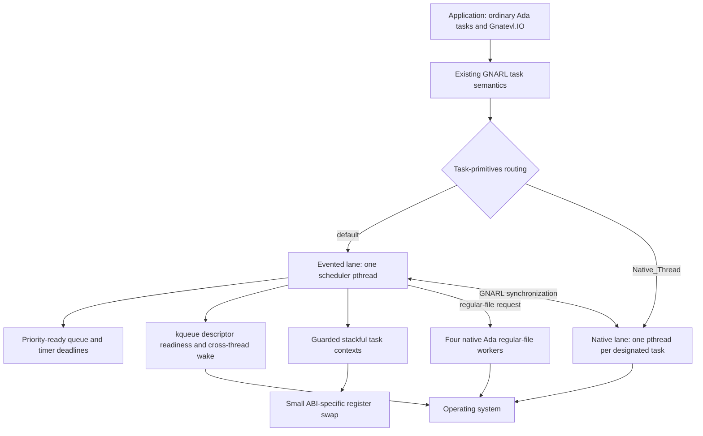
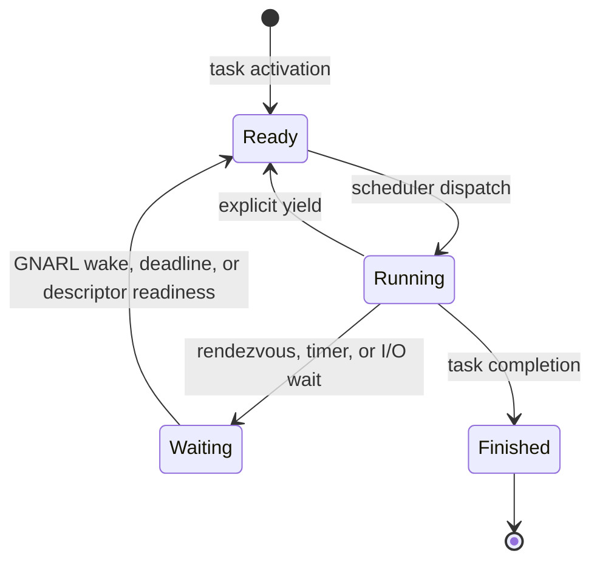
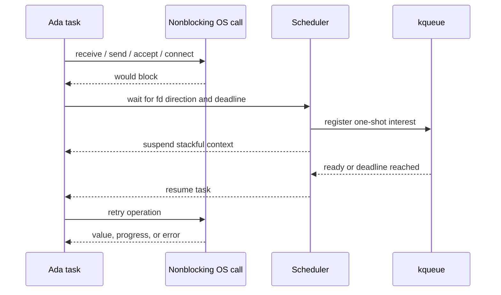

# GNATEVL

GNATEVL is an experimental GNAT 16 runtime for running ordinary Ada tasks as
stackful tasks on an event loop, while retaining native pthread-backed tasks as
an explicit escape hatch.

It is an augmentation of the existing GNAT runtime, not a new async language or
a replacement tasking model. Rendezvous, protected objects, task activation,
masters, exceptions, and normal blocking-looking Ada control flow still come
from GNARL. GNATEVL changes how a task is scheduled and adds I/O operations that
cooperate with either execution mode.

The current implementation is verified on macOS/AArch64 with GNAT 16.1. Its
event backend is `kqueue`; other operating-system backends are portability work,
not emulated by `ucontext` or another context API.

## Programming model

An ordinary Ada task is evented by default:

```ada
task Worker;
```

A task that must own an operating-system thread is explicitly designated:

```ada
task Blocking_Worker is
   pragma Task_Info (Gnatevl.Native_Thread);
end Blocking_Worker;
```

`Gnatevl.Event_Loop_Task` is the explicit spelling of the default. These two
constants currently reuse GNAT's `Default_Scope` and `System_Scope` task-info
values, preserving the compiler/runtime ABI and avoiding a compiler fork.

Both forms remain Ada tasks and can rendezvous, use protected objects, and wait
on the same GNARL synchronization objects. The designation controls the task's
execution resource; it does not create a second tasking language.

The same GNATEVL I/O call also works from either kind of task:

```ada
Gnatevl.IO.Timers.Sleep_For (0.050);
Gnatevl.IO.Sockets.Receive (Socket, Buffer, Last, Timeout => 1.0);
Gnatevl.IO.Files.Read_At
  (File, Offset => 0, Item => Buffer, Last => Last);
```

In an evented task, these calls suspend only the current Ada task. In a native
task, they may block only that task's pthread. Values, `out` parameters, local
variables, exception propagation, and call stacks behave like normal
synchronous Ada code in both cases.

## Architecture



### GNARL integration boundary

GNATEVL integrates at `System.Task_Primitives.Operations`, below GNARL's task
semantics. The patched task primitives route each task to one of two execution
lanes:

- Evented tasks receive a guarded stack and a resumable execution context. A
  priority-aware ready queue multiplexes them onto one scheduler pthread.
- `Native_Thread` tasks use the normal pthread-backed path.
- Synchronization between the lanes still passes through GNARL. A native task
  can wake the event-loop scheduler through a `kqueue` user event.

Keeping the integration below GNARL is what lets existing Ada task syntax and
semantics survive. Reimplementing rendezvous or protected objects would create a
parallel runtime with subtly different behavior; GNATEVL deliberately avoids
that.

### Context switching is not event polling

These are independent mechanisms with different jobs:

| Mechanism | Purpose | Current implementation | Portability boundary |
| --- | --- | --- | --- |
| Context switching | Save one evented task's CPU/stack state and resume another | Guarded stacks plus a small ABI-specific register-swap routine | ABI and architecture |
| Event polling | Sleep until a descriptor, timer, or cross-thread wake is ready | `kqueue` and `EVFILT_USER` | Operating system |
| Scheduling | Choose which runnable Ada task executes next | Ada priority-ready queue and deadline bookkeeping | Runtime policy |

GNATEVL does not use `ucontext`. A context switch cannot tell whether a socket is
readable, and `kqueue` cannot preserve an Ada task's suspended call stack. Both
pieces are necessary: the poller discovers readiness; the context machinery
makes suspension and resumption look like an ordinary procedure call.

The scheduler state transition is:



Scheduling inside the evented lane is cooperative. A CPU-bound task must reach a
runtime suspension or yield point; otherwise it owns the loop. A native task is
the intended designation for code that blocks unpredictably, invokes blocking
foreign libraries, or needs independent CPU execution.

`delay 0.0` is an explicit cooperative yield for an evented task. A permanently
runnable yielding task does not starve descriptors: after at most 64 dispatches,
the scheduler promotes expired timers and drains up to 64 immediately available
poll events before returning to the ready queue. Both budgets are explicit
policy, keeping I/O moving without allowing a hot descriptor set to monopolize
the loop in the opposite direction.

## Task-aware I/O

GNATEVL exposes synchronous-looking operations in:

- `Gnatevl.IO.Timers`: relative and absolute sleeps.
- `Gnatevl.IO.Sockets`: connect, accept, partial/exact receive, and partial/all
  send operations.
- `Gnatevl.IO.Files`: open, close, positional read, and positional write.
- `Gnatevl.IO`: descriptor waits and task-mode detection used by the packages
  above.

### Sockets and descriptors

Socket operations use readiness, not callback delivery and not kernel
completion queues. The evented path is:



If the first system call succeeds, no suspension occurs. If it would block, the
task is parked and the scheduler runs other work. On readiness, the original
call resumes, retries the operation, and returns its result normally. A native
task uses `poll` for the equivalent wait, blocking its own pthread but not the
event-loop thread.

Descriptor registrations are one-shot so the resumed task owns the retry and
decides whether another wait is needed. Exact reads and complete writes loop
over partial progress while preserving a single deadline.

Accepted Darwin sockets have `SO_NOSIGPIPE` applied before they are exposed to
the caller. This matches GNAT.Sockets' process-safety convention while retaining
the raw nonblocking `accept(2)` retry path required by the event loop. Native
`poll(2)` waits retry `EINTR` with a recomputed remaining monotonic deadline.

### Timers

An evented sleep records a scheduler deadline and suspends the current context.
A native sleep blocks only its pthread. Timer calls share one public API and use
monotonic time, so wall-clock changes do not alter elapsed waits.

### Regular files

Regular disk files are different from sockets: on the target platform,
`kqueue` readiness does not make a potentially blocking `pread` or `pwrite`
safe to execute on the event-loop thread.

GNATEVL therefore uses a small pool of designated native Ada tasks for file
operations. An evented caller rendezvous with a worker, suspends through normal
GNARL machinery, and resumes when the result is available. A native caller can
execute the same positional operation directly. Explicit offsets avoid shared
file-position races.

This worker bridge is intentionally written as Ada tasking, not as a separate C
thread-pool runtime.

## Design decisions

| Decision | Rationale | Consequence |
| --- | --- | --- |
| Keep ordinary Ada task syntax | Existing programs and GNARL semantics remain recognizable | No separate `async`/`await`, callback, or future API is required |
| Make evented execution the default | Large numbers of mostly-waiting tasks should not require one pthread each | CPU-bound or blocking code must be identified and isolated |
| Keep native threads as a task designation | Some foreign calls, disk work, CPU work, and platform APIs genuinely need threads | The runtime is hybrid rather than ideologically thread-free |
| Integrate below GNARL | Rendezvous, protected objects, activation, and masters are already mature | The patch is coupled to the exact GNAT runtime source version |
| Use stackful contexts | Normal calls, locals, `out` values, and exceptions survive suspension naturally | Each evented task still needs a virtual stack and ABI-specific switching code |
| Separate scheduler, context, and poller | CPU state, scheduling policy, and OS readiness are different concerns | New architectures and new OS pollers can be ported independently |
| Use readiness-and-retry I/O | It maps directly to nonblocking sockets and keeps control in Ada | Arbitrary blocking libc or foreign calls cannot be intercepted transparently |
| Offload regular-file I/O | Disk operations must not stall the single event loop | The fixed worker pool introduces bounded parallelism and possible backpressure |
| Put runtime logic in Ada | Types, task coordination, errors, and policies remain inspectable in the target language | OS entry points are imported from C system interfaces; only register switching is assembly |
| Generate a static custom RTS | The experiment works without a compiler fork and can fail closed on mismatched sources | Builds require the matching installed GNAT 16.1 runtime sources |

## Ada, C, and assembly boundary

There are no C source files in the GNATEVL runtime. Ada implements scheduling,
queues, timeouts, descriptor registration, stacks, task routing, I/O retry
logic, and the regular-file worker protocol. It imports the platform primitives
that the operating system exposes through its C ABI, including `kqueue`,
`kevent`, `mmap`, `poll`, socket calls, and positional file calls.

The only assembly is the minimal context swap needed to save and restore the
callee-saved machine state. Rewriting a system-call declaration in Ada would
not make the kernel implementation Ada; the useful boundary is to keep policy
and coordination in Ada while treating the OS ABI as a narrow platform layer.

## SPARK proof boundary

SPARK can cover the deterministic policy kernels without pretending that the
entire task runtime is currently proofable. `Gnatevl.Time_Math` implements the
timeout clamp used by socket retry loops and the nanosecond/millisecond
conversions used by event-loop and native descriptor waits. Its contracts cover
the infinite-timeout sentinel, non-expired timeout, expiration, remaining-time
cases, rounding up to poll milliseconds, and saturation at the `poll(2)` integer
limit.

Two more production policy units prove native `poll` and `accept` result
classification, including `EINTR` retry and would-block handling, and regular
file open validation and exact Darwin `O_RDONLY`/`O_WRONLY`/`O_RDWR`, `O_CREAT`,
and `O_TRUNC` flag composition. The Ada import of variadic `open(2)` remains an
ABI boundary; on AArch64 Darwin it deliberately uses GNAT's `C_Variadic_2`
calling convention.

The runtime's production ready-queue comparator is also a SPARK unit. Its proof
establishes that higher priorities sort first, equal priorities retain FIFO
sequence order, and the resulting relation is irreflexive, asymmetric, and
transitive. The same unit proves scheduler deadline classification and safe
calculation of the next poll timeout. It now also proves earliest-deadline
selection, maintenance cadence, dispatch-counter safety, and the distinction
between immediate and deferred fiber destruction. The intrusive linked-list
updates and actual context handoff use these proved decisions but remain outside
SPARK until pointer ownership is factored from scheduler locking.

Run the proof through the Alire-provided GNATprove toolchain:

```sh
./scripts/prove.sh
```

The current run discharges 63 flow, functional-contract, termination, and
run-time-safety checks across four production policy units, with zero unproved
checks. Good next proof candidates are intrusive ready-list insertion/removal
invariants, whole-list minimum-deadline selection, and descriptor wake matching.
The GNARL tasking integration, imported system calls, address conversions,
assembly register swap, and kernel behavior remain trusted boundaries. These
can be wrapped in contracts, but GNATprove cannot establish their implementations
from this Ada source tree.

## Portability boundaries

| Area | macOS implementation | Likely next backend |
| --- | --- | --- |
| Descriptor poller | `kqueue` with `EVFILT_USER` wakeups | Linux `epoll` plus `eventfd`; Windows IOCP needs a completion-oriented adapter |
| Context switch | AArch64 and x86-64 ABI-specific assembly | One small implementation per architecture/ABI |
| Stack allocation | `mmap` plus guard pages | Platform virtual-memory API |
| OS calls | Thin Ada imports of Darwin/POSIX interfaces | Per-platform binding body |
| GNARL hook | Patch against GNAT 16.1 task primitives | Rebase and verify for each GNAT runtime version |

The scheduler and public I/O semantics are intended to remain Ada and
platform-neutral. Pollers and context implementations are explicitly isolated
rather than hidden behind a claim of universal portability.

## Repository layout

- [`runtime/ada`](runtime/ada): scheduler, context, stack, and `kqueue` runtime
  units.
- [`runtime/native`](runtime/native): ABI-specific context-switch assembly.
- [`runtime/patches`](runtime/patches): GNARL task-primitives integration.
- [`src`](src): public task-aware I/O packages.
- [`tests`](tests): runtime, socket, timeout, and native TCP smoke tests.
- [`showcases`](showcases): side-by-side scheduling and I/O demonstrations.
- [`scripts`](scripts): custom RTS construction, verification, and test runners.

## Build and test

The project expects Alire at `~/alr` and an installed GNAT 16.1 toolchain. Set
`ALR` to override the executable location:

```sh
./scripts/prepare-rts.sh
~/alr exec -- gprbuild --RTS="$PWD/build/rts" -P path/to/application.gpr
```

The build script copies the matching installed runtime sources, applies the
GNATEVL patch, adds the runtime units, and builds a static RTS. It checks source
compatibility by applying the source patch under `set -e`, so an incompatible
runtime source tree fails the build rather than being silently accepted.

Run the complete verification suite with:

```sh
./scripts/test.sh
./scripts/prove.sh
```

Current smoke coverage includes:

- evented and native task activation, rendezvous, protected operations, and
  timers;
- evented/native socket-pair transfer and timeout behavior;
- descriptor-readiness fairness under a continuously yielding evented task;
- read/write/create/truncate file-open combinations and same-descriptor reads;
- repeated evented-child teardown under a native master, exercising deferred
  fiber destruction and ATCB-address reuse;
- native TCP connect, accept, send, and receive behavior, including verification
  that accepted sockets suppress `SIGPIPE`.

## Showcases

Run every showcase with:

```sh
./scripts/showcases.sh
```

After they have been built, an individual showcase can be rerun directly:

```sh
./showcases/bin/evented_pipeline
./showcases/bin/many_evented_tasks
./showcases/bin/hybrid_blocking_bridge
./showcases/bin/evented_vs_threads
./showcases/bin/evented_io
```

The examples demonstrate:

- a producer/transform/sink pipeline using entry calls;
- fan-out timers and protected aggregation;
- evented coordination with native CPU workers;
- evented versus pthread-backed tasks under identical source-level work;
- a real loopback TCP exchange, positional file I/O, and timers through the
  task-aware I/O API.

## Performance snapshot

Five-run medians on the development Apple Silicon machine:

| Workload | Evented tasks | pthread tasks | Result |
| --- | ---: | ---: | --- |
| 256 tasks × 100 yields | 25.910 ms | 17.935 ms | pthreads 1.44× faster |
| 2,048 tasks × 20 ms wait | 83.675 ms | 308.056 ms | evented 3.68× faster |

This is the intended tradeoff, not a claim that event loops always win. Native
threads are very competitive at modest concurrency and can run CPU work in
parallel. Evented tasks become attractive when many mostly-waiting activities
would otherwise pay for thousands of pthreads and kernel scheduling events.

## Current constraints

- Only macOS has a working event backend today.
- The evented lane currently uses one scheduler pthread, so it does not provide
  parallel CPU execution by itself.
- Cooperative scheduling means an evented task that never reaches a suspension
  point can monopolize the loop.
- Arbitrary blocking foreign calls are not automatically made event-aware; use
  a designated native task or an explicit worker boundary.
- The regular-file pool is fixed at four native workers.
- Closing a descriptor concurrently with an indefinite wait has no general
  cancellation protocol yet; finite deadlines are safer.
- Timer expiration currently scans scheduler state rather than using a more
  scalable deadline heap.
- Fiber guard pages make stack overflow fail fast, but the evented stack does
  not yet have an alternate signal stack that translates the fault into Ada
  `Storage_Error`; overflow currently terminates the process.
- `Task_Info` produces an obsolete-feature warning in current GNAT, but it
  provides the required per-task designation without a compiler fork.
- The custom RTS patch is tied deliberately to the verified GNAT 16.1 sources.

The next architectural work is broader platform support, explicit cancellation,
fairness/preemption policy, scalable timer management, and more complete stress
and semantic-conformance testing across both execution lanes.
