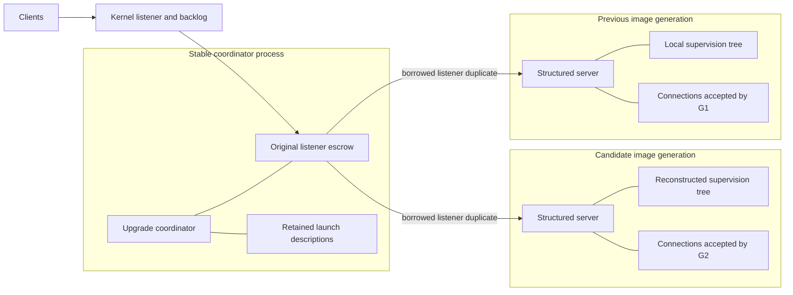
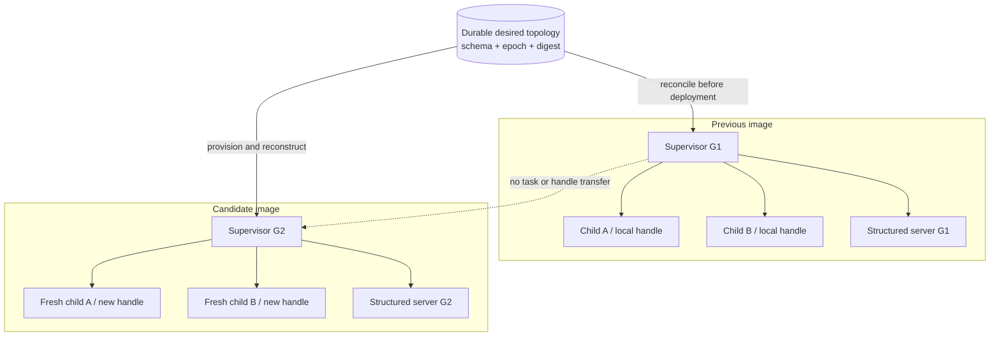
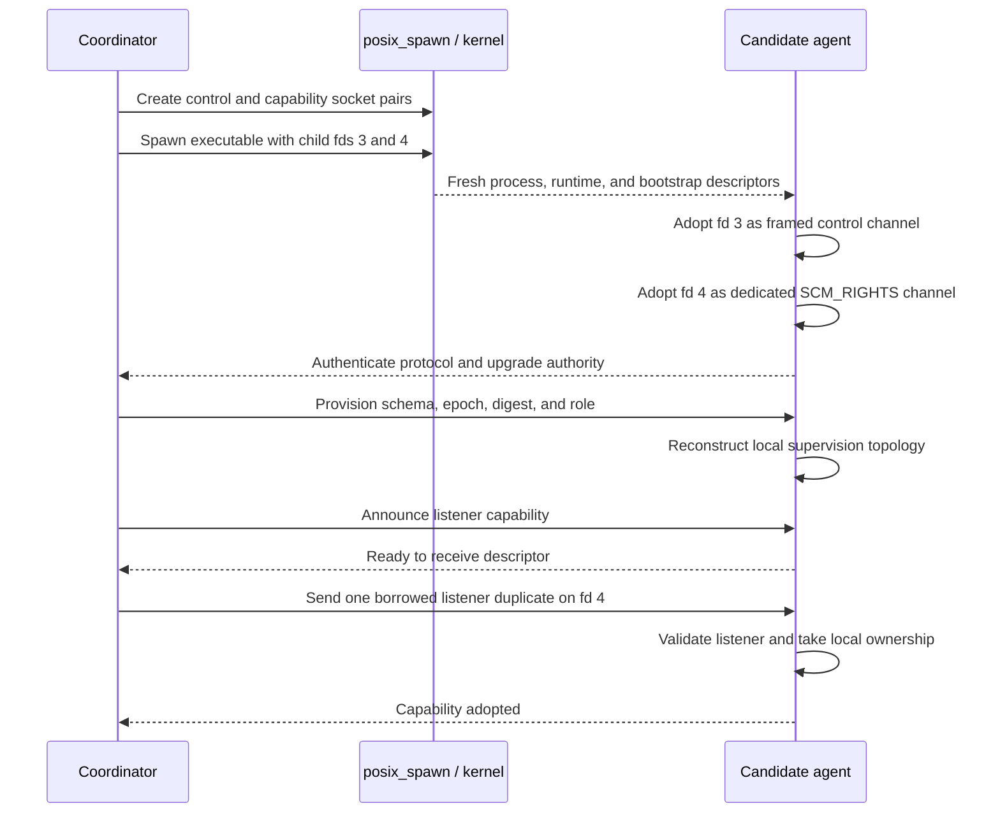
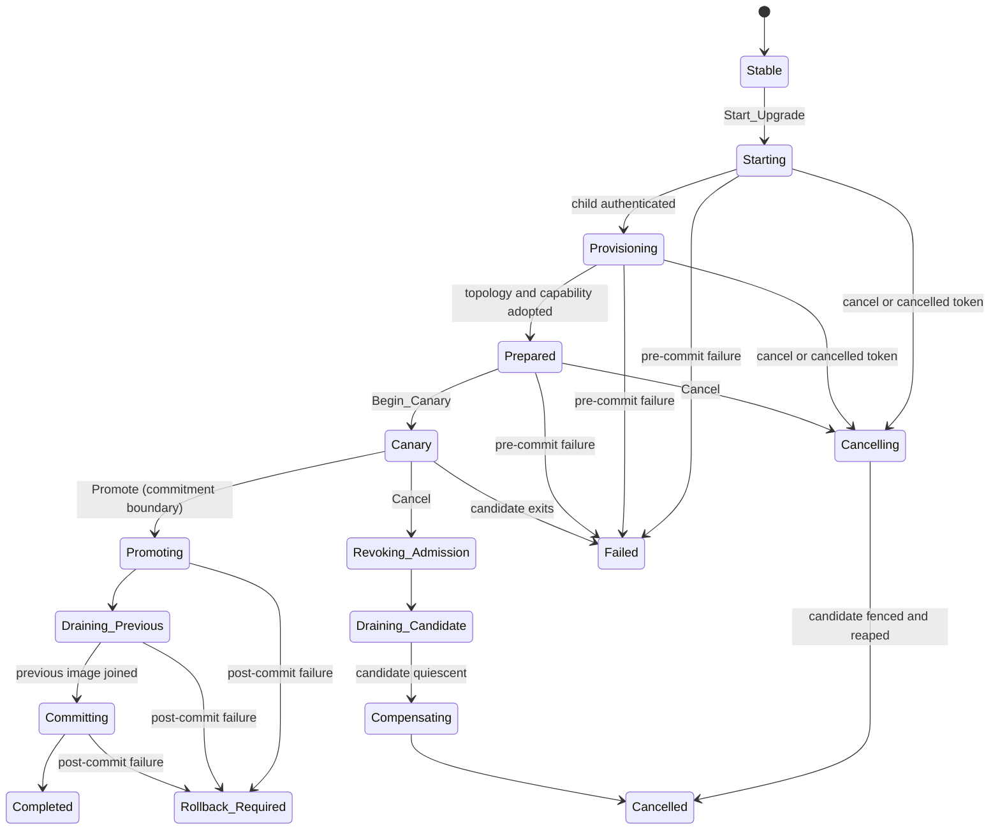
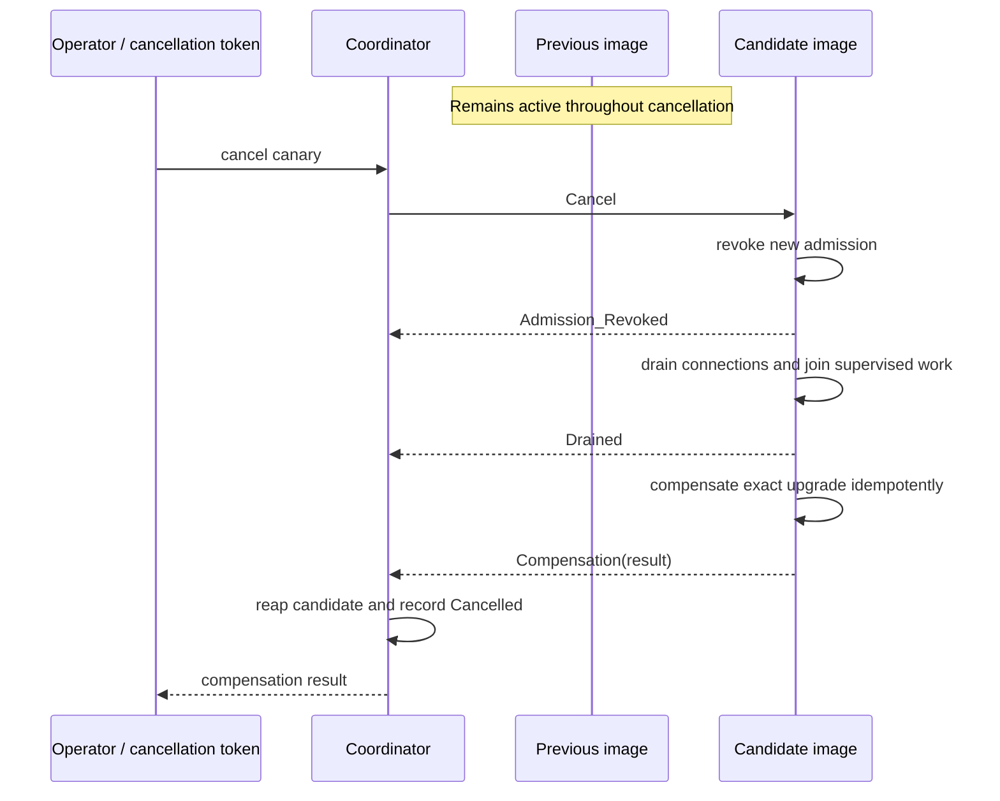
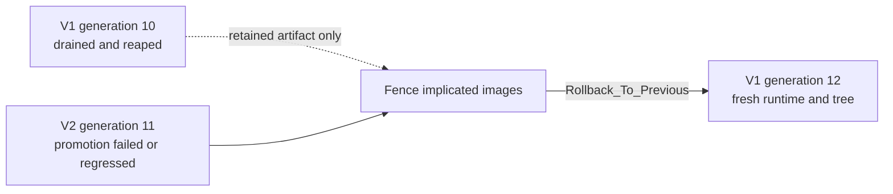

# New-process upgrade guide: handoff, canaries, and reversal

The published [process-upgrade website guide](https://flyology.org/guide/process-upgrades/)
presents this design as an operational walkthrough with diagrams. This record
retains the detailed protocol and implementation rationale.

Status: implemented experimental guide and contract.

This design defines how one stable Flyology coordinator replaces a running
application image with another executable. It preserves admission while each
image retains its own Ada tasks, connections, subprocesses, runtime, and local
supervision authority. It does not migrate task stacks, protected objects,
active TLS sessions, subprocess parentage, or other process-local state.

The externally visible goal is a rolling image replacement: new work can enter
the candidate while old work remains owned by and drains in the previous image.
The old image exits only after its structured scopes join. A cancellable canary
keeps the previous image active until an explicit promotion commits the
replacement.

## Contents

- [The mental model](#the-mental-model)
- [Ownership and supervision](#ownership-model)
- [Bootstrap and launch inheritance](#two-channel-bootstrap)
- [Protocol and lifecycle](#wire-protocol)
- [Integrating an image agent](#integrating-an-image-agent)
- [Driving the coordinator](#driving-the-coordinator)
- [Canaries, cancellation, and compensation](#canary-roles-and-overlap)
- [Failure and reversal](#failure-policy)
- [Observability and operating procedures](#observability)
- [Native boundary and verification](#native-boundary-audit)

## The mental model

This is a rolling replacement, not an in-process code patch. The coordinator
keeps the stable resources that must survive deployment. Each executable image
gets a new address space, a new Ada runtime, and a newly constructed local
supervision tree. Socket handoff lets both generations reach the same listening
endpoint; structured drain lets each generation finish the work it already
owns.



The useful invariant is:

> Transfer capabilities and desired state; reconstruct tasks and local state.

That distinction answers most design questions. A listener descriptor can be
duplicated into another process. An Ada task, protected object, handler stack,
or live TLS provider session cannot.

### What survives an upgrade?

| Resource or state | What happens | Owner after handoff |
| --- | --- | --- |
| Bound listening socket | Borrowed with `SCM_RIGHTS` | Coordinator retains the original; each admitted image owns one duplicate |
| Kernel listen backlog | Remains attached to the socket | Kernel |
| Existing client connection | Stays in the image that accepted it | Previous or candidate image |
| Desired topology | Identified by versioned signature, schema, epoch, digest, and role | Durable application source plus each reconstructed image |
| Supervision tree and Ada tasks | Recreated from desired topology | New image only |
| Protected objects and task-local state | Not transferred | Original image until it drains |
| TLS and protocol session state | Not transferred | Image that owns the connection |
| Shared-memory backing | May be reopened or handed off explicitly; local views are recreated | External owner according to the shared-memory contract |
| Child subprocess | Remains with the image that spawned and reaps it | Original image |
| Working directory and environment | Inherited at spawn or copied from the stored launch description | New image process |
| Executable artifact | Retained as an immutable launch description for reversal | Coordinator |

The current implementation aims for uninterrupted *admission*, not migration
of every live object. Long-lived connections can continue on the previous
image while new connections reach the candidate.

### Why a new process instead of in-process code replacement?

An in-process switch can preserve addresses and open objects, but Ada code,
elaboration state, task stacks, dispatch tables, exception metadata, and
foreign-library state do not form a stable reload ABI. Loading the new image as
a shared library would also change how applications are built and would still
require every long-lived object to obey an explicit versioned boundary.

| Approach | Preserves live memory | Isolation and reversal | Build/ABI cost | Flyology position |
| --- | --- | --- | --- | --- |
| Replace executable with a new process | No; reconstruct from desired state | Strong process boundary; old image can remain active until commit | Ordinary executable plus protocol integration | Implemented path |
| `exec` in the same process id | No; all memory and tasks disappear | No overlapping canary or old-image drain | Moderate; descriptors must be arranged before `exec` | Useful for simple restart, not this controller |
| Load a new shared library in process | Potentially, for objects behind a designed ABI | Weak fault isolation; unload is unsafe while any old code or callback is reachable | High and application-wide | Not implemented |
| Patch instructions or relocate a running binary | Appears to preserve everything | Extremely weak safety and practically irreversible | Toolchain- and ABI-specific | Out of scope |

The new-process design makes the version boundary visible and testable. Where
an application truly needs in-process replacement, it should isolate that
feature behind its own narrow, versioned, task-quiescent plugin ABI rather than
treating arbitrary Ada state as reloadable.

## Boundaries and terminology

- An **image generation** is one running executable plus its fresh Flyology
  runtime and local supervision tree.
- The **coordinator** is the stable process that owns upgrade transactions,
  executable identities, listener escrow, and process owners.
- A **candidate** is an image generation that has not been promoted.
- **Admission authority** is a borrowed duplicate of a listening socket or an
  external router assignment. Possessing a listener does not transfer an
  existing connection.
- A **desired topology** is versioned process-independent application data from
  which a candidate reconstructs static and dynamic supervised children.
- **Compensation** is an application operation that reverses or offsets staged
  canary effects. It is not a general transaction rollback guarantee.

The coordinator identity, upgrade id, and image generation qualify every
command. Local `Flyology.Supervision.Child_Handle` values never cross a process
boundary and are never reconstructed in another process.

## Ownership model

The coordinator owns the original bound listener for its complete lifetime. It
sends a borrowed duplicate through `SCM_RIGHTS` to each admitted image. Closing
an image's duplicate does not close the coordinator's listener or discard the
kernel backlog.

Each image solely owns every connection it accepts. Existing connections stay
with that image until normal completion or its drain deadline. Plain sockets,
TLS provider state, protocol buffers, handler stacks, cancellation sources, and
application session state are not split between images.

Shared-memory backings may be borrowed across the process boundary. Each image
creates its own mapping and process-local views. Existing lifecycle, schema,
guard, quiescence, poison, and owner-death rules remain authoritative. An
upgrade is not permission to steal or reset a persisted guard.

The first coordinator API transfers one listener capability. It does not yet
carry an application-defined list of shared-memory backings. `Prepare` receives
the versioned application signature, topology schema, epoch, digest, and role;
an application that needs durable state must currently reopen it through its
own stable naming or broker mechanism. A later state-capability surface must be
bounded and must retain the same one-at-a-time expectation/adoption handshake.

An operating-system subprocess remains owned and reaped by the image that
started it. A service that needs subprocess continuity across image replacement
must arrange for the stable coordinator or another stable process manager to
own that subprocess from creation.

### Supervision trees are reconstructed, not transferred

The desired topology is the bridge between generations. The old tree remains
fully responsible for its children until it joins. The candidate creates a
different tree with different process-local handles, then proves that it has
reconciled the requested epoch and digest.



This has three consequences:

1. Desired dynamic membership cannot live only inside the old supervisor.
2. Readiness must cover the entire role-required tree, not merely process
   startup or a bound listener.
3. A failed candidate can be discarded without mutating the old tree, provided
   its external effects are fenced or compensatable.

## Two-channel bootstrap

The coordinator spawns a candidate with two connected Unix stream endpoints at
fixed child descriptors:

- descriptor 3 carries bounded framed control messages;
- descriptor 4 is a dedicated one-byte, one-descriptor capability channel.

The two lanes remain separate because ordinary stream reads must not share the
dedicated ancillary-data protocol. Parent endpoints are close-on-exec. Child
endpoints are installed with `posix_spawn` file actions and made close-on-exec
immediately after the new image adopts them, so later child launches cannot
inherit upgrade authority.

The public subprocess operation is deliberately narrow. It creates the two
socket pairs and returns owned parent endpoints together with the child process;
it does not expose a general unbounded descriptor-action builder.



### Launch context

The image artifact is a `Flyology.Subprocesses.Command`. An unset working
directory inherits the coordinator's current directory at each spawn. An
explicit working directory is stored in the command and is therefore reused by
a later rollback. Environment inheritance behaves the same way: inherited mode
samples the coordinator environment again, while an explicit environment is
stored with the command. Deployments that require repeatability should use an
absolute executable path, explicit working directory, and explicit environment.

The child receives end-of-file on standard input, inherits the coordinator's
standard output and error, and starts in a new process group. Inheriting the two
output streams avoids coordinator-owned pipes that no task drains; deployment
supervision remains responsible for the final log sink. Flyology clears the
child's signal mask and resets catchable signal dispositions before `exec`.
Normal operating-system launch context not overridden by the spawner, including
credentials, supplementary groups, umask, resource limits, and scheduling/nice
state, follows host `posix_spawn` inheritance rules.

| Launch property | Default behavior | Reproducible deployment choice |
| --- | --- | --- |
| Executable lookup | Exact path; no `PATH` search | Use an absolute path |
| Arguments | Stored exactly; no shell interpretation | Store the complete argument vector in `Command` |
| Working directory | Sample coordinator cwd at each spawn | Call `Set_Working_Directory` with an absolute directory |
| Environment | Sample coordinator environment at each spawn | `Clear_Environment`, then set an explicit allowlist |
| Standard input | Immediate EOF | Use a separate application channel if input is required |
| Standard output/error | Inherit coordinator streams | Put the coordinator under the intended log supervisor |
| Process group | New group rooted at the child | Keep descendants in that group if coordinator cleanup must cover them |
| Signal mask/dispositions | Empty mask and default catchable dispositions | Install application handlers during normal image startup |
| Credentials, groups, umask, limits, nice state | Host `posix_spawn` inheritance | Configure the coordinator before launch or use an external process manager |
| Flyology descriptors | Close-on-exec except bootstrap fds during launch | Preserve `FD_CLOEXEC` on application-owned descriptors |

Inherited cwd and environment are sampled again when reversal starts a fresh
prior image. Retaining the prior `Command` therefore guarantees the configured
launch *policy*, not a byte-for-byte ambient process context. Explicit values
are the appropriate choice when reversal must reproduce the earlier launch.

Flyology-created descriptors are close-on-exec except for the deliberate child
bootstrap descriptors 3 and 4, which are made close-on-exec during adoption.
An arbitrary application or foreign descriptor without `FD_CLOEXEC` may still
leak through `exec`; the coordinator cannot retroactively make that descriptor
safe. Listener access is never ambient inheritance: it arrives later through
the validated capability channel.

## Wire protocol

Protocol records use explicit big-endian fixed-width encoding. Ada record
representation, enumeration positions outside the codec, native addresses, and
compiler-dependent values never appear on the wire.

Every frame contains:

- protocol magic and version;
- message kind;
- coordinator identity;
- upgrade id;
- image generation;
- monotonically increasing per-direction sequence;
- bounded payload length;
- payload bytes.

Unknown versions, kinds, lengths, identities, generations, sequences, or
nonzero reserved bytes fail closed. Control EOF is terminal for an uncommitted
candidate. A committed active image may follow application policy and continue
serving, but cannot claim that future upgrades remain coordinated.

Capability delivery is sequential. A control frame first names the expected
capability kind and index; the receiver acknowledges that expectation, receives
exactly one descriptor on the dedicated channel, validates and adopts it, then
acknowledges adoption. The next capability is not announced until the previous
one completes. A channel error poisons and retires that channel.

## Process and upgrade state machines

One candidate transaction follows the state machine below. The upper path is a
successful promotion. The lower paths are cancellation before and after
candidate admission. Any pre-commit failure becomes `Failed`; a failure after
the promotion boundary becomes `Rollback_Required`.



The accepted `Promote` command is the commitment boundary: the candidate may
enable `Active_Only` work before acknowledging it, and cancellation is no
longer valid. The coordinator then starts the previous image's one-shot
structured shutdown. A request to return to the previous binary is a new,
explicit rollback upgrade using its retained immutable artifact, not
cancellation or resumption of the old server object.

### Authority and serialization

Every mutating operation carries the exact
`(Coordinator, Upgrade, Candidate)` authority returned by `Start_Upgrade`.
Stale handles fail without changing coordinator state. Upgrade identifiers and
image-generation identifiers never wrap; exhaustion requires a new coordinator
identity.

Coordinator operations and `Snapshot` are synchronous and must currently be
externally serialized. A cancellation token wakes the operation performing
startup or readiness; it does not grant a second task permission to invoke a
coordinator operation concurrently.

The state policy is a pure SPARK unit. It validates exact commands and derives
the only legal next phase. I/O, process signaling, callbacks, clocks, text, and
descriptor ownership remain outside the proof kernel.

## Startup, topology reconstruction, and readiness

Candidate startup proceeds as follows:

1. Spawn without admission authority.
2. Exchange protocol and exact upgrade authority.
3. Receive the application signature, topology schema, epoch, digest, and
   candidate role.
4. Construct a fresh local supervisor and fresh nested controllers in the
   application `Prepare` hook.
5. Reconcile desired dynamic-family requests idempotently.
6. Receive and validate the borrowed listener capability.
7. Start required services and wait for exact local readiness.
8. Verify that the desired-topology epoch and digest are still current.
9. Report image readiness.

Static dependency declarations come from the new binary. Desired dynamic child
membership and configuration come from process-independent application state.
The application must persist a desired change before reconciling it into the
current process, so the old supervisor is an actuator rather than the only
source of truth.

Image readiness requires all of the following:

- topology schema and configuration are accepted;
- the required desired epoch and digest are reconciled;
- every role-required supervised child reports ready;
- required local service publications are active;
- every structured server reports `Accepting`;
- no local supervisor node has escalated or terminated.

`Structured_Servers.Snapshot.Running` is insufficient because it is set before
all handler tasks finish activation. The server therefore publishes a distinct
`Accepting` field only after the listener is owned and every handler task has
activated and received its start rendezvous. Shutdown clears `Accepting` before
new admission stops.

## Integrating an image agent

Every managed executable starts the same small agent near its main entry point.
The generic hooks are deliberately application-specific: Flyology manages the
cross-process protocol, while the application defines how its local topology is
constructed, observed, stopped, promoted, and compensated.

```ada
package Image_Agent is new Flyology.Process_Generations.Agents
  (Application_Context => Application_Context,
   Prepare             => Prepare,
   Run_Server          => Run_Server,
   Ready               => Ready,
   Request_Stop        => Request_Stop,
   Promoted            => Promoted,
   Compensate          => Compensate);

Context : Application_Context;
begin
   Image_Agent.Run
     (Context,
      Ready_Timeout   => 20.0,
      Drain_Timeout   => 30.0,
      Control_Timeout => Flyology.IO.Infinite);
```

The hooks have distinct lifecycle obligations:

| Hook | Called when | Required property |
| --- | --- | --- |
| `Prepare` | Before candidate admission | Validate schema and reconstruct the requested local topology without externally admitting work |
| `Run_Server` | After listener adoption | Own one structured server scope until shutdown joins all nested work |
| `Ready` | Repeatedly during readiness | Return true only for the exact epoch/digest and a healthy, accepting role-required topology |
| `Request_Stop` | Cancellation, drain, or cleanup | Idempotently revoke admission first, then request structured shutdown |
| `Promoted` | At the commitment boundary | Publish the active deployment epoch and enable `Active_Only` effects |
| `Compensate` | After cancelled candidate quiescence | Be idempotent for the exact upgrade handle and durably report its result |

`Run_Server` executes in an agent-owned native task. It should normally call
`Structured_Servers.Serve`, because that scope gives the agent an exact point
at which the listener is closed, handlers are joined, and compensation is safe
to begin. If the server returns before any drain command, the agent reports a
lifecycle failure and exits; the next serialized coordinator operation or
snapshot reconciles that terminal process state.

## Driving the coordinator

The stable process creates the listener once and transfers it into coordinator
escrow. Use an absolute executable path and explicit launch context when a
deployment must be reproducible.

```ada
Listener  : Flyology.IO.Sockets.Socket_Type;
Manager   : Flyology.Process_Generations.Coordinators.Coordinator;
Initial   : Flyology.Process_Generations.Upgrade_Handle;
Artifact  : Flyology.Subprocesses.Command :=
  Flyology.Subprocesses.To_Command ("/opt/example/bin/server-v1");
Provision : Flyology.Process_Generations.Messages.Provisioning_Data :=
  (Application_Signature => 16#4558_414D_504C_4501#,
   Topology_Schema       => 1,
   Topology_Epoch        => 42,
   Digest                => Desired_Digest,
   Role                  => Flyology.Process_Generations.Active_Only);
begin
   Flyology.Subprocesses.Set_Working_Directory
     (Artifact, "/opt/example/current");
   Flyology.Subprocesses.Clear_Environment (Artifact);
   Flyology.Subprocesses.Set_Environment_Variable
     (Artifact, "EXAMPLE_CONFIG", "/etc/example/server.toml");

   --  Create, bind, and listen on Listener before this call.
   Flyology.Process_Generations.Coordinators.Initialize
     (Manager, Identity => 1, Listener => Listener);

   Flyology.Process_Generations.Coordinators.Start_Initial
     (Manager, Artifact, Provision, Initial, Timeout => 30.0);
```

`Initialize` consumes the listener. The first image therefore receives the
same kind of borrowed duplicate as every later image; there is no privileged
in-process generation.

### Run a cancellable canary

```ada
Stop         : aliased Flyology.Cancellation.Token;
Candidate    : Flyology.Process_Generations.Upgrade_Handle;
Compensation : Flyology.Process_Generations.Compensation_Result;

Flyology.Process_Generations.Coordinators.Start_Upgrade
  (Manager, New_Artifact, New_Provision, Candidate,
   Timeout => 30.0, Token => Stop'Access);

Flyology.Process_Generations.Coordinators.Begin_Canary
  (Manager, Candidate, Timeout => 30.0, Token => Stop'Access);

if Canary_Health_Is_Acceptable then
   Flyology.Process_Generations.Coordinators.Promote
     (Manager, Candidate, Timeout => 30.0);
else
   Flyology.Process_Generations.Coordinators.Cancel
     (Manager, Candidate, Compensation, Timeout => 30.0);
end if;
```

Another task may call `Stop.Request` while `Start_Upgrade` or `Begin_Canary` is
blocked. Those operations raise `Flyology.Cancellation.Operation_Cancelled`
only after they have run the applicable fencing path. Do not concurrently call
`Cancel` from that task; coordinator operations remain externally serialized.

```mermaid
sequenceDiagram
    participant O as Operator / deployer
    participant C as Coordinator
    participant P as Previous image
    participant N as Candidate image

    O->>C: Start_Upgrade(binary, topology, token)
    C->>N: spawn, authenticate, provision, lend listener
    N-->>C: Prepared (not accepting)
    O->>C: Begin_Canary(handle, token)
    C->>N: Start_Canary
    N->>N: start structured server and prove Accepting
    N-->>C: Ready(epoch, digest)
    Note over P,N: Both images may accept; each owns its connections
    O->>C: Promote(handle)
    C->>N: Promote
    N->>N: enable Active_Only work
    N-->>C: Promoted
    C->>P: Drain
    P->>P: revoke admission, join handlers and children
    P-->>C: Drained
    C->>C: reap P and commit N as active
```

## Canary roles and overlap

The initial implementation permits ready-first overlap. Both previous and
candidate images can accept from borrowed duplicates of one listening socket.
The operating system does not promise a controllable percentage. This mode is
useful for compatibility exercise but must not claim weighted routing.

Precise canary weights require one of:

- an external load balancer;
- a separate canary endpoint;
- a later stable admission broker that accepts and acknowledges transfer of
  each connection.

The candidate receives an application role:

- `Canary_Safe` work may run in both images;
- `Fenced` work must validate the current deployment epoch atomically with its
  effect;
- `Active_Only` work begins only after promotion;
- `Shadow` work cannot commit externally visible effects.

The first process-generation controller exposes role and phase; application
topology policy decides which children are required. It does not infer whether
an arbitrary child is safe to duplicate.

## Cancellation and compensation

Cancellation before admission terminates the candidate without disturbing the
previous image. Cancellation during a canary performs the following ordered
transaction:

1. Revoke candidate routing or request structured-server shutdown.
2. Confirm no new connection can be assigned to the candidate.
3. Drain candidate connections and role-specific background work.
4. Establish candidate application quiescence.
5. Invoke the application compensation hook outside controller locks.
6. Persist the compensation result.
7. Join and reap the candidate.

The blocking startup and readiness operations accept a one-shot cancellation
token. Requesting it does not concurrently mutate the externally serialized
coordinator. Startup cancellation fences the unadmitted image. Readiness-time
cancellation wakes before consuming a control frame, queues `Cancel`, and uses
the ordered drain and compensation transaction above. A `Ready` frame already
in flight is accepted only as the response immediately preceding admission
revocation; cancellation still wins.



If readiness and cancellation cross on the wire, the candidate may send
`Ready` immediately before processing `Cancel`. The coordinator validates that
proof, then still requires `Admission_Revoked`; the late readiness frame never
turns cancellation into promotion.

Compensation receives the exact upgrade identity and may be invoked more than
once after a crash or uncertain acknowledgment. It must therefore be
idempotent. Its result is one of `Nothing_To_Do`, `Compensated`,
`Compensation_Pending`, `Irreversible_Effects`, or `Compensation_Failed`.

A candidate-local hook is unavailable if that process has died. Correctness
that depends on compensation requires a durable, versioned compensation record
understood by the previous image, a stable helper, or an external workflow.
Access-to-subprogram values never serve as durable recovery records.

Canary cancellation cannot retract responses, messages already consumed,
payments, or other externally observed effects. Prefer upgrade-qualified
namespaces or overlays that can be discarded on cancellation and published on
promotion. Destructive state migration waits until the previous image drains.

### Design compensation as recovery, not an undo button

A useful pattern is to put canary writes in an upgrade-qualified namespace:

```text
staged/<coordinator-id>/<upgrade-id>/<candidate-generation>/...
```

Cancellation can then discard or tombstone that namespace after quiescence;
promotion can publish an atomic pointer to it. Where external systems do not
support this pattern, record enough durable information for a stable helper or
operator workflow to finish compensation after the candidate has died.

Classify effects before choosing a canary role:

| Effect | Suitable approach |
| --- | --- |
| Read-only computation | `Shadow` or `Canary_Safe` |
| Cache population or replaceable derived data | Upgrade-qualified namespace plus idempotent cleanup |
| Database write guarded by active deployment epoch | `Fenced` |
| Singleton scheduler, leader, or outbound dispatcher | `Active_Only` |
| Irreversible external action | Keep out of the canary or report `Irreversible_Effects` |

## Failure policy

- Failure before readiness retires the candidate and leaves the previous image
  active.
- Candidate failure during a canary closes its process-owned listener and is
  reconciled by the next serialized coordinator operation or snapshot.
  Candidate-local compensation is then recorded pending because the dead image
  cannot run its hook; durable external recovery remains authoritative.
- Failure after promotion is classified `Rollback_Required`; an operator may
  explicitly start a fresh rollback generation from the retained prior
  artifact.
- A previous image that does not drain remains observable. Optional signals do
  not weaken Ada join or shared-state recovery requirements.
- Hard kill is explicit policy. It may abandon persisted guards or transitional
  slots and is never described as clean drain.
- Build ids identify artifacts but do not authenticate them. Signature and
  deployment trust policy remain external.

| Observation | Coordinator result | What remains available | Operator action |
| --- | --- | --- | --- |
| Spawn, authentication, provisioning, or readiness fails | `Failed` | Previous active image | Inspect failure, correct artifact/topology, start a new transaction |
| Cancellation before admission | `Cancelled` | Previous active image | None unless cleanup reports a failure |
| Canary cancellation completes | `Cancelled` plus compensation result | Previous active image | Resolve `Compensation_Pending`, `Irreversible_Effects`, or `Compensation_Failed` externally |
| Candidate exits during canary | `Failed`, candidate removed, compensation pending | Previous active image | Run durable compensation or abandon staged namespace |
| Previous image misses drain deadline after promotion begins | `Rollback_Required` | Candidate may already have committed effects | Fence uncertain images, then explicitly reverse or continue forward |
| Active image exits outside an upgrade | `Failed` or `Rollback_Required`, depending on retained reversal state | Listener escrow and possibly prior artifact | Start an explicit fresh generation; no task is resurrected |
| Coordinator itself exits | No further in-memory coordination | Image behavior follows application policy; listener escrow is lost | External supervisor must restart or replace the deployment |

### Reversal is another deployment

`Rollback_To_Previous` does not wake the drained process. It fences every image
implicated in an uncertain promotion, then starts a fresh process from the
retained prior `Command` and provisioning data.



The new V1 generation gets a new process id, image generation, runtime, task
identities, listener duplicate, connections, and supervision handles. Reversal
restores an artifact and desired topology, not prior memory. Schema evolution
must therefore preserve a forward-readable recovery path or use an external
migration protocol.

## Observability

The current snapshot reconciles terminal process observations before returning
fixed copied values: exact upgrade authority,
candidate and active image generations, phase, desired-topology epoch and
digest, readiness, admission state, rollback availability, compensation
result, and the first bounded failure. This reconciliation may reap an already
terminal managed process. Operations and snapshots are externally serialized
in this first API. Snapshots are observations and never grant
authority. A transition event ring and concurrently readable snapshot owner
remain later observability work; this implementation does not claim them.

Treat `Snapshot` as both observation and terminal-child reconciliation. A
deployment loop should take it only under the same serialization used for
mutating coordinator calls, export the complete authority tuple, and alert on
the following combinations:

| Snapshot condition | Meaning |
| --- | --- |
| `Phase = Prepared` and `Has_Candidate` | Candidate is provisioned but its server has not begun admission |
| `Phase = Canary` and `Candidate_Admitted` | Candidate may own live connections; cancellation requires drain and compensation |
| `Has_Candidate` and not `Candidate_Ready` in another phase | The last synchronous operation ended before matching readiness evidence was retained |
| `Compensation_Pending` | Candidate-local recovery is unavailable or acknowledgment was uncertain |
| `Failed` with `Has_Active` | The transaction failed but the previous image remains available |
| `Rollback_Required` | The commitment boundary was crossed; use an explicit forward or reversal decision |
| `Has_Active = False` | No image is currently managed as active, even if listener escrow still exists |

The first bounded failure is retained in the snapshot. Preserve child logs as a
separate diagnostic stream: bootstrap images inherit coordinator stdout and
stderr precisely so their output is not trapped in unread coordinator-owned
pipes.

## Operational procedures

### Before the first managed image

1. Bind and listen once in the stable coordinator.
2. Put the coordinator under a process and log supervisor.
3. Decide whether cwd and environment are explicit or intentionally inherited.
4. Store desired topology outside the image-local supervision tree.
5. Assign one stable application signature and version every topology schema.
6. Classify background effects as `Canary_Safe`, `Fenced`, `Active_Only`, or
   `Shadow`.
7. Make structured shutdown revoke admission before it waits for children.
8. Make compensation idempotent by exact upgrade authority.

### For each candidate

1. Verify and stage the executable without replacing the currently running
   file in place. An absolute, immutable artifact path makes reversal clearer.
2. Persist the new desired topology epoch and digest.
3. Call `Start_Upgrade`; on return the candidate is prepared but not serving.
4. Call `Begin_Canary`; observe application health and effect fencing.
5. To reject it, request cancellation or call `Cancel`, then inspect the
   compensation result before deleting staged state.
6. To accept it, call `Promote`. From this point, cancellation is invalid.
7. Wait for promotion to drain and reap the previous image.
8. Retain the previous artifact and compatible recovery data for the intended
   reversal window.

### If promotion becomes uncertain

1. Stop issuing new coordinator commands except serialized snapshots and the
   selected recovery operation.
2. Determine whether the candidate crossed `Promoting`. If it did, assume
   `Active_Only` effects may have begun.
3. Fence duplicated external effects independently of process liveness.
4. Choose either a forward repair using a newer artifact or
   `Rollback_To_Previous`.
5. Treat reversal as a fresh deployment and validate its readiness normally.
6. Resolve any abandoned shared-memory guards or durable compensation records
   only with the authority and quiescence required by those subsystems.

### During coordinator shutdown

`Shutdown` attempts every occupied image even if one fails. Each image receives
its own complete drain timeout; one stuck image does not consume the next
image's budget. The coordinator releases listener escrow only after attempting
all managed slots and reports cleanup failure after those attempts.

## Native boundary audit

The bootstrap change was reviewed after implementation and policy was moved
back into Ada:

- Ada creates both Unix socket pairs, relocates and owns their descriptors,
  validates that bootstrap descriptors are either all disabled or four
  distinct values above descriptor 4, and performs every cleanup decision.
- `flyology_subprocess_duplicate_above` remains because `fcntl` duplication is
  variadic and selected through host headers.
- `flyology_subprocess_spawn` retains construction of opaque
  `posix_spawn_file_actions_t` and `posix_spawnattr_t` objects. Ada supplies the
  already-validated descriptor set and owns argument construction, process
  lifetime, failure classification, and cleanup.
- Listener validation is Ada policy. Linux now imports fixed-signature
  `getsockopt(SO_ACCEPTCONN)` directly. Darwin retains the small
  `proc_pidfdinfo` leaf because XNU does not expose listener state through that
  socket option and the host-defined `socket_fdinfo` layout belongs in C.
- One-shot `sendmsg`/`recvmsg` ancillary encoding and bounded `CMSG_*` traversal
  remain in C because the alignment and traversal operations are C macros.
  Ada validates the protocol, closes every extra descriptor, establishes
  ownership, and poisons failed channels.

Symbol allowlists and host ABI probes fail when this boundary expands or a
required leaf disappears.

## Verification

Focused policy tests cover every legal transition, every rejected stale or
out-of-phase command, cancellation from every pre-promotion phase, promotion,
rollback classification, and nonwrapping identity exhaustion. GNATprove must
prove the complete policy unit with no unproved checks or warnings.

Descriptor tests cover bootstrap inheritance, close-on-exec restoration,
listener validation, borrow and transfer ownership, malformed ancillary data,
peer failure, channel poisoning, and descriptor reuse.

End-to-end tests use two distinct server binaries and verify:

- held previous-image connections remain usable during replacement;
- an incompatible candidate startup leaves the previous image active;
- cancellation interrupts in-flight provisioning and readiness without
  disturbing the previous image;
- a `Ready`/`Cancel` crossing still ends with revoked admission and candidate
  compensation;
- stale transaction authority is rejected without coordinator mutation;
- cancellation leaves the previous image accepting;
- successful and failed compensation outcomes are retained;
- topology digest mismatch rejects readiness without disturbing the active
  image;
- an image server that stops after readiness is reported as failed and is
  reconciled out of the next coordinator snapshot;
- promotion drains and reaps the previous image;
- new connections reach the promoted candidate;
- rollback starts a fresh prior image rather than reviving a one-shot server;
- a later upgrade and promotion can complete after rollback;
- coordinator shutdown drains the final managed image and budgets each
  occupied image independently.

Focused bootstrap, transport, listener-handoff, and structured-server tests
separately verify exact `Accepting` publication, close-on-exec restoration,
stale sequences, malformed ancillary data, listener validation, channel
poisoning, borrow/transfer ownership, bootstrap stdin EOF, inherited
stdout/stderr, and nonblocking terminal-process observation.

Darwin and Linux run the same behavioral protocol. Platform-specific native
code remains limited to fixed ABI mechanisms that Ada cannot express directly;
Ada owns validation, state machines, retry, ownership, cleanup, and policy.
